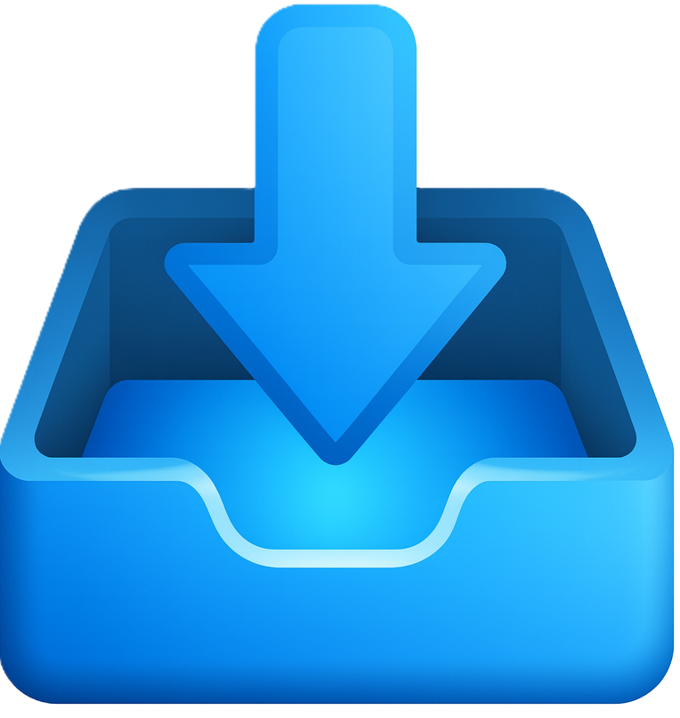
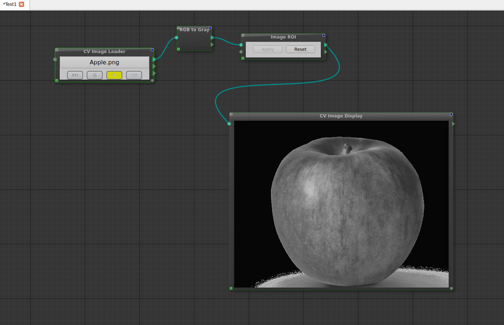

# ภาพรวมส่วนติดต่อผู้ใช้ (UI Overview)

บทนี้อธิบายภาพรวมของส่วนติดต่อผู้ใช้ (User Interface) ของโปรแกรม CVDev เพื่อให้ผู้ใช้งานเข้าใจโครงสร้างหน้าจอและหน้าที่ของแต่ละส่วนก่อนเริ่มใช้งานจริง

---

## หน้าจอหลักของโปรแกรม

เมื่อเปิดโปรแกรม CVDev ผู้ใช้งานจะพบกับหน้าจอหลักซึ่งประกอบด้วยสี่สส่วน คือ แถบเมนู (Menu Bar) แผงโหนด (Node Panel) พื้นที่แสดงผลลัพธ์ (Output Panel) พื้นที่ทำงาน (Workspace) แผงคุณสมบัติ (Property Panel)

---

## แถบเมนู (Menu Bar)

	

แถบเมนูอยู่บริเวณด้านบนของหน้าจอ ใช้สำหรับจัดการโปรเจกต์และการตั้งค่าระบบ เช่น

*  สร้างโปรเจกต์ใหม่ (New Project) สร้างพื้นที่ทำงานใหม่ / ล้างหน้าจอ
*  เปิดไฟล์งาน (Load หรือ Open File) เรียกดูและเปิดไฟล์โปรเจกต์เดิมที่เคยบันทึกไว้ขึ้นมา เพื่อทำการแก้ไขหรือใช้งานต่อ
*  บันทึกโปรเจค (Save Projec) บันทึกการเปลี่ยนแปลงล่าสุดลงในไฟล์โปรเจกต์
*  ยกเลิกสิ่งที่ทำไปแล้ว (Undo) ย้อนกลับไปสถานะก่อนหน้า หรือยกเลิกคำสั่งล่าสุดที่เพิ่งทำไป (เช่น กรณีลบโหนดผิด หรือลากวางผิดตำแหน่ง)
*  การทำซ้ำ(Redo) ย้อนกลับการกระทำที่เพิ่งถูกยกเลิกไป (ใช้สำหรับกู้คืนสิ่งที่เพิ่งกด Undo ไป)
*  การจัดแนวตามเส้นตาราง (Snap to grid) ช่วยจัดตำแหน่งของโหนดให้ตรงกับเส้นตารางโดยอัตโนมัติเมื่อทำการเคลื่อนย้าย เพื่อให้ผังงานดูเป็นระเบียบ
---

## แผงโหนด (Node Panel)

        

แผงโหนดแสดงรายการโหนดที่สามารถใช้งานได้ 
ผู้ใช้งานสามารถเลือกโหนดที่ต้องการและเพิ่มลงใน Workflow ได้อย่างง่ายดาย

---
## พื้นที่แสดงผลลัพธ์ (Output Panel)

พื้นที่แสดงผลลัพธ์ใช้สำหรับแสดงผลลัพธ์จากการประมวลผล
เช่น ภาพที่ผ่านการประมวลผล หรือผลลัพธ์จากโมเดล Machine Learning

---

## พื้นที่ทำงาน (Workspace)

        

พื้นที่ทำงานหรือ Canvas เป็นบริเวณหลักสำหรับสร้าง Workflow
ผู้ใช้งานสามารถลากโหนดจากแผงโหนดมาวางและเชื่อมต่อกันในบริเวณนี้

---

## แผงคุณสมบัติ (Property Panel)

        

แผงคุณสมบัติใช้สำหรับปรับค่าพารามิเตอร์ของโหนดที่เลือก
เช่น ขนาดภาพ ค่า Threshold หรือพาธของไฟล์อินพุต

---

