# รายละเอียดโหนด (Node Reference)

ส่วนนี้จะอธิบายรายละเอียดของโหนดแต่ละตัว โดยเรียงลำดับตามหมวดหมู่ที่ปรากฏในหน้าต่าง Node Category เพื่อให้ค้นหาได้สะดวก

---

## 1. Computer Vision
หมวดหมู่นี้รวมอัลกอริทึมทางคอมพิวเตอร์วิทัศน์ขั้นสูง สำหรับการวิเคราะห์ภาพที่ซับซ้อน

	

แบ่งออกเป็น 2 โหนด คือ

??? node "- **CV Optical Flow PyrLK:**"
	

	{  width=80 }
	

	**Optical Flow** คือโหนดสำหรับ **"ติดตามการเคลื่อนไหวของวัตถุ"** โดยระบบจะล็อกเป้าจุดเด่น (เช่น มุมตึก ขอบโต๊ะ) แล้วลากเส้นติดตามเมื่อจุดนั้นขยับไปในเฟรมถัดไป
	

	

        
	

    **ตารางการตั้งค่า (Properties)**

    ### 1. Common (การตั้งค่าทั่วไป)
    | Property | Default | คำอธิบาย |
    | :--- | :--- | :--- |
    | **Node ID** | `0` | เลขประจำตัวลำดับของโหนด |
    | **Source** | `False` | กำหนดว่าเป็นโหนดต้นกำเนิดข้อมูลหรือไม่  *(False = เป็นโหนดประมวลผลที่รับค่าจากโหนดอื่น)* |
    | **Lock Position** | `False` | ล็อกตำแหน่งโหนดบนหน้าจอ editor ไม่ให้ใช้เมาส์ลากย้าย |
    | **Enable** | `True` | เปิด/ปิด การทำงานของโหนด  *(False = หยุดทำงาน/Bypass)* |
    | **Minimize** | `False` | ย่อขนาดโหนดให้เหลือแค่แถบชื่อเพื่อประหยัดพื้นที่หน้าจอ |
    | **Draw Entries** | `True` | แสดงจุดเชื่อมต่อพอร์ต (Ports) บนตัวโหนด |
    | **Show Caption** | `True` | แสดงแถบชื่อ (Caption) ด้านบนของโหนด |
    | **Enable Zenoh** | `False` | เปิดระบบสื่อสารผ่าน Zenoh (สำหรับส่งข้อมูลผ่าน Network/IoT) |
    | **Caption** | `Text...` | ชื่อโหนดที่แสดงผล (CV Optical Flow PyrLK) |

    ### 2. Image Memory (จัดการหน่วยความจำ)
    | Property | Default | คำอธิบาย |
    | :--- | :--- | :--- |
    | **Sharing Mode** | `Pool` | โหมดการจองหน่วยความจำแบบ Pool (จองวนซ้ำเพื่อความเร็ว) |
    | **Pool Size** | `3` | จำนวนบัฟเฟอร์ที่จองไว้ล่วงหน้า (3 เฟรม) |

    ### 3. Detection (การตรวจจับจุดเด่น)
    ก่อนติดตามวัตถุ ระบบต้องหา "จุดเด่น" (Features) เพื่อใช้เป็นจุดอ้างอิง
    
    | Property | Default | คำอธิบาย |
    | :--- | :--- | :--- |
    | **Auto Detect** | `True` | ให้โปรแกรมหาจุดที่จะติดตามให้อัตโนมัติ |
    | **Max Corners** | `200` | จำกัดจำนวนจุดเด่นสูงสุด  *(ถ้าเยอะเกินไปเครื่องจะประมวลผลช้า)* |
    | **Quality Level** | `0.01` | คุณภาพความคมชัดของจุด  *(ถ้าตั้งสูงไปอาจหาจุดไม่เจอ, 0.01 = ยอมรับความชัดระดับหนึ่ง)* |
    | **Min Distance** | `10.0` | ระยะห่างขั้นต่ำระหว่างจุดเด่นแต่ละจุด (Pixel) ไม่ให้กระจุกตัว |
    | **Block Size** | `3` | ขนาดพื้นที่รอบๆ จุดที่จะใช้คำนวณว่าเป็นมุมหรือไม่ |

    ### 4. Tracking (การติดตามการเคลื่อนไหว)
    พารามิเตอร์หลักของอัลกอริทึม Lucas-Kanade
    
    | Property | Default | คำอธิบาย |
    | :--- | :--- | :--- |
    | **Window Size** | `21, 21` | ขนาดหน้าต่างค้นหา (กว้าง x สูง)  *(ยิ่งใหญ่ยิ่งจับวัตถุเร็วได้ดี แต่ความละเอียดลดลง)* |
    | **Max Level** | `3` | ระดับ Pyramid (การย่อภาพเป็นชั้นๆ) ช่วยให้ติดตามวัตถุที่เคลื่อนที่ไกลๆ ได้ |
    | **Max Iterations**| `30` | จำนวนรอบสูงสุดที่วนลูปคำนวณหาจุดใหม่ |
    | **Epsilon** | `0.01` | ค่าความแม่นยำเป้าหมาย (ถ้าคำนวณได้ละเอียดถึงระดับนี้ให้หยุดวนลูปทันที) |
    | **Min Eig Thres** | `0.0001`| เกณฑ์กรองจุดที่ไม่ดีทิ้ง (เช่น จุดบนพื้นเรียบๆ) ถ้าระบบคำนวณค่าได้ต่ำกว่านี้จะเลิกตาม |
    | **Flags** | `0` | ค่าโหมดพิเศษ (0 = โหมดปกติ) |

    ### 5. Display (การแสดงผล)
    | Property | Default | คำอธิบาย |
    | :--- | :--- | :--- |
    | **Draw Tracks** | `True` | วาดเส้นลากตามจุดที่วัตถุเคลื่อนที่ไป |
    | **Motion Scale** | `1.0` | ตัวคูณความยาวของเส้น/ลูกศร |
    | **Draw Arrows** | `True` | วาดหัวลูกศรที่ปลายเส้นเพื่อบอกทิศทาง |
    | **Track Color** | `Green` | สีของเส้นกราฟิก (ค่า Default: B:0, G:255, R:0) |
    | **Track Thickness**| `2` | ความหนาของเส้น (Pixel) |

	---

    !!! tip "เทคนิคการปรับจูน (Tuning Guide)"
        * **วัตถุเคลื่อนที่เร็วมาก (Fast Motion):** ให้ **เพิ่ม**ค่า `Window Size` (เช่น 31x31) และ **เพิ่ม**ค่า `Max Level` (เช่น 4-5) เพื่อให้ระบบมองเห็นการเปลี่ยนแปลงในระยะที่กว้างขึ้นและไกลขึ้น
        * **หาจุดเกาะไม่เจอ (No Features Detected):** ให้ **ลด**ค่า `Quality Level` ลง (เช่น 0.005) เพื่อยอมรับจุดที่มีความคมชัดต่ำลง หรือจุดที่อยู่ในที่แสงน้อย
        * **จุดเกาะกระจุกตัว (Clustered Points):** ให้ **เพิ่ม**ค่า `Min Distance` เพื่อบังคับให้จุดกระจายตัวออกไปให้ทั่ววัตถุ ไม่ไปกองรวมกันที่จุดเดียว

    !!! warning "ข้อควรระวัง: Performance Impact"
        * **เครื่องหน่วง/กระตุก (Lag):** หากตั้งค่า `Max Corners` ไว้สูงเกินไป (เช่น > 500) หรือ `Window Size` ใหญ่มากๆ ระบบจะต้องคำนวณหนักมาก แนะนำให้เริ่มที่ 50-100 จุดสำหรับงานทั่วไป
        * **การติดตามไหล/หลุด (Drifting):** หากจุดติดตามเริ่ม "ไหล" ออกจากวัตถุ อาจเกิดจากพื้นผิววัตถุเรียบเกินไป (ไม่มีลวดลาย) ให้ลองปรับ `Min Eig Threshold` สูงขึ้นเพื่อคัดกรองจุดคุณภาพต่ำออก

    !!! info "Window Size vs Precision"
        * **Window Size ใหญ่:** จับการเคลื่อนที่เร็วๆ ได้ดีมาก แต่ความแม่นยำของตำแหน่งจุด (Pixel Precision) อาจลดลงเล็กน้อย
        * **Window Size เล็ก:** ระบุตำแหน่งจุดได้แม่นยำ แต่จะหลุดการติดตามได้ง่ายมากหากวัตถุขยับเร็วกว่ากรอบหน้าต่าง

??? node "- **CV Optical Flow Farneback**"
	

	{ width=80 }
	

	**Optical Flow Farneback** คือโหนดสำหรับคำนวณการเคลื่อนไหวแบบ **"หนาแน่น (Dense)"** โดยระบบจะคำนวณเวกเตอร์การเคลื่อนที่ของ **ทุกพิกเซลในภาพ** ไม่ใช่แค่จุดเด่น ทำให้เห็นรายละเอียดการไหลของวัตถุทั้งชิ้น เหมาะกับงานที่ต้องการความละเอียดสูง

	!!! quote "เหมาะสำหรับ"
    	- การแยกวัตถุออกจากพื้นหลัง (Motion Segmentation)
    	- การจับความเคลื่อนไหวของของเหลวหรือควัน
    	- ตรวจจับท่าทาง (Action Recognition)

	

        
        

	**ตารางการตั้งค่า (Properties)**

    ### 1. Common (การตั้งค่าทั่วไป)
    | Property | Default | คำอธิบาย |
    | :--- | :--- | :--- |
    | **Node ID** | `0` | เลขประจำตัวลำดับของโหนด |
    | **Source** | `False` | โหนดต้นกำเนิดข้อมูล  *(False = ต้องรับภาพจากโหนดอื่นมาประมวลผล)* |
    | **Lock Position** | `False` | ล็อกตำแหน่งโหนดบนหน้าจอ editor ไม่ให้ลากย้าย |
    | **Enable** | `True` | เปิด/ปิด การใช้งานโหนดนี้ |
    | **Minimize** | `False` | ย่อขนาดโหนดให้เล็กสุด (False = แสดงผลเต็มรูปแบบ) |
    | **Draw Entries** | `True` | แสดงจุดเชื่อมต่อ (Ports) สำหรับลากสาย |
    | **Show Caption** | `True` | แสดงแถบชื่อโหนดด้านบน (Caption Bar) |
    | **Enable Zenoh** | `False` | เปิดระบบสื่อสารข้อมูลผ่านเครือข่าย Zenoh (IoT/Edge) |
    | **Caption** | `CV Optical Flow...`| ชื่อโหนดที่แสดงผลบนหน้าจอ |

    ### 2. Image Memory (จัดการหน่วยความจำ)
    | Property | Default | คำอธิบาย |
    | :--- | :--- | :--- |
    | **Sharing Mode** | `Pool` | โหมดการจองหน่วยความจำแบบ Pool (จองล่วงหน้าเพื่อลดการสร้างใหม่บ่อยๆ) |
    | **Pool Size** | `3` | จำนวนบัฟเฟอร์ที่จองเตรียมไว้ (3 เฟรมหมุนเวียน) |

    ### 3. Operation (การทำงาน)
    | Property | Default | คำอธิบาย |
    | :--- | :--- | :--- |
    | **Pyramid Scale** | `0.5` | อัตราส่วนการย่อภาพในแต่ละชั้นปิรามิด  *(0.5 = ย่อทีละครึ่ง ช่วยจับการเคลื่อนไหวหลายระยะ)* |
    | **Pyramid Levels** | `3` | จำนวนชั้นของปิรามิด (ระดับจำลองภาพ หยาบ -> ละเอียด) |
    | **Window Size** | `15` | ขนาดหน้าต่างเฉลี่ย  *(ค่ามาก = ทน Noise ได้ดีแต่ภาพเบลอ, ค่าน้อย = เก็บขอบชัดแต่อ่อนไหวต่อ Noise)* |
    | **Iterations** | `3` | จำนวนรอบการคำนวณในแต่ละชั้นปิรามิด  *(ยิ่งเยอะยิ่งแม่น แต่กินสเปคเครื่อง)* |
    | **Poly N** | `5` | ขนาดพื้นที่รอบจุดที่ใช้สร้างสมการพหุนาม (แนะนำ 5 หรือ 7) |
    | **Poly Sigma** | `1.1` | ค่าเบี่ยงเบนมาตรฐาน (Sigma) ของ Gaussian  *(สัมพันธ์กับ Poly N: ถ้า N=5 ใช้ 1.1, ถ้า N=7 ใช้ 1.5)* |

    ### 4. Display (การแสดงผล)
    | Property | Default | คำอธิบาย |
    | :--- | :--- | :--- |
    | **Show Magnitude**| `False` | แสดงความแรงของการเคลื่อนไหวเป็นภาพขาวดำ |
    | **Color Map** | `Jet` | ชุดสีที่ใช้ระบายภาพ Optical Flow เพื่อบอกทิศทาง/ความเร็ว  *(Jet = สีรุ้ง, สีเย็น=ขยับน้อย, สีร้อน=ขยับเยอะ)* |

    ---

    !!! tip "การตั้งค่า Poly N และ Sigma"
        เพื่อให้ภาพมีความเนียนสมจริง ควรปรับค่าคู่กันดังนี้:
        * **เน้นทั่วไป:** Poly N = `5`, Poly Sigma = `1.1`
        * **เน้นความเนียน (แต่ขอบเบลอ):** Poly N = `7`, Poly Sigma = `1.5`

    !!! info "การอ่านค่าสี (Color Map: Jet)"
        * **โทนเย็น (น้ำเงิน/ฟ้า):** วัตถุอยู่นิ่ง หรือเคลื่อนที่ช้า
        * **โทนร้อน (แดง/ส้ม):** วัตถุมีการเคลื่อนที่เร็ว

## 2. DNN (Deep Neural Networks)
โหนดสำหรับการใช้งานปัญญาประดิษฐ์ (AI) และ Deep Learning

	

??? node "- **Text Detection Model:**"
	

	{width=80} 
	

	
	# Text Detection Model

	โหนดสำหรับตรวจจับตำแหน่งข้อความในรูปภาพ (Text Localization) โดยใช้โมเดล Deep Learning (DBNet) เพื่อส่งคืนค่าพิกัดกรอบสี่เหลี่ยม (Bounding Box) สำหรับนำไปใช้งานต่อในกระบวนการ OCR

	## Properties Reference
	

        
        

	ตารางอธิบายการตั้งค่าพารามิเตอร์ต่างๆ ภายในโหนด

	### 1. Common Settings
	การตั้งค่าพื้นฐานสำหรับการควบคุมการทำงานของโหนด

	| Property | Default | คำอธิบาย |
	| :--- | :--- | :--- |
	| **Node** | `0` | คือรหัสประจำตัวของโหนดนี้ ใช้สำหรับอ้างอิงภายในระบบ (เช่น เวลาโปรแกรมบันทึกว่าโหนดไหนต่อกับโหนดไหน) |
	| **Source** | `False` | (เช็คบ็อกซ์) มักใช้ระบุว่าโหนดนี้เป็น "ต้นทางข้อมูล" (Source) หรือไม่ ในที่นี้ไม่ได้ติ๊ก แปลว่าโหนดนี้ต้องรับภาพเข้ามาจากโหนดอื่นก่อนจึงจะทำงานได้ |
	| **Lock Position** | `False` | ถ้าติ๊กช่องนี้ จะไม่สามารถใช้เมาส์ลากย้ายตำแหน่งกล่องนี้ได้ (ใช้ล็อคตำแหน่งเมื่อจัดหน้าจอเสร็จแล้ว) |
	| **Enable** | `True` | เปิด/ปิด การทำงานของโหนด (หากเป็น False จะเป็นการ Bypass ข้อมูล) |
	| **Minimize** | `False` | ใช้ย่อเก็บรายละเอียดโหนดให้เหลือแค่ชื่อ (ยุบกล่อง) เพื่อประหยัดพื้นที่หน้าจอ|	
	| **Draw Entries** | `True` | แสดงจุดเชื่อมต่อ (Ports) บนตัวโหนดในหน้า Editor |
	| **Show Caption** | `True` | เลือกให้แสดงชื่อ "Text Dectection Model" บนหัวกล่องหรือไม่ |
	| **Enable Zenoh** | `False` | เปิดใช้งานการส่งข้อมูล Output ผ่านโปรโตคอล Zenoh (สำหรับ IoT/Network) |

	### 2. Model Configuration
	การตั้งค่าเกี่ยวกับโมเดล AI และความแม่นยำในการตรวจจับ

	| Property | Default | คำอธิบาย |
	| :--- | :--- | :--- |
	| **Model Filename** | - | **(Required)** ที่อยู่ไฟล์โมเดล AI (รองรับ .onnx) |
	| **Binary Threshold** | `0.30` | ค่าความน่าจะเป็นขั้นต่ำ (Probability Map) ที่จะระบุว่าเป็นพิกเซลของตัวอักษร |
	| **Polygon Threshold** | `0.50` | ค่าความมั่นใจเฉลี่ยของกรอบข้อความ (Box Score) หากต่ำกว่านี้จะถูกตัดทิ้ง |
	| **Unclip Ratio** | `2.00` | อัตราส่วนการขยายขอบของกรอบข้อความ (Box Expansion) จากผลลัพธ์ของโมเดล |

	### 3. Input Parameters
	การจัดการรูปภาพก่อนเข้าสู่กระบวนการประมวลผล

	| Property | Default | คำอธิบาย |
	| :--- | :--- | :--- |
	| **Input Size** | `736x736` | ขนาดภาพ (Width x Height) ที่จะ Resize ก่อนส่งเข้าโมเดล  _แนะนำ: ควรเป็นค่าพหุคูณของ 32_ |
	| **Max Candidate** | `200` | จำนวนกรอบข้อความสูงสุดที่อนุญาตให้แสดงผลต่อ 1 ภาพ |

	---

	## 🛠 Tuning Guide (เทคนิคการปรับจูน)

	การปรับค่าพารามิเตอร์เพื่อให้ได้ผลลัพธ์ที่ดีที่สุด ขึ้นอยู่กับลักษณะของรูปภาพหน้างาน

	!!! tip "เทคนิค: การปรับค่า Threshold"
    	* **หาข้อความไม่เจอ (Undetected):** ให้ลอง **ลด**ค่า `Binary Threshold` (เช่น 0.2) หรือ **เพิ่ม** `Input Size`
    	* **เจอขยะ/จุดรบกวน (Noise):** ให้ **เพิ่ม**ค่า `Polygon Threshold` (เช่น 0.6) เพื่อกรองเฉพาะจุดที่มั่นใจจริงๆ

	!!! warning "ข้อควรระวัง: Unclip Ratio"
    	* หากตั้งค่า **Unclip Ratio** มากเกินไป กรอบข้อความอาจจะขยายจนไปกินพื้นที่ของบรรทัดอื่น หรือทับซ้อนกัน (Overlapping)
    	* หากตั้งค่าน้อยเกินไป อาจทำให้ส่วนหางของตัวอักษรขาดหายไปได้

	!!! info "Performance Note"
    	การตั้งค่า **Input Size** ที่สูงขึ้น (เช่น `1024x1024` ขึ้นไป) จะช่วยให้ตรวจจับตัวอักษรขนาดเล็กได้ดีขึ้น แต่จะแลกมาด้วยการใช้หน่วยความจำ (VRAM) ที่สูงขึ้นและเวลาประมวลผลที่นานขึ้น

??? node "- **NecML Classification:**"
	

        {width=80}
	

    **NecML Classification** คือโหนดสำหรับ **"จำแนกประเภทรูปภาพ"** (Image Classification) โดยรองรับการโหลดโมเดล Deep Learning และมีฟังก์ชัน **Preprocessing** (Blob Image) ในตัว เพื่อปรับค่าแสงและสีของภาพให้ตรงกับมาตรฐานที่โมเดลถูกเทรนมา (Normalization)
    
    ##**ตารางการตั้งค่า (Properties)**
	

	 
	

    ### 1. Common & Model Config
    <dir align="center">

    | Property | Default | คำอธิบาย |
    | :--- | :--- | :--- |
    | **Enable** | `True` | เปิด/ปิด การทำงานของโหนด |
    | **Node ID** | `1` | เลขประจำตัวลำดับของโหนด |
    | **Caption** | `NecML...` | ชื่อโหนดที่แสดงผล |
    | **Model Filename** | - | **(Required)** ไฟล์โมเดล AI นามสกุลที่รองรับ (เช่น .onnx, .tflite) |
    | **Config Filename**| - | ไฟล์ตั้งค่าเพิ่มเติมของโมเดล (ถ้ามี) |

    </dir>

    ### 2. Blob Image (Preprocessing)
    การเตรียมข้อมูลภาพก่อนส่งเข้าโมเดล (สำคัญมาก หากตั้งค่าผิด โมเดลจะทายผิดทันที)

    | Property | Default | คำอธิบาย |
    | :--- | :--- | :--- |
    | **Inverse Scale** | `255.0` | ตัวหารค่าสี (Scale Factor)  *(ปกติใช้ 255 เพื่อแปลงค่าสีจาก 0-255 ให้เป็นช่วง 0.0-1.0)* |
    | **Mean R, G, B** | `0.485`, `0.456`, `0.406` | ค่าเฉลี่ยสี (Mean) สำหรับลบออกจากภาพต้นฉบับ  *(ค่า Default นี้คือมาตรฐาน ImageNet)* |
    | **Std R, G, B** | `0.229`, `0.224`, `0.225` | ค่าเบี่ยงเบนมาตรฐาน (Std) สำหรับนำมาหารค่าสี  *(ค่า Default นี้คือมาตรฐาน ImageNet)* |
    | **Size (W x H)** | `300x300` | ขนาดภาพที่โมเดลต้องการ (Input Size) ระบบจะย่อ/ขยายภาพให้เป็นขนาดนี้อัตโนมัติ |

    ---

    !!! tip "เข้าใจค่า Blob Image (Mean & Std)"
        ค่าตัวเลขทศนิยมที่เห็น (0.485, 0.229 ฯลฯ) คือค่า **Standard Normalization** ของชุดข้อมูล **ImageNet**
        * **หากคุณใช้โมเดลสำเร็จรูป** (เช่น ResNet, MobileNet, EfficientNet) ที่โหลดมาจากอินเทอร์เน็ต ส่วนใหญ่จะต้องใช้ค่า Default นี้ **ห้ามเปลี่ยน**
        * **หากคุณเทรนโมเดลเอง** (Custom Training) ต้องตั้งค่าเหล่านี้ให้ตรงกับตอนที่คุณเทรนโมเดลมา

    !!! warning "ขนาดภาพ (Input Size)"
        ต้องระบุ **Width** และ **Height** ให้ตรงกับที่โมเดลถูกออกแบบมาเป๊ะๆ (เช่น โมเดล EfficientNet-B0 มักใช้ 224x224 หรือ 300x300) หากใส่เลขผิด อาจทำให้โปรแกรม Error หรือผลลัพธ์เพี้ยนได้

??? node "- **Yolo Object Detection:**"
	

	{width=80}
	

	
    **Yolo Object Detection** คือโหนดสำหรับ **"ตรวจจับและระบุตำแหน่งวัตถุ"** (Object Detection) โดยใช้อัลกอริทึมตระกูล **YOLO** (You Only Look Once) ที่มีความรวดเร็วสูง สามารถบอกได้ว่าในภาพมีวัตถุอะไรบ้างและอยู่ที่ตำแหน่งไหน (Bounding Box)

    ##**ตารางการตั้งค่า (Properties)**
	

	
	

    ### 1. Common (การตั้งค่าทั่วไป)
    <dir align="center">

    | Property | Default | คำอธิบาย |
    | :--- | :--- | :--- |
    | **Enable** | `True` | เปิด/ปิด การทำงานของโหนด |
    | **Node ID** | `2` | เลขประจำตัวลำดับของโหนด |
    | **Source** | `False` | โหนดต้นกำเนิดข้อมูล (False = รับภาพจากโหนดอื่น) |
    | **Lock Position** | `False` | ล็อกตำแหน่งโหนดบนหน้าจอ |
    | **Minimize** | `False` | ย่อขนาดโหนด |
    | **Draw Entries** | `True` | แสดงจุดเชื่อมต่อ (Ports) |
    | **Show Caption** | `True` | แสดงแถบชื่อโหนด |
    | **Enable Zenoh** | `False` | เปิดระบบสื่อสารผ่าน Zenoh |
    | **Caption** | `Yolo Object...` | ชื่อโหนดที่แสดงผล |

    </dir>

    ### 2. Model Configuration (ไฟล์โมเดล)
    ต้องระบุไฟล์ให้ครบทั้ง 3 ส่วนเพื่อให้โมเดลทำงานได้สมบูรณ์

    | Property | Default | คำอธิบาย |
    | :--- | :--- | :--- |
    | **Weight Filename** | - | **(Required)** ไฟล์น้ำหนักโมเดลที่ผ่านการเทรนมาแล้ว (เช่น `.weights`, `.onnx`) |
    | **Classes Filename**| - | **(Required)** ไฟล์รายชื่อคลาส (Label) ที่โมเดลรู้จัก (เช่น `.names`, `.txt`) |
    | **Configuration** | - | **(Required)** ไฟล์โครงสร้างโมเดล (เช่น `.cfg`) *สำหรับ Darknet Framework* |

    ### 3. Image Preprocessing (การเตรียมภาพ)
    ตั้งค่าการแปลงภาพให้ตรงกับที่โมเดลถูกเทรนมา (YOLO มักใช้ขนาด 416x416 หรือ 608x608)

    | Property | Default | คำอธิบาย |
    | :--- | :--- | :--- |
    | **Inverse Scale** | `255.0` | ตัวหารค่าสีเพื่อทำ Normalization (0-255 -> 0.0-1.0) |
    | **Size (W x H)** | `416x416` | ขนาดภาพ Input ที่โมเดลต้องการ  *(YOLOv3/v4 มาตรฐานมักใช้ 416x416)* |
    | **Swap RB** | `True` | สลับช่องสีแดงและน้ำเงิน (Red-Blue Swapping)  *(เปลี่ยนจาก BGR เป็น RGB)* |

    ---

    !!! tip "ทำไมต้อง Swap RB = True?"
        * **OpenCV** (ไลบรารีที่ใช้รับภาพ) จะอ่านสีแบบ **BGR** (Blue-Green-Red)
        * **YOLO** (และโมเดลส่วนใหญ่) ถูกเทรนมาด้วยสีแบบ **RGB** (Red-Green-Blue)
        * ดังนั้นเราจึงต้องติ๊ก **Swap RB** เป็น `True` เสมอ เพื่อให้สีตรงกัน ไม่งั้นโมเดลจะทายผิด (เช่น เห็นแอปเปิ้ลสีแดงเป็นสีน้ำเงิน)

    !!! warning "File Consistency (ความเข้ากันได้ของไฟล์)"
        ไฟล์ `Weight`, `Classes` และ `Configuration` ต้องเป็นชุดเดียวกันและเวอร์ชันเดียวกันเสมอ (เช่น ถ้าใช้ YOLOv3 ก็ต้องเป็น cfg ของ YOLOv3) หากใช้ไฟล์ข้ามรุ่น โปรแกรมอาจจะ Error หรือปิดตัวเองทันที

??? node "- **DNN Face Detection:**"
	

	{width=80}
	

    **Yolo Object Detection** คือโหนดสำหรับ **"ตรวจจับและระบุตำแหน่งวัตถุ"** (Object Detection) โดยใช้อัลกอริทึมตระกูล **YOLO** (You Only Look Once) ที่มีความรวดเร็วสูง สามารถบอกได้ว่าในภาพมีวัตถุอะไรบ้างและอยู่ที่ตำแหน่งไหน (Bounding Box)

    ##**ตารางการตั้งค่า (Properties)**
	

	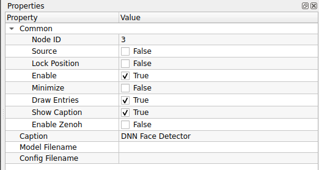
	

    ### 1. Common (การตั้งค่าทั่วไป)
    <dir align="center">

    | Property | Default | คำอธิบาย |
    | :--- | :--- | :--- |
    | **Enable** | `True` | เปิด/ปิด การทำงานของโหนด |
    | **Node ID** | `2` | เลขประจำตัวลำดับของโหนด |
    | **Source** | `False` | โหนดต้นกำเนิดข้อมูล (False = รับภาพจากโหนดอื่น) |
    | **Lock Position** | `False` | ล็อกตำแหน่งโหนดบนหน้าจอ |
    | **Minimize** | `False` | ย่อขนาดโหนด |
    | **Draw Entries** | `True` | แสดงจุดเชื่อมต่อ (Ports) |
    | **Show Caption** | `True` | แสดงแถบชื่อโหนด |
    | **Enable Zenoh** | `False` | เปิดระบบสื่อสารผ่าน Zenoh |
    | **Caption** | `Yolo Object...` | ชื่อโหนดที่แสดงผล |

    </dir>

    ### 2. Model Configuration (ไฟล์โมเดล)
    ต้องระบุไฟล์ให้ครบทั้ง 3 ส่วนเพื่อให้โมเดลทำงานได้สมบูรณ์

    | Property | Default | คำอธิบาย |
    | :--- | :--- | :--- |
    | **Weight Filename** | - | **(Required)** ไฟล์น้ำหนักโมเดลที่ผ่านการเทรนมาแล้ว (เช่น `.weights`, `.onnx`) |
    | **Classes Filename**| - | **(Required)** ไฟล์รายชื่อคลาส (Label) ที่โมเดลรู้จัก (เช่น `.names`, `.txt`) |
    | **Configuration** | - | **(Required)** ไฟล์โครงสร้างโมเดล (เช่น `.cfg`) *สำหรับ Darknet Framework* |

    ### 3. Image Preprocessing (การเตรียมภาพ)
    ตั้งค่าการแปลงภาพให้ตรงกับที่โมเดลถูกเทรนมา (YOLO มักใช้ขนาด 416x416 หรือ 608x608)
    <dir align="center">

    | Property | Default | คำอธิบาย |
    | :--- | :--- | :--- |
    | **Inverse Scale** | `255.0` | ตัวหารค่าสีเพื่อทำ Normalization (0-255 -> 0.0-1.0) |
    | **Size (W x H)** | `416x416` | ขนาดภาพ Input ที่โมเดลต้องการ  *(YOLOv3/v4 มาตรฐานมักใช้ 416x416)* |
    | **Swap RB** | `True` | สลับช่องสีแดงและน้ำเงิน (Red-Blue Swapping)  *(เปลี่ยนจาก BGR เป็น RGB)* |

    </dir>
    ---

    !!! tip "ทำไมต้อง Swap RB = True?"
        * **OpenCV** (ไลบรารีที่ใช้รับภาพ) จะอ่านสีแบบ **BGR** (Blue-Green-Red)
        * **YOLO** (และโมเดลส่วนใหญ่) ถูกเทรนมาด้วยสีแบบ **RGB** (Red-Green-Blue)
        * ดังนั้นเราจึงต้องติ๊ก **Swap RB** เป็น `True` เสมอ เพื่อให้สีตรงกัน ไม่งั้นโมเดลจะทายผิด (เช่น เห็นแอปเปิ้ลสีแดงเป็นสีน้ำเงิน)

    !!! warning "File Consistency (ความเข้ากันได้ของไฟล์)"
        ไฟล์ `Weight`, `Classes` และ `Configuration` ต้องเป็นชุดเดียวกันและเวอร์ชันเดียวกันเสมอ (เช่น ถ้าใช้ YOLOv3 ก็ต้องเป็น cfg ของ YOLOv3) หากใช้ไฟล์ข้ามรุ่น โปรแกรมอาจจะ Error หรือปิดตัวเองทันที

??? node "- **Onnx Classification Model:**"
	

	{width=80}
	

    **Onnx Classification Model** คือโหนดสำหรับรันโมเดลจำแนกภาพ (Image Classification) ที่อยู่ในรูปแบบมาตรฐาน **ONNX (Open Neural Network Exchange)** ทำให้สามารถนำโมเดลที่สร้างจากเฟรมเวิร์กต่างๆ (เช่น PyTorch, TensorFlow, MATLAB) มาใช้งานร่วมกันได้

    ##**ตารางการตั้งค่า (Properties)**
	

	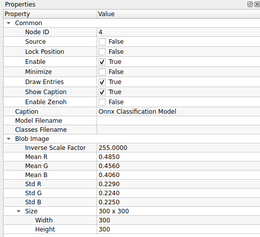
	

    ### 1. Common (การตั้งค่าทั่วไป)
    <dir align="center">

    | Property | Default | คำอธิบาย |
    | :--- | :--- | :--- |
    | **Enable** | `True` | เปิด/ปิด การทำงานของโหนด |
    | **Node ID** | `4` | เลขประจำตัวลำดับของโหนด |
    | **Source** | `False` | โหนดนี้ไม่ใช่ Source (ต้องรับภาพเข้ามาประมวลผล) |
    | **Lock Position** | `False` | ล็อกตำแหน่งโหนดบนหน้าจอ |
    | **Minimize** | `False` | ย่อขนาดโหนด |
    | **Draw Entries** | `True` | แสดงจุดเชื่อมต่อ (Ports) |
    | **Show Caption** | `True` | แสดงแถบชื่อโหนด |
    | **Enable Zenoh** | `False` | เปิดระบบสื่อสาร Zenoh |
    | **Caption** | `Onnx Class...` | ชื่อโหนดที่แสดงผล |
    
    </dir>

    ### 2. Model Configuration (ไฟล์โมเดล)
    <dir align="center">
    
    | Property | Default | คำอธิบาย |
    | :--- | :--- | :--- |
    | **Model Filename** | - | **(Required)** ไฟล์โมเดลนามสกุล `.onnx` |
    | **Classes Filename**| - | **(Required)** ไฟล์ Text (.txt) ที่ระบุชื่อคลาส (Label) บรรทัดละ 1 ชื่อ |

    </dir>

    ### 3. Blob Image (Preprocessing)
    การเตรียมภาพก่อนส่งเข้าโมเดล (Normalization) โดยค่า Default ที่ตั้งมาคือมาตรฐาน **ImageNet**
    <dir align="center">

    | Property | Default | คำอธิบาย |
    | :--- | :--- | :--- |
    | **Inverse Scale** | `255.0` | ตัวหารค่าสีเพื่อแปลงช่วงข้อมูล (จาก 0-255 เป็น 0.0-1.0) |
    | **Mean R, G, B** | `0.485`, `0.456`, `0.406` | ค่าเฉลี่ยสี (Mean) สำหรับลบออกจากภาพต้นฉบับ |
    | **Std R, G, B** | `0.229`, `0.224`, `0.225` | ค่าเบี่ยงเบนมาตรฐาน (Std) สำหรับนำมาหารค่าสี |
    | **Size (W x H)** | `300x300` | ขนาดภาพ Input ที่โมเดลต้องการ (ระบบจะ Resize ให้เอง) |

    </dir>
    ---

    !!! tip "ความยืดหยุ่นของ ONNX"
        คุณสามารถดาวน์โหลดโมเดลสำเร็จรูปจาก **ONNX Model Zoo** มาทดลองใช้ได้ทันที แต่สิ่งสำคัญคือ **ต้องตั้งค่า Blob Image ให้ตรงกับคู่มือของโมเดลนั้นๆ** (บางโมเดลอาจใช้ค่า Mean/Std ไม่เหมือนกัน หรือใช้ Size เป็น 224x224)

    !!! warning "Classes Filename"
        ไฟล์รายชื่อคลาส (Classes) จะต้องเรียงลำดับบรรทัดให้ตรงกับ Output ID ของโมเดลเป๊ะๆ (เช่น บรรทัดที่ 1 คือ Class 0, บรรทัดที่ 2 คือ Class 1) หากเรียงผิด โมเดลจะทายถูกแต่บอกชื่อผิด

??? node "- **Text Recognition Model:**"
	

	{width=80}
	

    **Text Recognition Model** คือโหนดสำหรับ **"อ่านตัวอักษร"** (Optical Character Recognition - OCR) โดยทำหน้าที่แปลงภาพพื้นที่ข้อความ (ที่มักจะได้มาจากขั้นตอน Text Detection) ให้กลายเป็นข้อความตัวหนังสือ (String) ที่คอมพิวเตอร์สามารถนำไปประมวลผลต่อได้

    ##**ตารางการตั้งค่า (Properties)**
	

	
	

    ### 1. Common (การตั้งค่าทั่วไป)
    <dir align="center">

    | Property | Default | คำอธิบาย |
    | :--- | :--- | :--- |
    | **Node ID** | `5` | เลขประจำตัวลำดับของโหนด |
    | **Source** | `False` | โหนดนี้ไม่ใช่ Source (ต้องรับข้อมูลภาพ/Crop เข้ามาประมวลผล) |
    | **Lock Position** | `False` | ล็อกตำแหน่งโหนดบนหน้าจอ |
    | **Enable** | `True` | เปิด/ปิด การทำงานของโหนด |
    | **Minimize** | `False` | ย่อขนาดโหนด |
    | **Draw Entries** | `True` | แสดงจุดเชื่อมต่อ (Ports) |
    | **Show Caption** | `True` | แสดงแถบชื่อโหนด |
    | **Enable Zenoh** | `False` | เปิดระบบสื่อสาร Zenoh |
    | **Caption** | `Text Recog...` | ชื่อโหนดที่แสดงผล |

    </dir>

    ### 2. Model Configuration (ไฟล์โมเดล)
    ต้องระบุทั้งตัวโมเดลและไฟล์พจนานุกรมภาษาให้สอดคล้องกัน

    | Property | Default | คำอธิบาย |
    | :--- | :--- | :--- |
    | **Model Filename** | - | **(Required)** ไฟล์โมเดล AI สำหรับอ่านตัวอักษร (เช่น .onnx) |
    | **Vocabulary Filename**| - | **(Required)** ไฟล์ Text (.txt) ที่ระบุชุดตัวอักษร (Character Set) ที่โมเดลนี้รู้จัก  *(ต้องเป็นไฟล์ที่มาคู่กับโมเดลเสมอ)* |

    ---

    !!! tip "Detection vs Recognition (ต่างกันอย่างไร?)"
        * **Text Detection:** ทำหน้าที่แค่ **"หา"** ว่าข้อความอยู่ตรงไหน (ได้ผลลัพธ์เป็นกรอบสี่เหลี่ยม)
        * **Text Recognition:** ทำหน้าที่ **"อ่าน"** ว่าในกรอบนั้นเขียนว่าอะไร (ได้ผลลัพธ์เป็นตัวหนังสือ)
        * *ในการใช้งานจริง มักจะต้องต่อโหนด Detection ก่อน แล้วส่งผลลัพธ์มาให้โหนด Recognition*

    !!! warning "ความสำคัญของ Vocabulary File"
        **Vocabulary File** เปรียบเสมือน "ดัชนี" ของโมเดล ถ้าคุณใช้โมเดลอ่านภาษาไทย แต่ไปใส่ Vocabulary ของภาษาอังกฤษ ผลลัพธ์ที่ได้จะเป็นภาษาต่างดาวหรืออ่านไม่ออกเลย **ต้องใช้ไฟล์ที่มาคู่กับโมเดลเท่านั้น**

??? node "- **NomadML Classification:**"
	

	{width=80}
	

	
    **NomadML Classification** คือโหนดสำหรับรันโมเดลจำแนกภาพ (Image Classification) ที่ได้รับการปรับแต่งหรือฝึกสอนผ่านแพลตฟอร์ม **NomadML** รองรับการตั้งค่า Preprocessing แบบละเอียดเพื่อให้สอดคล้องกับโมเดลที่ใช้งาน

    ##**ตารางการตั้งค่า (Properties)**
	

	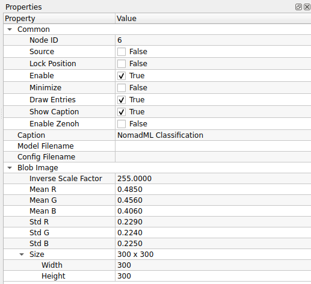
	

    ### 1. Common (การตั้งค่าทั่วไป)
    <dir align="center">

    | Property | Default | คำอธิบาย |
    | :--- | :--- | :--- |
    | **Enable** | `True` | เปิด/ปิด การทำงานของโหนด |
    | **Node ID** | `6` | เลขประจำตัวลำดับของโหนด |
    | **Source** | `False` | โหนดนี้ไม่ใช่ Source (รับภาพจากโหนดอื่น) |
    | **Lock Position** | `False` | ล็อกตำแหน่งโหนด |
    | **Minimize** | `False` | ย่อขนาดโหนด |
    | **Draw Entries** | `True` | แสดงจุดเชื่อมต่อ (Ports) |
    | **Show Caption** | `True` | แสดงแถบชื่อโหนด |
    | **Enable Zenoh** | `False` | เปิดระบบสื่อสาร Zenoh |
    | **Caption** | `NomadML...` | ชื่อโหนดที่แสดงผล |

    </dir>

    ### 2. Model Configuration (ไฟล์โมเดล)
    <dir align="center">

    | Property | Default | คำอธิบาย |
    | :--- | :--- | :--- |
    | **Model Filename** | - | **(Required)** ไฟล์โมเดลที่ได้จากการ Export (เช่น .onnx, .tflite) |
    | **Config Filename**| - | ไฟล์การตั้งค่าโมเดลเพิ่มเติม (ถ้ามี) เช่น ไฟล์ JSON หรือ YAML |

    </dir>

    ### 3. Blob Image (Preprocessing)
    ชุดค่ามาตรฐานสำหรับการเตรียมภาพ (ค่า Default เป็นมาตรฐาน ImageNet)
    <dir align="center">

    | Property | Default | คำอธิบาย |
    | :--- | :--- | :--- |
    | **Inverse Scale** | `255.0` | ตัวหารค่าสี (Normalization Factor) |
    | **Mean R, G, B** | `0.485`, `0.456`, `0.406` | ค่าเฉลี่ยสี (Mean) สำหรับลบออกจากภาพต้นฉบับ |
    | **Std R, G, B** | `0.229`, `0.224`, `0.225` | ค่าเบี่ยงเบนมาตรฐาน (Std) สำหรับหารค่าสี |
    | **Size (W x H)** | `300x300` | ขนาดภาพ Input ที่โมเดลต้องการระบบจะ Resize ให้เองอัตโนมัติ |

    </dir>
    ---

    !!! tip "NomadML Workflow"
        หากคุณใช้โมเดลจาก **NomadML** ตรวจสอบให้แน่ใจว่าได้ตั้งค่า **Size (Width/Height)** ให้ตรงกับตอนที่ตั้งค่าโปรเจกต์เทรนโมเดล (Training Config) เพื่อให้ความแม่นยำสูงสุด

    !!! info "Standard Normalization"
        ค่า **Mean** และ **Std** ที่ตั้งมาให้ เป็นค่ามาตรฐานของ **ImageNet** ซึ่งโมเดลส่วนใหญ่ในปัจจุบัน (เช่น MobileNetV2, ResNet50) มักจะใช้ค่าชุดนี้ หากโมเดลของคุณเทรนมาด้วยค่าอื่น ให้แก้ไขตัวเลขตรงนี้ให้ตรงกัน

## 3. GPL

	

??? node "- **MQTT Publisher:**"
	

	{width=80}
	

    **NomadML Classification** คือโหนดสำหรับรันโมเดลจำแนกภาพ (Image Classification) ที่ได้รับการปรับแต่งหรือฝึกสอนผ่านแพลตฟอร์ม **NomadML** รองรับการตั้งค่า Preprocessing แบบละเอียดเพื่อให้สอดคล้องกับโมเดลที่ใช้งาน

    ##**ตารางการตั้งค่า (Properties)**
	

	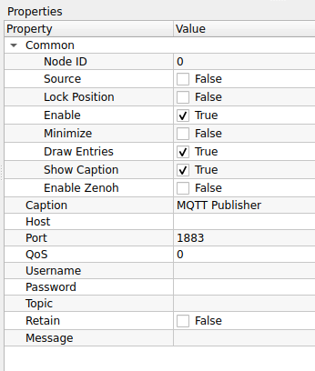
	

    ### 1. Common (การตั้งค่าทั่วไป)
    | Property | Default | คำอธิบาย |
    | :--- | :--- | :--- |
    | **Enable** | `True` | เปิด/ปิด การทำงานของโหนด |
    | **Node ID** | `6` | เลขประจำตัวลำดับของโหนด |
    | **Source** | `False` | โหนดนี้ไม่ใช่ Source (รับภาพจากโหนดอื่น) |
    | **Lock Position** | `False` | ล็อกตำแหน่งโหนด |
    | **Minimize** | `False` | ย่อขนาดโหนด |
    | **Draw Entries** | `True` | แสดงจุดเชื่อมต่อ (Ports) |
    | **Show Caption** | `True` | แสดงแถบชื่อโหนด |
    | **Enable Zenoh** | `False` | เปิดระบบสื่อสาร Zenoh |
    | **Caption** | `NomadML...` | ชื่อโหนดที่แสดงผล |

    ### 2. Model Configuration (ไฟล์โมเดล)
    | Property | Default | คำอธิบาย |
    | :--- | :--- | :--- |
    | **Model Filename** | - | **(Required)** ไฟล์โมเดลที่ได้จากการ Export (เช่น .onnx, .tflite) |
    | **Config Filename**| - | ไฟล์การตั้งค่าโมเดลเพิ่มเติม (ถ้ามี) เช่น ไฟล์ JSON หรือ YAML |

    ### 3. Blob Image (Preprocessing)
    ชุดค่ามาตรฐานสำหรับการเตรียมภาพ (ค่า Default เป็นมาตรฐาน ImageNet)

    | Property | Default | คำอธิบาย |
    | :--- | :--- | :--- |
    | **Inverse Scale** | `255.0` | ตัวหารค่าสี (Normalization Factor) |
    | **Mean R, G, B** | `0.485`, `0.456`, `0.406` | ค่าเฉลี่ยสี (Mean) สำหรับลบออกจากภาพต้นฉบับ |
    | **Std R, G, B** | `0.229`, `0.224`, `0.225` | ค่าเบี่ยงเบนมาตรฐาน (Std) สำหรับหารค่าสี |
    | **Size (W x H)** | `300x300` | ขนาดภาพ Input ที่โมเดลต้องการระบบจะ Resize ให้เองอัตโนมัติ |

    ---

    !!! tip "NomadML Workflow"
        หากคุณใช้โมเดลจาก **NomadML** ตรวจสอบให้แน่ใจว่าได้ตั้งค่า **Size (Width/Height)** ให้ตรงกับตอนที่ตั้งค่าโปรเจกต์เทรนโมเดล (Training Config) เพื่อให้ความแม่นยำสูงสุด

    !!! info "Standard Normalization"
        ค่า **Mean** และ **Std** ที่ตั้งมาให้ เป็นค่ามาตรฐานของ **ImageNet** ซึ่งโมเดลส่วนใหญ่ในปัจจุบัน (เช่น MobileNetV2, ResNet50) มักจะใช้ค่าชุดนี้ หากโมเดลของคุณเทรนมาด้วยค่าอื่น ให้แก้ไขตัวเลขตรงนี้ให้ตรงกัน

??? node "- **MQTT Subsciber:**"
	

	{width=80}
	

    **MQTT Subscriber** คือโหนดสำหรับ **"รับข้อมูล"** จากอุปกรณ์อื่นผ่านโปรโตคอล **MQTT** (Message Queuing Telemetry Transport) โดยโหนดนี้จะเชื่อมต่อกับตัวกลาง (Broker) และรอฟังข้อมูลจากหัวข้อ (Topic) ที่กำหนด

    ##**ตารางการตั้งค่า (Properties)**
	

	
	

    ### 1. Common (การตั้งค่าทั่วไป)
    | Property | Default | คำอธิบาย |
    | :--- | :--- | :--- |
    | **Enable** | `True` | เปิด/ปิด การทำงานของโหนด |
    | **Node ID** | `1` | เลขประจำตัวลำดับของโหนด |
    | **Source** | `False` | (False = ถือเป็นโหนดรับข้อมูล ไม่ใช่ต้นกำเนิดสัญญาณภาพ) |
    | **Draw Entries** | `True` | แสดงจุดเชื่อมต่อ (Ports) |
    | **Show Caption** | `True` | แสดงแถบชื่อโหนด |
    | **Enable Zenoh** | `False` | เปิดระบบสื่อสาร Zenoh |
    | **Caption** | `MQTT Sub...` | ชื่อโหนดที่แสดงผล |

    ### 2. Connection Settings (การเชื่อมต่อ)
    ตั้งค่าเพื่อเชื่อมต่อไปยัง MQTT Broker (เซิร์ฟเวอร์ตัวกลาง)

    | Property | Default | คำอธิบาย |
    | :--- | :--- | :--- |
    | **Host** | - | **(Required)** ที่อยู่ IP หรือ Domain Name ของ Broker (เช่น `localhost`, `192.168.1.50`, `broker.emqx.io`) |
    | **Port** | `1883` | พอร์ตสำหรับการเชื่อมต่อ  *(ปกติ 1883 สำหรับ Non-SSL และ 8883 สำหรับ SSL)* |
    | **Username** | - | ชื่อผู้ใช้ (หาก Broker ตั้งค่าล็อครหัสผ่านไว้) |
    | **Password** | - | รหัสผ่าน (หาก Broker ตั้งค่าล็อครหัสผ่านไว้) |

    ### 3. Subscription (การรับข้อมูล)
    ระบุหัวข้อที่ต้องการดักฟังข้อมูล

    | Property | Default | คำอธิบาย |
    | :--- | :--- | :--- |
    | **Topic** | - | **(Required)** หัวข้อข่าวสารที่ต้องการรับ (เช่น `factory/machine1/temp`) |
    | **QoS** | `0` | ระดับคุณภาพการส่งข้อมูล (Quality of Service)  *(ดูคำอธิบายด้านล่าง)* |

    ---

    !!! tip "ความหมายของ Topic Wildcards"
        คุณสามารถใช้สัญลักษณ์พิเศษเพื่อรับข้อมูลหลายหัวข้อพร้อมกันได้:
        * **`+` (Plus):** แทนที่ 1 ระดับชั้น (เช่น `sensors/+/temp` จะรับทั้ง `sensors/bed/temp` และ `sensors/kitchen/temp`)
        * **`#` (Hash):** แทนที่ทุกระดับชั้นที่เหลือ (เช่น `sensors/#` จะรับทุกอย่างที่ขึ้นต้นด้วย sensors)

    !!! info "ระดับ QoS (Quality of Service)"
        * **0 (At most once):** ส่งแล้วจบกัน ไม่มีการยืนยัน (เร็วสุด แต่อาจมีข้อมูลหาย)
        * **1 (At least once):** รับประกันว่าข้อมูลถึงปลายทางแน่นอน (แต่อาจได้รับซ้ำ)
        * **2 (Exactly once):** รับประกันว่าข้อมูลถึงปลายทาง 1 ครั้งถ้วน (ช้าที่สุด แต่แม่นยำที่สุด)

## 4. GUI (Graphical User Interface)
เครื่องมือสำหรับสร้างส่วนติดต่อผู้ใช้บนหน้าจอ เพื่อปรับค่าต่างๆ ได้ทันที

	

??? node "- **Push Button:**"
	

	{width=80}
	

    **Push Button** คือโหนดสำหรับสร้าง **"ปุ่มกด"** (Interactive Button) บนหน้าจอ Dashboard เพื่อให้ผู้ใช้งานสามารถคลิกเพื่อส่งสัญญาณ Trigger หรือส่งค่าตัวเลข (Integer) ออกไปควบคุมการทำงานของโหนดอื่นๆ ได้
    
	##**ตารางการตั้งค่า (Properties)**
	

	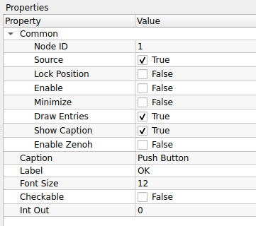
	

    ### 1. Common (การตั้งค่าทั่วไป)
    | Property | Default | คำอธิบาย |
    | :--- | :--- | :--- |
    | **Node ID** | `1` | เลขประจำตัวลำดับของโหนด |
    | **Source** | `True` | **(สำคัญ)** โหนดนี้เป็น Source (ต้นกำเนิดสัญญาณ) |
    | **Lock Position** | `False` | ล็อกตำแหน่งโหนดบนหน้าจอ |
    | **Enable** | `True` | เปิด/ปิด การทำงานของโหนด |
    | **Minimize** | `False` | ย่อขนาดโหนด |
    | **Draw Entries** | `True` | แสดงจุดเชื่อมต่อ (Ports) |
    | **Show Caption** | `True` | แสดงแถบชื่อโหนด |
    | **Enable Zenoh** | `False` | เปิดระบบสื่อสาร Zenoh |
    | **Caption** | `Push Button` | ชื่อโหนดที่แสดงผล |

    ### 2. Button Configuration (ตั้งค่าปุ่ม)
    | Property | Default | คำอธิบาย |
    | :--- | :--- | :--- |
    | **Label** | `OK` | ข้อความที่ปรากฏบนปุ่มกด (เช่น Start, Stop, Reset) |
    | **Font Size** | `12` | ขนาดตัวอักษรของ Label |
    | **Checkable** | `False` | กำหนดพฤติกรรมของปุ่ม  *(False = ปุ่มกดเด้งปกติ, True = ปุ่มกดค้างแบบสวิตช์ On/Off)* |
    | **Int Out** | `0` | ค่าตัวเลขจำนวนเต็ม (Integer) ที่จะส่งออกมาเมื่อปุ่มถูกกด |

    ---

    !!! tip "Checkable: True vs False"
        * **False (Momentary):** ทำงานเหมือนกริ่งประตู กดแล้วปล่อย สัญญาณจะส่งออกมาแค่จังหวะเดียว เหมาะสำหรับปุ่ม **Trigger** หรือ **Reset**
        * **True (Toggle):** ทำงานเหมือนสวิตช์ไฟ กดแล้วปุ่มจะบุ๋มลงไป (On) กดอีกทีจะเด้งคืน (Off) เหมาะสำหรับปุ่ม **Start/Stop** เครื่องจักร

    !!! info "Int Out Usage"
        ค่า **Int Out** มีประโยชน์มากเมื่อคุณนำปุ่มหลายๆ ปุ่มไปต่อเข้ากับ Logic Condition เช่น:
        * ปุ่ม A ตั้ง Int Out = `1` (สั่งเปิดไฟ)
        * ปุ่ม B ตั้ง Int Out = `0` (สั่งปิดไฟ)

??? node "- **LCD Number:**"
	

	{width=80}
	

    **LCD Number** คือโหนดสำหรับ **"แสดงค่าตัวเลข"** ในรูปแบบหน้าจอ LCD (7-Segment Display) เหมือนเครื่องคิดเลขหรือนาฬิกาดิจิตอล เหมาะสำหรับใช้แสดงผลลัพธ์ที่เป็นตัวเลขจำนวนเต็มหรือทศนิยมบนหน้า Dashboard ให้ดูโดดเด่นและอ่านง่าย

    **ตารางการตั้งค่า (Properties)**
    

	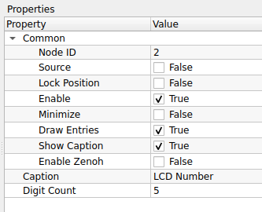
	

    ### 1. Common (การตั้งค่าทั่วไป)
    | Property | Default | คำอธิบาย |
    | :--- | :--- | :--- |
    | **Node ID** | `2` | เลขประจำตัวลำดับของโหนด |
    | **Source** | `False` | โหนดนี้ไม่ใช่ Source (ต้องรับค่าตัวเลขเข้ามาแสดงผล) |
    | **Lock Position** | `False` | ล็อกตำแหน่งโหนดบนหน้าจอ |
    | **Enable** | `True` | เปิด/ปิด การทำงานของโหนด |
    | **Minimize** | `False` | ย่อขนาดโหนด |
    | **Draw Entries** | `True` | แสดงจุดเชื่อมต่อ (Ports) |
    | **Show Caption** | `True` | แสดงแถบชื่อโหนด |
    | **Enable Zenoh** | `False` | เปิดระบบสื่อสาร Zenoh |
    | **Caption** | `LCD Number` | ชื่อโหนดที่แสดงผล |

    ### 2. Display Configuration (การแสดงผล)
    | Property | Default | คำอธิบาย |
    | :--- | :--- | :--- |
    | **Digit Count** | `5` | จำนวนหลักของตัวเลขสูงสุดที่ต้องการแสดงบนหน้าจอ  *(รวมจุดทศนิยมและเครื่องหมายลบด้วย)* |

    ---

    !!! tip "การกำหนดค่า Digit Count"
        ควรตั้งค่า **Digit Count** ให้ครอบคลุมจำนวนหลักสูงสุดที่คาดว่าจะเกิดขึ้น
        * ตัวอย่าง: ถ้าต้องการแสดงค่า `123.45` คุณต้องเผื่อที่ไว้อย่างน้อย **6 หลัก** (3 หลักหน้า + 1 จุดทศนิยม + 2 หลักหลัง)
        * หากตั้งค่าน้อยเกินไป ตัวเลขอาจจะถูกตัด หรือแสดงผลผิดเพี้ยนได้

    !!! info "การใช้งานร่วมกับโหนดอื่น"
        โหนดนี้ออกแบบมาเพื่อรับค่า **Integer (จำนวนเต็ม)** หรือ **Float (ทศนิยม)** จากโหนดคำนวณต่างๆ (เช่น โหนดนับจำนวนวัตถุ, โหนดวัดขนาด, หรือค่า Score จาก AI) มาแสดงผลให้ผู้ใช้งานเห็นได้ทันที

??? node "- **Activate all Nodes:**"
	

	{width=80}
	

   
    **Activate all Nodes** คือโหนดคำสั่งพิเศษ (System Action) ที่ทำหน้าที่ **"สั่งเปิดการทำงาน (Enable) ของโหนดทุกตัวในโปรเจกต์"** ทันทีที่ได้รับสัญญาณ Trigger นิยมนำมาต่อพ่วงกับปุ่มกดเพื่อทำฟังก์ชัน "Start System" หรือ "Reset System"

    ##**ตารางการตั้งค่า (Properties)**
     

	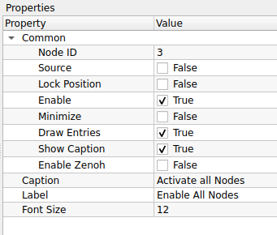
	

    ### 1. Common (การตั้งค่าทั่วไป)
    | Property | Default | คำอธิบาย |
    | :--- | :--- | :--- |
    | **Node ID** | `3` | เลขประจำตัวลำดับของโหนด |
    | **Source** | `False` | โหนดนี้ไม่ใช่ Source (ต้องรับสัญญาณ Trigger มาจากโหนดอื่น เช่น ปุ่มกด) |
    | **Lock Position** | `False` | ล็อกตำแหน่งโหนด |
    | **Enable** | `True` | เปิด/ปิด การทำงานของโหนด |
    | **Minimize** | `False` | ย่อขนาดโหนด |
    | **Draw Entries** | `True` | แสดงจุดเชื่อมต่อ (Ports) |
    | **Show Caption** | `True` | แสดงแถบชื่อโหนด |
    | **Enable Zenoh** | `False` | เปิดระบบสื่อสาร Zenoh |
    | **Caption** | `Activate...` | ชื่อโหนดที่แสดงผล |

    ### 2. Display Configuration (การแสดงผล)
    | Property | Default | คำอธิบาย |
    | :--- | :--- | :--- |
    | **Label** | `Enable All...`| ข้อความที่จะแสดงบนตัวโหนดเพื่อบอกสถานะหรือหน้าที่ |
    | **Font Size** | `12` | ขนาดตัวอักษรของ Label |

    ---

    !!! tip "วิธีการใช้งาน (Usage Workflow)"
        โหนดนี้มักจะไม่ทำงานด้วยตัวคนเดียว (เพราะ Source = False) แต่จะถูกใช้ร่วมกับ **Push Button** ดังนี้:
        1.  สร้างโหนด **Push Button** (ตั้งชื่อว่า Start)
        2.  ลากสายจาก **Push Button** มาเข้าที่ **Activate all Nodes**
        3.  เมื่อผู้ใช้กดปุ่ม Start -> สัญญาณจะวิ่งมาที่โหนดนี้ -> โหนดนี้จะสั่ง **Enable = True** ให้กับทุกโหนดในระบบทันที

    !!! info "ทำไมต้องมีโหนดนี้?"
        ในการทำงานจริง เราอาจจะตั้งค่าโหนดบางตัวเป็น `Enable = False` (ปิดไว้ก่อน) เพื่อไม่ให้ระบบทำงานทันทีที่เปิดโปรแกรม
        โหนดนี้จึงทำหน้าที่เหมือนกุญแจสตาร์ทรถ ที่รอคำสั่งจากผู้ใช้แล้วค่อยปลุกระบบทั้งหมดให้ตื่นพร้อมกัน

??? node "- **Display Text:**"
    

	{width=80}
	

    **Display Text** คือโหนดสำหรับการแสดงผล (Visualization) ที่ทำหน้าที่ **"แสดงข้อความ (String) หรือค่าตัวเลข"** บนหน้าจอ GUI ของโหนดโดยตรง ใช้สำหรับตรวจสอบความถูกต้องของข้อมูล (Monitor), ดูผลลัพธ์การทำงาน หรือสร้างป้ายกำกับ (Label) ในระบบ Flow

    ## **ตารางการตั้งค่า (Properties)**
    

    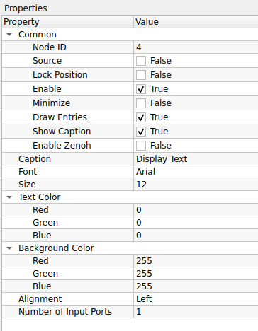
    

    ### 1. Common (การตั้งค่าทั่วไป)
    | Property | Default | คำอธิบาย |
    | :--- | :--- | :--- |
    | **Node ID** | `4` | เลขประจำตัวลำดับของโหนด |
    | **Source** | `False` | โหนดนี้ไม่ใช่ Source (ต้องรับข้อมูลจากโหนดอื่นเข้ามาแสดงผล) |
    | **Lock Position** | `False` | ล็อกตำแหน่งโหนดไม่ให้ขยับ |
    | **Enable** | `True` | เปิด/ปิด การทำงานของโหนด |
    | **Minimize** | `False` | ย่อขนาดโหนดให้เล็กลง |
    | **Draw Entries** | `True` | แสดงจุดเชื่อมต่อ (Ports) |
    | **Show Caption** | `True` | แสดงแถบชื่อโหนดด้านบน |
    | **Enable Zenoh** | `False` | เปิดระบบสื่อสาร Zenoh (สำหรับการส่งข้อมูลข้าม Network) |
    | **Caption** | `Display Text` | ชื่อโหนดที่แสดงผลบริเวณส่วนหัว |

    ### 2. Style & Configuration (รูปแบบและการตั้งค่า)
    | Property | Default | คำอธิบาย |
    | :--- | :--- | :--- |
    | **Font** | `Arial` | รูปแบบฟอนต์ของข้อความที่แสดง |
    | **Size** | `12` | ขนาดของตัวอักษร |
    | **Alignment** | `Left` | การจัดตำแหน่งข้อความ (Left / Center / Right) |
    | **Number of Input Ports**| `1` | จำนวนช่องรับสัญญาณอินพุต (สำหรับรับข้อความมาแสดง) |

    ### 3. Color Settings (การตั้งค่าสี)
    | Property | Default (R,G,B) | คำอธิบาย |
    | :--- | :--- | :--- |
    | **Text Color** | `0, 0, 0` | สีของตัวอักษร (ค่าเริ่มต้น: สีดำ) |
    | **Background Color** | `255, 255, 255`| สีพื้นหลังของพื้นที่แสดงข้อความ (ค่าเริ่มต้น: สีขาว) |

    !!! tip "วิธีการใช้งาน (Usage Workflow)"
        โหนดนี้มักจะอยู่ท้ายสุดของ Flow ย่อย เพื่อใช้เป็นจุดสังเกตการณ์ (Observer):
        1.  เตรียมโหนดที่มีข้อมูลขาออกเป็นข้อความ หรือตัวเลข (เช่น **Counter**, **Read Barcode**, หรือ **String Constant**)
        2.  ลากสายจาก Output ของโหนดเหล่านั้น มาเข้าที่ Input ของ **Display Text**
        3.  ข้อความจะปรากฏขึ้นบนตัวโหนดทันทีที่ได้รับข้อมูล (Real-time update)

    !!! info "ประโยชน์การใช้งาน (Use Case)"
        * **Debugging:** ใช้ดูค่าตัวแปรต่างๆ ในระบบว่าส่งมาถูกต้องหรือไม่ระหว่างการพัฒนา
        * **Dashboard:** ใช้จัดวางหน้าจอ UI อย่างง่าย เพื่อแสดงสถานะระบบให้ผู้ใช้เห็น เช่น ข้อความ "PASS", "FAIL" หรือแสดงค่าจำนวนนับ (Count)
        * **Labeling:** สามารถใช้โหนดนี้โดยไม่ต้องต่อสาย Input เพื่อพิมพ์ข้อความค้างไว้ (Static Text) สำหรับเป็นคำอธิบายหรือหัวข้อในหน้า Workspace
        
## 5. Image Analysis (การวิเคราะห์ภาพ)
เครื่องมือสำหรับดึงข้อมูลเชิงสถิติหรือคุณลักษณะออกจากภาพ

	

??? node "- **CV Create Histogram:**"
    

	{width=80}
	

    **CV Create Histogram** คือโหนดสำหรับการวิเคราะห์ภาพ (Image Analysis) ทำหน้าที่ **"คำนวณและวาดกราฟฮิสโตแกรม"** เพื่อแสดงการกระจายตัวของค่าความเข้มแสง (Intensity) หรือสี (R, G, B) ในภาพ ช่วยให้ผู้ใช้สามารถตรวจสอบคุณภาพของแสง, คอนทราสต์ (Contrast) หรือสมดุลสี (Color Balance) ของภาพอินพุตได้

    ## **ตารางการตั้งค่า (Properties)**
    

    
    

    ### 1. Common (การตั้งค่าทั่วไป)
    | Property | Default | คำอธิบาย |
    | :--- | :--- | :--- |
    | **Caption** | `CV Create Histogram` | ชื่อโหนดที่แสดงผลบน Workspace |

    ### 2. Operation (การตั้งค่าการคำนวณ)
    | Property | Default | คำอธิบาย |
    | :--- | :--- | :--- |
    | **Bin Count** | `256` | ความละเอียดของกราฟ (จำนวนแท่งกราฟ) ปกติใช้ 256 สำหรับภาพ 8-bit |
    | **Maximum Intensity**| `255.0000` | ค่าความเข้มแสงสูงสุดที่จะนำมาคำนวณ |
    | **Minimum Intensity**| `0.0000` | ค่าความเข้มแสงต่ำสุดที่จะนำมาคำนวณ |
    | **Norm Type** | `NORM_MINMAX` | วิธีการปรับสเกลข้อมูล (Normalization) เพื่อให้กราฟแสดงผลได้เหมาะสม - **NORM_MINMAX:** ปรับยืดกราฟให้เต็มความสูง (นิยมใช้ที่สุด) - **NORM_L1/L2:** ปรับตามผลรวมทางคณิตศาสตร์ |

    ### 3. Display (การตั้งค่าการแสดงผลกราฟ)
    | Property | Default | คำอธิบาย |
    | :--- | :--- | :--- |
    | **Line Thickness** | `2` | ความหนาของเส้นกราฟ (Pixel) |
    | **Line Type** | `LINE_8` | อัลกอริทึมการวาดเส้น (LINE_8 คือเส้นต่อเนื่องแบบ 8-connected) |
    | **Draw Endpoints** | `True` | ลากเส้นเชื่อมจุดเริ่มต้นและจุดสิ้นสุดของกราฟหรือไม่ |
    | **Enable B** | `True` | แสดงกราฟของช่องสัญญาณสีน้ำเงิน (Blue Channel) |
    | **Enable G** | `True` | แสดงกราฟของช่องสัญญาณสีเขียว (Green Channel) |
    | **Enable R** | `True` | แสดงกราฟของช่องสัญญาณสีแดง (Red Channel) |

    ---

    !!! tip "วิธีการใช้งาน (Usage Workflow)"
        โหนดนี้มักใช้ในการ Pre-processing หรือ Monitor ระบบ:
        1.  รับภาพจากโหนด **Read Image** หรือกล้อง
        2.  ส่งเข้าโหนด **CV Create Histogram**
        3.  ผลลัพธ์ (Output) จะเป็นภาพกราฟฮิสโตแกรม สามารถต่อเข้ากับ **Display Image** เพื่อดูผลได้ทันที

    !!! info "เกร็ดความรู้: Normalization Type"
        ใน Property **Norm Type** การเลือก `NORM_MINMAX` (ค่าเริ่มต้น) คือตัวเลือกที่ดีที่สุดสำหรับการแสดงผล เพราะระบบจะปรับสเกลยอดกราฟที่สูงที่สุดให้พอดีกับกรอบภาพ ทำให้เราเห็นรูปทรงของกราฟได้ชัดเจน ไม่ล้นจอหรือเตี้ยเกินไป

    !!! note "เจาะลึก: Norm Type (การปรับสเกล)"
    การคำนวณ Histogram แบบดิบๆ อาจได้ค่าจำนวน Pixel สูงถึงหลักหมื่นหรือแสน ซึ่งยากต่อการนำมาวาดกราฟในกรอบสี่เหลี่ยมเล็กๆ เราจึงต้องมี **Normalization** เพื่อบีบอัดข้อมูลลงมา
    
    * **NORM_MINMAX (แนะนำสำหรับดูด้วยตา):**
        ระบบจะหาค่าที่สูงที่สุดในกราฟ แล้วปรับให้ค่านั้นเท่ากับความสูงสูงสุดของหน้าต่างแสดงผล (เช่น 100% ของความสูง) ทำให้กราฟดู "เต็มจอ" สวยงามและวิเคราะห์รูปทรงได้ง่ายที่สุด
    * **NORM_L1 (ผลรวม):**
        ปรับสเกลโดยอิงจาก "ผลรวมของค่าทั้งหมด" (Sum of absolute values) มักใช้ในงานทางคณิตศาสตร์หรือความน่าจะเป็น (Probability Density Function)
    * **NORM_L2 (Euclidean):**
        ปรับสเกลโดยอิงจากรากที่สองของผลรวมกำลังสอง
    * **NORM_INF (Infinity):**
        ปรับโดยอิงจากค่าสัมบูรณ์ที่มากที่สุด (คล้าย MinMax ในบางบริบท)

??? node "- **CV MinMax Location:**"
    

	{width=80}
	

    **CV MinMax Location** คือโหนดสำหรับการวิเคราะห์ภาพ (Image Analysis) ทำหน้าที่ **"ค้นหาค่าความเข้มแสงต่ำสุด (Min) และสูงสุด (Max) พร้อมระบุพิกัด (X, Y) ของจุดนั้นๆ"** ภายในภาพอินพุต ช่วยให้ทราบตำแหน่งของวัตถุที่มีความสว่างโดดเด่น หรือใช้หาตำแหน่งที่ตรงกันที่สุดเมื่อใช้งานร่วมกับโหนด Template Matching

    ## **ตารางการตั้งค่า (Properties)**
    

    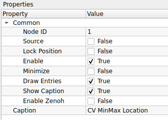
    

    ### 1. Common (การตั้งค่าทั่วไป)
    | Property | Default | คำอธิบาย |
    | :--- | :--- | :--- |
    | **Node ID** | `1` | เลขประจำตัวลำดับของโหนด |
    | **Source** | `False` | โหนดนี้ไม่ใช่ Source (ต้องรับภาพ Input เข้ามา) |
    | **Lock Position** | `False` | ล็อกตำแหน่งโหนด |
    | **Enable** | `True` | เปิด/ปิด การทำงานของโหนด |
    | **Minimize** | `False` | ย่อขนาดโหนด |
    | **Draw Entries** | `True` | แสดงจุดเชื่อมต่อ (Ports) |
    | **Show Caption** | `True` | แสดงแถบชื่อโหนด |
    | **Enable Zenoh** | `False` | เปิดระบบสื่อสาร Zenoh |
    | **Caption** | `CV MinMax Location` | ชื่อโหนดที่แสดงผลบน Workspace |

    ---

    !!! tip "วิธีการใช้งาน (Usage Workflow)"
        โหนดนี้ทำงานกับภาพระดับสีเทา (Grayscale Image) ได้ดีที่สุด:
        1.  **Input:** ส่งภาพเข้าสู่โหนด (หากเป็นภาพสี แนะนำให้แปลงเป็น Grayscale ก่อน)
        2.  **Processing:** โหนดจะสแกนทั้งภาพเพื่อหา pixel ที่มีค่าน้อยสุดและมากสุด
        3.  **Output:** ส่งค่าออกมา 4 อย่างหลักๆ คือ:
            * **Min Val:** ค่าความเข้มแสงต่ำสุด (เช่น 0)
            * **Max Val:** ค่าความเข้มแสงสูงสุด (เช่น 255)
            * **Min Loc:** พิกัด (x, y) ของจุดที่มืดที่สุด
            * **Max Loc:** พิกัด (x, y) ของจุดที่สว่างที่สุด

    !!! info "ตัวอย่างการประยุกต์ใช้ (Use Case)"
        * **Hotspot Detection:** หาตำแหน่งของไฟ LED หรือจุดเลเซอร์ที่สว่างที่สุดในภาพ (ดูค่า Max Loc)
        * **Template Matching:** เมื่อใช้โหนด *Match Template* ผลลัพธ์ที่ได้จะเป็น heatmap ซึ่งต้องส่งต่อมาที่ **CV MinMax Location** เพื่อหาพิกัดคำตอบ (จุดที่ Match ที่สุดคือจุดที่มีค่า Max หรือ Min สูงสุด ขึ้นอยู่กับอัลกอริทึม)

??? node "- **CV Color Map:**"
    

	{width=80}
	

    **CV Color Map** คือโหนดสำหรับการประมวลผลภาพ (Image Processing) ทำหน้าที่ **"ใส่เฉดสี (False Color) ให้กับภาพขาวดำ"** โดยการแทนค่าความเข้มแสง (Intensity) ด้วยสีสันต่างๆ ตามตารางสี (Color Map) ที่กำหนด นิยมใช้เพื่อทำให้ตามนุษย์แยกแยะรายละเอียดของข้อมูลได้ง่ายขึ้น เช่น ภาพถ่ายความร้อน (Thermal), ภาพความลึก (Depth Map) หรือภาพการแพทย์

    ## **ตารางการตั้งค่า (Properties)**
    

    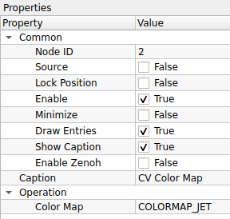
    

    ### 1. Common (การตั้งค่าทั่วไป)
    | Property | Default | คำอธิบาย |
    | :--- | :--- | :--- |
    | **Node ID** | `2` | เลขประจำตัวลำดับของโหนด |
    | **Source** | `False` | โหนดนี้ไม่ใช่ Source (ต้องรับภาพ Input เข้ามา) |
    | **Lock Position** | `False` | ล็อกตำแหน่งโหนด |
    | **Enable** | `True` | เปิด/ปิด การทำงานของโหนด |
    | **Minimize** | `False` | ย่อขนาดโหนด |
    | **Draw Entries** | `True` | แสดงจุดเชื่อมต่อ (Ports) |
    | **Show Caption** | `True` | แสดงแถบชื่อโหนด |
    | **Enable Zenoh** | `False` | เปิดระบบสื่อสาร Zenoh |
    | **Caption** | `CV Color Map` | ชื่อโหนดที่แสดงผลบน Workspace |

    ### 2. Operation (การตั้งค่าการทำงาน)
    | Property | Default | คำอธิบาย |
    | :--- | :--- | :--- |
    | **Color Map** | `COLORMAP_JET` | รูปแบบโทนสีที่ต้องการใช้ (ดูรายชื่อทั้งหมดด้านล่าง) |

    ---

    !!! note "รายชื่อรูปแบบสี (Available Color Maps)"
        สามารถเลือกโทนสีให้เหมาะกับงานได้ดังนี้:

        * **กลุ่มยอดนิยม (General Purpose):**
            * `COLORMAP_JET`: (ค่าเริ่มต้น) ไล่สีรุ้ง (น้ำเงิน->แดง) คอนทราสต์สูง นิยมใช้ที่สุด
            * `COLORMAP_TURBO`: คล้าย Jet แต่ไล่โทนสีเนียนตากว่า และแม่นยำกว่าทางสายตา
            * `COLORMAP_HSV`: ไล่สีตามวงล้อสี HSV
        
        * **กลุ่มโทนร้อน/ความเข้ม (Heat/Intensity):**
            * `COLORMAP_HOT`: ดำ->แดง->เหลือง->ขาว (เหมือนเหล็กเผาไฟ)
            * `COLORMAP_INFERNO`, `COLORMAP_MAGMA`, `COLORMAP_PLASMA`: โทนดำ-ม่วง-ส้ม-เหลือง ให้ความรู้สึกทันสมัยและอ่านค่าง่าย
            * `COLORMAP_AUTUMN`: แดง->เหลือง (โทนฤดูใบไม้ร่วง)
        
        * **กลุ่มโทนเย็น (Cool Tones):**
            * `COLORMAP_OCEAN`: สีน้ำเงินเข้ม->ขาว (เหมือนมหาสมุทร)
            * `COLORMAP_WINTER`: น้ำเงิน->เขียว (โทนฤดูหนาว)
            * `COLORMAP_COOL`: ฟ้า->ชมพู
            * `COLORMAP_TWILIGHT`: โทนสีม่วง-น้ำเงิน ช่วงพลบค่ำ
        
        * **กลุ่มอื่นๆ (Others):**
            * `COLORMAP_BONE`: สีเทาอมฟ้า (นิยมใช้ในภาพ X-Ray การแพทย์)
            * `COLORMAP_SPRING`, `COLORMAP_SUMMER`: โทนสีตามฤดูกาล
            * `COLORMAP_PINK`: ไล่สีโทน sepia-pink
            * `COLORMAP_PARULA`, `COLORMAP_CIVIDIS`: โทนสีมาตรฐานงานวิจัย (Perceptually Uniform)

    !!! tip "วิธีการใช้งาน (Usage Workflow)"
        1.  **Input:** เตรียมภาพที่เป็น Grayscale (ภาพขาวดำ) เช่น ภาพจากกล้อง Depth Camera หรือภาพที่ผ่านการคำนวณมาแล้ว
        2.  **Process:** ต่อสายเข้าโหนด **CV Color Map** และเลือกรูปแบบสีที่ต้องการ
        3.  **Output:** จะได้ภาพสี RGB ที่พร้อมนำไปแสดงผลที่ **Display Image**

## 6. Image Conversion (การแปลงรูปแบบภาพ)
ใช้สำหรับเปลี่ยนประเภทข้อมูลหรือพื้นที่สีของภาพ

	
    

??? node "- **CV Convert Depth:**"
    

	{width=80}
	

    **CV Convert Depth** คือโหนดสำหรับการประมวลผลภาพ (Image Processing) ทำหน้าที่ **"แปลงความลึกของบิต (Bit Depth) และปรับสเกลค่าของพิกเซล"** ช่วยให้ผู้ใช้สามารถเปลี่ยนชนิดข้อมูลของภาพ (Data Type) เช่น แปลงจากภาพ Floating Point (32-bit) ให้กลายเป็นภาพปกติ (8-bit) เพื่อการแสดงผล หรือใช้ปรับค่าความสว่าง (Gain/Offset) ได้ในขั้นตอนเดียว

    ## **ตารางการตั้งค่า (Properties)**
    

    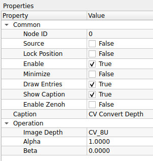
    

    ### 1. Common (การตั้งค่าทั่วไป)
    | Property | Default | คำอธิบาย |
    | :--- | :--- | :--- |
    | **Node ID** | `0` | เลขประจำตัวลำดับของโหนด |
    | **Source** | `False` | โหนดนี้ไม่ใช่ Source (ต้องรับภาพ Input เข้ามา) |
    | **Lock Position** | `False` | ล็อกตำแหน่งโหนด |
    | **Enable** | `True` | เปิด/ปิด การทำงานของโหนด |
    | **Minimize** | `False` | ย่อขนาดโหนด |
    | **Draw Entries** | `True` | แสดงจุดเชื่อมต่อ (Ports) |
    | **Show Caption** | `True` | แสดงแถบชื่อโหนด |
    | **Enable Zenoh** | `False` | เปิดระบบสื่อสาร Zenoh |
    | **Caption** | `CV Convert Depth` | ชื่อโหนดที่แสดงผลบน Workspace |

    ### 2. Operation (การตั้งค่าการคำนวณ)
    | Property | Default | คำอธิบาย |
    | :--- | :--- | :--- |
    | **Image Depth** | `CV_8U` | ชนิดข้อมูลปลายทางที่ต้องการแปลง (Target Bit Depth) ดูรายละเอียดด้านล่าง |
    | **Alpha** | `1.0000` | ค่าตัวคูณ (Scale Factor) ใช้ขยายหรือลดค่าของพิกเซล (เปรียบเหมือน Contrast/Gain) |
    | **Beta** | `0.0000` | ค่าบวกเพิ่ม (Delta) ใช้เลื่อนค่าของพิกเซลขึ้นหรือลง (เปรียบเหมือน Brightness/Offset) |

    ---

    !!! note "เจาะลึก: ความหมายของ Image Depth"
        รหัสย่อในช่อง Image Depth มีความหมายดังนี้:
        
        * **CV_8U (8-bit Unsigned):** ค่าช่วง 0-255 (ภาพปกติทั่วไปต้องใช้แบบนี้เพื่อแสดงผล)
        * **CV_8S (8-bit Signed):** ค่าช่วง -128 ถึง 127
        * **CV_16U (16-bit Unsigned):** ค่าช่วง 0-65535 (นิยมใช้ในกล้อง Depth Camera หรือภาพทางการแพทย์)
        * **CV_16S (16-bit Signed):** ค่าช่วง -32768 ถึง 32767
        * **CV_32F (32-bit Float):** ทศนิยมความละเอียด 32-bit (นิยมใช้ในกระบวนการคำนวณ AI หรือคณิตศาสตร์ที่ต้องการความละเอียดสูง)
        * **CV_64F (64-bit Float):** ทศนิยมความละเอียด 64-bit (Double precision)

    !!! tip "สูตรการคำนวณ (Calculation Formula)"
        โหนดนี้ทำงานโดยใช้สมการ Linear Transformation ดังนี้:
        
        $$pixel_{out} = (pixel_{in} \times \alpha) + \beta$$
        
        * ถ้าต้องการ **เพิ่มความสว่าง (Brightness):** ให้เพิ่มค่า **Beta** (เช่น 50)
        * ถ้าต้องการ **เพิ่มคอนทราสต์ (Contrast):** ให้เพิ่มค่า **Alpha** (เช่น 1.5 หรือ 2.0)
        * ถ้าต้องการ **แปลง 32-bit Float (ค่า 0.0-1.0) เป็น 8-bit (0-255):** ตั้งค่า `Alpha = 255`, `Beta = 0`, `Image Depth = CV_8U`

??? node "- **CV Thresholding:**"
    

	{width=80}
	

    
    **CV Thresholding** คือโหนดสำหรับการประมวลผลภาพ (Image Processing) ทำหน้าที่ **"คัดแยกข้อมูลภาพแบบทวิภาค (Binary Segmentation)"** โดยการแปลงภาพระดับสีเทา (Grayscale) ให้กลายเป็นภาพขาว-ดำ (Binary Image) ตามค่าเกณฑ์ (Threshold) ที่กำหนด เพื่อใช้ในการแยกวัตถุที่สนใจออกจากพื้นหลัง

    ## **ตารางการตั้งค่า (Properties)**
    

    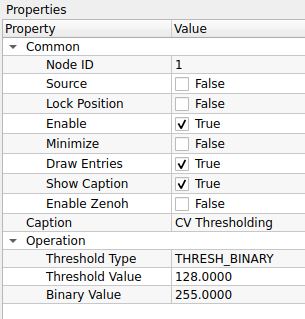
    

    ### 1. Common (การตั้งค่าทั่วไป)
    | Property | Default | คำอธิบาย |
    | :--- | :--- | :--- |
    | **Node ID** | `1` | เลขประจำตัวลำดับของโหนด |
    | **Source** | `False` | โหนดนี้ไม่ใช่ Source (ต้องรับภาพ Input เข้ามา) |
    | **Lock Position** | `False` | ล็อกตำแหน่งโหนด |
    | **Enable** | `True` | เปิด/ปิด การทำงานของโหนด |
    | **Minimize** | `False` | ย่อขนาดโหนด |
    | **Draw Entries** | `True` | แสดงจุดเชื่อมต่อ (Ports) |
    | **Show Caption** | `True` | แสดงแถบชื่อโหนด |
    | **Enable Zenoh** | `False` | เปิดระบบสื่อสาร Zenoh |
    | **Caption** | `CV Thresholding` | ชื่อโหนดที่แสดงผลบน Workspace |

    ### 2. Operation (การตั้งค่าการคำนวณ)
    | Property | Default | คำอธิบาย |
    | :--- | :--- | :--- |
    | **Threshold Type** | `THRESH_BINARY` | รูปแบบการคัดแยก (ดูรายละเอียดด้านล่าง) |
    | **Threshold Value** | `128.0000` | ค่าเกณฑ์กลาง (0-255) ที่ใช้ตัดสินใจ *(ถ้าพิกเซลใดสว่างกว่าค่านี้ จะถูกเปลี่ยนเป็นสีขาว)* |
    | **Binary Value** | `255.0000` | ค่าความสว่างสูงสุดที่จะใส่ให้พิกเซลที่ผ่านเกณฑ์ (ปกติใช้ 255 คือสีขาว) |

    ---

    !!! note "เจาะลึก: Threshold Type (รูปแบบการคัดแยก)"
        การเลือก Type จะเปลี่ยนสมการคณิตศาสตร์ที่ใช้ตัดสินใจ ดังนี้:
        
        * **กลุ่มพื้นฐาน (Basic):**
            * `THRESH_BINARY`: (ยอดนิยม) ถ้าสว่างกว่าเกณฑ์ -> เป็นสีขาว, ถ้ามืดกว่า -> เป็นสีดำ
            * `THRESH_BINARY_INV`: (กลับค่า) ถ้าสว่างกว่าเกณฑ์ -> เป็นสีดำ, ถ้ามืดกว่า -> เป็นสีขาว
            * `THRESH_TRUNC`: ถ้าสว่างกว่าเกณฑ์ -> ให้เท่ากับค่าเกณฑ์ (ตัดยอด), ส่วนที่เหลือคงเดิม
            * `THRESH_TOZERO`: ถ้าสว่างกว่าเกณฑ์ -> คงเดิม, ถ้ามืดกว่า -> เป็นสีดำ (0)
            * `THRESH_TOZERO_INV`: ถ้าสว่างกว่าเกณฑ์ -> เป็นสีดำ (0), ถ้ามืดกว่า -> คงเดิม
            
        * **กลุ่มอัตโนมัติ (Automatic):**
            * `THRESH_OTSU`: คำนวณหาค่า Threshold Value ที่ดีที่สุดให้อัตโนมัติ (เหมาะกับภาพที่มีวัตถุกับพื้นหลังแยกกันชัดเจน)
            * `THRESH_TRIANGLE`: วิธีการหาเกณฑ์อัตโนมัติแบบ Triangle Algorithm
        
        * **กลุ่มปรับตัวตามพื้นที่ (Adaptive):**
            * `ADAPTIVE_THRESH_MEAN_C`: คำนวณเกณฑ์จากค่าเฉลี่ยของพื้นที่รอบๆ (เหมาะกับภาพที่มีแสงเงาไม่เท่ากัน)
            * `ADAPTIVE_THRESH_GAUSSIAN_C`: คำนวณเกณฑ์จากค่าเฉลี่ยถ่วงน้ำหนักแบบ Gaussian (ให้ผลลัพธ์ที่นวลตากว่า Mean)

    !!! tip "วิธีการใช้งาน (Usage Workflow)"
        1.  **Input:** ส่งภาพ Grayscale เข้าสู่โหนด (สำคัญมาก! ต้องเป็นภาพขาวดำเท่านั้น)
        2.  **Adjust:**
            * หากแสงคงที่: เลือก `THRESH_BINARY` และปรับ `Threshold Value` จนได้วัตถุที่ชัดเจน
            * หากแสงไม่คงที่/มีเงา: ลองใช้ `THRESH_OTSU` หรือ `ADAPTIVE_...`
        3.  **Output:** จะได้ภาพขาว-ดำ ที่พร้อมสำหรับงานตรวจจับรูปร่าง (Find Contours)หรืออ่านบาร์โค้ด

??? node "- **CV Canny Edge:**"
    

	{width=80}
	

    **CV Canny Edge** คือโหนดสำหรับการประมวลผลภาพ (Image Processing) ทำหน้าที่ **"ตรวจจับเส้นขอบ (Edge Detection)"** ของวัตถุในภาพโดยใช้อัลกอริทึม Canny ซึ่งมีความแม่นยำสูง ช่วยลดสัญญาณรบกวนและให้ผลลัพธ์เป็นภาพลายเส้นขาว-ดำ (เส้นขอบสีขาว พื้นหลังสีดำ)

    ## **ตารางการตั้งค่า (Properties)**
    

    
    

    ### 1. Common (การตั้งค่าทั่วไป)
    | Property | Default | คำอธิบาย |
    | :--- | :--- | :--- |
    | **Node ID** | `2` | เลขประจำตัวลำดับของโหนด |
    | **Caption** | `CV Canny Edge` | ชื่อโหนดที่แสดงผลบน Workspace |

    ### 2. Image Memory (การจัดการหน่วยความจำภาพ)
    *(ส่วนนี้สำหรับการบริหารจัดการทรัพยากรเครื่องเมื่อรันต่อเนื่อง)*
    | Property | Default | คำอธิบาย |
    | :--- | :--- | :--- |
    | **Sharing Mode** | `Pool Mode` | รูปแบบการจัดการหน่วยความจำ - **Pool Mode:** ใช้หน่วยความจำชุดเดิมวนซ้ำ (ประหยัด RAM เหมาะกับ Video Stream)  - **Broadcast Mode:** สร้างข้อมูลชุดใหม่ทุกครั้ง (กิน RAM มากกว่า) |  
    | **Pool Size** | `3` | จำนวน Buffer ที่เตรียมไว้สำหรับหมุนเวียน (กรณีใช้ Pool Mode) |

    ### 3. Operation (การตั้งค่าอัลกอริทึม)
    | Property | Default | คำอธิบาย |
    | :--- | :--- | :--- |
    | **Kernel Size** | `3` | ขนาดหน้าต่างของ Sobel Operator สำหรับหา Gradient (ต้องเป็นเลขคี่ เช่น 3, 5, 7) |
    | **Upper Threshold** | `90` | ค่าเกณฑ์สูง (High Threshold) ถ้าค่า Gradient เกินนี้ -> เป็นขอบแน่นอน |
    | **Lower Threshold** | `30` | ค่าเกณฑ์ต่ำ (Low Threshold) ถ้าค่า Gradient ต่ำกว่านี้ -> ตัดทิ้งไม่เป็นขอบ |
    | **Use Edge Gradient**| `False` | วิธีการคำนวณขนาด Gradient - **False:** ใช้ L1 Norm $|dx| + |dy|$ (คำนวณเร็ว) - **True:** ใช้ L2 Norm $\sqrt{dx^2 + dy^2}$ (แม่นยำกว่า แต่ช้ากว่าเล็กน้อย) |

    ---

    !!! note "หลักการทำงาน: Hysteresis Thresholding"
        อัลกอริทึม Canny ตัดสินใจว่าจุดไหนเป็นขอบโดยใช้เกณฑ์ 2 ค่า (Upper/Lower) ดังนี้:
        
        1.  **Strong Edge:** จุดที่มีความเข้มเกิน **Upper Threshold** จะถูกนับเป็น "เส้นขอบ" ทันที
        2.  **Weak Edge:** จุดที่มีค่าอยู่ระหว่าง **Lower** และ **Upper** จะถูกพิจารณาว่าเป็นเส้นขอบ *ก็ต่อเมื่อ* จุดนั้นเชื่อมต่ออยู่กับ Strong Edge เท่านั้น
        3.  **No Edge:** จุดที่ต่ำกว่า **Lower Threshold** จะถูกตัดทิ้ง

    !!! tip "เทคนิคการปรับค่า (Tuning Tips)"
        * **อัตราส่วน:** แนะนำให้ตั้งค่า Upper : Lower ในอัตราส่วนประมาณ **2:1** หรือ **3:1** (เช่น Upper=90, Lower=30)
        * **ถ้าเส้นขาด:** ให้ลดค่า Lower Threshold ลง
        * **ถ้ามีจุดรบกวน (Noise) เยอะ:** ให้เพิ่มค่า Upper Threshold หรือ Lower Threshold ขึ้น

    !!! tip "เทคนิค: Pool Mode vs Broadcast Mode"
        * เลือก **Pool Mode** เสมอเมื่อทำงานปกติ (เช่น รับภาพ -> แปลงขอบ -> แสดงผล) เพราะกินแรมน้อยกว่า
        * เลือก **Broadcast Mode** ก็ต่อเมื่อคุณต่อสาย Output ออกไป 2 ทาง แล้วทางหนึ่งมีการ *เขียนทับ* ข้อมูลภาพ แล้วคุณกลัวว่าภาพอีกทางจะเพี้ยนตามไปด้วย

    !!! info "การปรับจูน Threshold"
        แนะนำให้ตั้งค่า **Upper** เป็น 2 ถึง 3 เท่าของ **Lower** (เช่น 90 กับ 30) เพื่อให้เส้นขอบเชื่อมต่อกันดีที่สุด หากเส้นขาดให้ลด Lower ลง หาก Noise เยอะให้เพิ่มทั้งสองค่าขึ้น

    !!! warning "ข้อควรระวัง"
        โหนดนี้ทำงานได้ดีที่สุดกับภาพ **Grayscale** (ขาวดำ) หากส่งภาพสีเข้ามา ระบบมักจะแปลงเป็น Grayscale ให้อัตโนมัติหรือประมวลผลทีละช่องสี ซึ่งอาจกินทรัพยากรเพิ่มขึ้น

??? node "- **CV Color Space:**"
    

	{width=80}
	

    **CV Color Space** คือโหนดสำหรับการประมวลผลภาพ (Image Processing) ทำหน้าที่ **"แปลงระบบสี (Color Space Conversion)"** ของภาพอินพุตจากรูปแบบหนึ่งไปสู่อีกรูปแบบหนึ่ง เช่น แปลงจากภาพสี (BGR) เป็นภาพขาวดำ (Grayscale) เพื่อลดปริมาณข้อมูลก่อนการวิเคราะห์ หรือแปลงเป็น HSV เพื่อใช้ในการตรวจจับวัตถุด้วยสี

    ## **ตารางการตั้งค่า (Properties)**
    

    
    

    ### 1. Common (การตั้งค่าทั่วไป)
    | Property | Default | คำอธิบาย |
    | :--- | :--- | :--- |
    | **Node ID** | `3` | เลขประจำตัวลำดับของโหนด |
    | **Caption** | `CV Color Space` | ชื่อโหนดที่แสดงผลบน Workspace |

    ### 2. Image Memory (การจัดการหน่วยความจำภาพ)
    | Property | Default | คำอธิบาย |
    | :--- | :--- | :--- |
    | **Sharing Mode** | `Pool Mode` | รูปแบบการจัดการหน่วยความจำ: - **Pool Mode:** ใช้หน่วยความจำเดิมวนซ้ำ (เร็ว, ประหยัด RAM) - **Broadcast Mode:** สร้างข้อมูลใหม่แยกออกมา (ปลอดภัยสำหรับการแยกสายงาน) |
    | **Pool Size** | `3` | จำนวน Buffer ที่เตรียมไว้หมุนเวียน (สำหรับ Pool Mode) |

    ### 3. Operation (การตั้งค่าการแปลงสี)
    | Property | Default | คำอธิบาย |
    | :--- | :--- | :--- |
    | **Input Color Space** | `BGR` | รูปแบบสีของภาพต้นทาง (ภาพจาก OpenCV ปกติจะเป็น BGR) |
    | **Output Color Space**| `RGB` | รูปแบบสีปลายทางที่ต้องการแปลง |

    ---

    !!! info "เกร็ดความรู้: ทำไมต้อง BGR?"
        โดยปกติโปรแกรมทั่วไปจะเก็บค่าสีแบบ **RGB** (Red-Green-Blue) แต่ไลบรารี **OpenCV** (ที่เป็นแกนหลักของโหนดนี้) ใช้มาตรฐานแบบ **BGR** (Blue-Green-Red) มาตั้งแต่อดีต
        
        ดังนั้น หากคุณนำภาพจาก OpenCV ไปแสดงผลบนหน้าจอ GUI บางประเภทแล้วสีเพี้ยน (เช่น คนหน้าสีฟ้า) ให้ใช้โหนดนี้แปลง **BGR -> RGB** ก่อนเสมอ

    !!! tip "คู่การแปลงที่ใช้งานบ่อย (Common Conversions)"
        * **BGR $\rightarrow$ Gray:** แปลงภาพสีเป็นขาวดำ (Grayscale) จำเป็นมากก่อนส่งเข้าโหนดพวก *Thresholding*, *Canny Edge* หรือ *Find Contours*
        * **BGR $\rightarrow$ HSV:** แปลงเป็นระบบสี Hue-Saturation-Value เหมาะสำหรับการ "จับคู่สี" (Color Detection) เพราะแยกค่าเนื้อสี (Hue) ออกจากแสงเงา (Value) ได้ชัดเจน
        * **BGR $\rightarrow$ RGB:** แปลงเพื่อนำไปแสดงผลบนหน้าจอ UI ทั่วไปให้สีถูกต้อง

??? node "- **CV Nomolization:**"
    

	{width=80}
	

    **CV Normalization** คือโหนดสำหรับการประมวลผลภาพ (Image Processing) ทำหน้าที่ **"ปรับสเกลค่าของพิกเซล (Pixel Value Scaling)"** ให้อยู่ในช่วงที่กำหนด (เช่น 0-255) หรือปรับมาตรฐานทางคณิตศาสตร์ ช่วยแก้ปัญหาภาพมืดเกินไป ภาพสว่างเกินไป หรือแปลงชนิดข้อมูล (Data Type) ให้เหมาะสมกับการแสดงผล

    ## **ตารางการตั้งค่า (Properties)**
    

    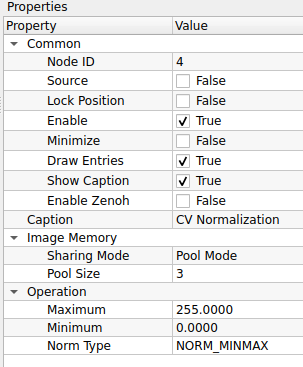
    

    ### 1. Common (การตั้งค่าทั่วไป)
    | Property | Default | คำอธิบาย |
    | :--- | :--- | :--- |
    | **Node ID** | `4` | เลขประจำตัวลำดับของโหนด |
    | **Caption** | `CV Normalization` | ชื่อโหนดที่แสดงผลบน Workspace |

    ### 2. Image Memory (การจัดการหน่วยความจำภาพ)
    | Property | Default | คำอธิบาย |
    | :--- | :--- | :--- |
    | **Sharing Mode** | `Pool Mode` | รูปแบบการจัดการหน่วยความจำ: - **Pool Mode:** ใช้หน่วยความจำเดิมวนซ้ำ (เร็ว, ประหยัด RAM) - **Broadcast Mode:** สร้างข้อมูลใหม่แยกออกมา (ปลอดภัยสำหรับการแยกสายงาน) |
    | **Pool Size** | `3` | จำนวน Buffer ที่เตรียมไว้หมุนเวียน (สำหรับ Pool Mode) |

    ### 3. Operation (การตั้งค่าการคำนวณ)
    | Property | Default | คำอธิบาย |
    | :--- | :--- | :--- |
    | **Maximum** | `255.0000` | ค่าสูงสุดของช่วงเป้าหมาย (Target High) ที่ต้องการปรับค่าไปหา |
    | **Minimum** | `0.0000` | ค่าต่ำสุดของช่วงเป้าหมาย (Target Low) ที่ต้องการปรับค่าไปหา |
    | **Norm Type** | `NORM_MINMAX` | สูตรคณิตศาสตร์ที่ใช้ในการปรับสเกล (ดูรายละเอียดด้านล่าง) |

    ---

    !!! note "เจาะลึก: Norm Type (รูปแบบการปรับสเกล)"
        การเลือก Norm Type จะเปลี่ยนวิธีการคำนวณอย่างสิ้นเชิง:
        
        * **NORM_MINMAX (แนะนำสำหรับ Image Processing):**
            * เป็นการ "ยืด" หรือ "บีบ" ค่าพิกเซลทั้งหมดในภาพ ให้ลงมาอยู่ในช่วง **[Minimum, Maximum]** ที่ตั้งไว้พอดี
            * **ประโยชน์:** ใช้ทำ Contrast Stretching (แก้ภาพซีดให้เข้มขึ้น) หรือแปลงภาพ Float (0.0-1.0) ให้เป็น 8-bit (0-255)
        
        * **NORM_INF, NORM_L1, NORM_L2:**
            * เป็นการหารค่าพิกเซลด้วยค่าทางคณิตศาสตร์ (Infinite norm, Absolute sum, Euclidean norm)
            * **ประโยชน์:** มักใช้ในการเตรียมข้อมูลสำหรับ AI/Machine Learning หรือคำนวณ Histogram ไม่ค่อยใช้กับการปรับแต่งภาพเพื่อการมองเห็นทั่วไป

    !!! tip "วิธีการใช้งาน (Usage Workflow)"
        **กรณีที่ 1: แก้ภาพซีด (Contrast Stretching)**
        1. ภาพต้นฉบับอาจมีค่าสีแค่ช่วงกลางๆ (เช่น 100-150) ทำให้ภาพดูมัวๆ
        2. ใช้โหนดนี้ ตั้งค่า `Norm Type = NORM_MINMAX`, `Min = 0`, `Max = 255`
        3. ผลลัพธ์: ส่วนที่มืดสุดจะถูกดึงไปที่ 0 และสว่างสุดไปที่ 255 ทำให้ภาพดูคมชัดขึ้นทันที

        **กรณีที่ 2: แปลงภาพ Float**
        1. รับภาพมาจากโหนดคำนวณที่ให้ค่าเป็นทศนิยม (เช่น 0.0 - 1.0)
        2. ใช้โหนดนี้ปรับให้เป็นช่วง 0 - 255 ก่อนส่งไปแสดงผลที่ **Display Image**

??? node "- **CV RGB Values:**"
    

	{width=80}
	

    **CV RGB Values** คือโหนดสำหรับกำหนด **"ค่าสี (Color Value)"** โดยระบุส่วนประกอบของสีแดง (Red), เขียว (Green), และน้ำเงิน (Blue) เพื่อใช้เป็นข้อมูลนำเข้า (Input) ให้กับโหนดที่ต้องการพารามิเตอร์เรื่องสี เช่น โหนดวาดรูปทรง (Draw Shapes) หรือโหนดเขียนข้อความ (Put Text)

    ## **ตารางการตั้งค่า (Properties)**
    

    
    

    ### 1. Common (การตั้งค่าทั่วไป)
    | Property | Default | คำอธิบาย |
    | :--- | :--- | :--- |
    | **Node ID** | `0` | เลขประจำตัวลำดับของโหนด |
    | **Source** | `False` | สถานะของโหนด (ในที่นี้ทำหน้าที่ส่งค่าสีออกไป) |
    | **Lock Position** | `False` | ล็อกตำแหน่งโหนด |
    | **Enable** | `True` | เปิด/ปิด การทำงานของโหนด |
    | **Minimize** | `False` | ย่อขนาดโหนด |
    | **Draw Entries** | `True` | แสดงจุดเชื่อมต่อ (Ports) |
    | **Show Caption** | `True` | แสดงแถบชื่อโหนด |
    | **Enable Zenoh** | `False` | เปิดระบบสื่อสาร Zenoh |
    | **Caption** | `CV RGB Values` | ชื่อโหนดที่แสดงผลบน Workspace |

    ### 2. Operation (การกำหนดค่าสี)
    | Property | Default | คำอธิบาย |
    | :--- | :--- | :--- |
    | **R Value** | `0` | ค่าความเข้มของสีแดง (Red) ช่วง 0-255 |
    | **G Value** | `0` | ค่าความเข้มของสีเขียว (Green) ช่วง 0-255 |
    | **B Value** | `0` | ค่าความเข้มของสีน้ำเงิน (Blue) ช่วง 0-255 |

    ---

    !!! tip "ตัวอย่างการผสมสี (Color Mixing Guide)"
        คุณสามารถกำหนดค่า R, G, B เพื่อสร้างสีต่างๆ ได้ดังนี้:
        
        * **สีดำ (Black):** R=0, G=0, B=0
        * **สีขาว (White):** R=255, G=255, B=255
        * **สีแดง (Red):** R=255, G=0, B=0
        * **สีเขียว (Green):** R=0, G=255, B=0
        * **สีน้ำเงิน (Blue):** R=0, G=0, B=255
        * **สีเหลือง (Yellow):** R=255, G=255, B=0
        * **สีม่วง (Magenta):** R=255, G=0, B=255
        * **สีฟ้า (Cyan):** R=0, G=255, B=255

    !!! info "วิธีการใช้งาน (Usage Workflow)"
        โหนดนี้มักใช้ร่วมกับโหนดกลุ่ม **Drawing** (การวาดภาพ):
        1.  สร้างโหนด **CV RGB Values** และตั้งค่าสีที่ต้องการ (เช่น สีแดง)
        2.  ลากสายจาก Output ของโหนดนี้ ไปเข้าที่พอร์ต **Color** ของโหนดปลายทาง (เช่น **Draw Rectangle** หรือ **Put Text**)
        3.  รูปทรงหรือข้อความที่วาดออกมา จะแสดงผลตามสีที่คุณตั้งค่าไว้

??? node "- **CV RGB to Gray:**"
    

	{width=80}
	

    **CV RGB to Gray** คือโหนดสำหรับการประมวลผลภาพ (Image Processing) ทำหน้าที่ **"แปลงภาพสี (RGB/BGR) ให้เป็นภาพขาวดำ (Grayscale)"** แบบช่องสัญญาณเดียว (Single Channel) เพื่อลดปริมาณข้อมูลและเตรียมภาพสำหรับอัลกอริทึมที่ต้องการความเข้มแสงเพียงอย่างเดียว เช่น การตรวจจับขอบ (Edge Detection) หรือการทำ Thresholding

    ## **ตารางการตั้งค่า (Properties)**
    

    
    

    ### 1. Common (การตั้งค่าทั่วไป)
    | Property | Default | คำอธิบาย |
    | :--- | :--- | :--- |
    | **Node ID** | `1` | เลขประจำตัวลำดับของโหนด |
    | **Source** | `False` | โหนดนี้ไม่ใช่ Source (ต้องรับภาพสีเข้ามา) |
    | **Lock Position** | `False` | ล็อกตำแหน่งโหนด |
    | **Enable** | `True` | เปิด/ปิด การทำงานของโหนด |
    | **Minimize** | `False` | ย่อขนาดโหนด |
    | **Draw Entries** | `True` | แสดงจุดเชื่อมต่อ (Ports) |
    | **Show Caption** | `True` | แสดงแถบชื่อโหนด |
    | **Enable Zenoh** | `False` | เปิดระบบสื่อสาร Zenoh |
    | **Caption** | `CV RGB to Gray` | ชื่อโหนดที่แสดงผลบน Workspace |

    ### 2. Image Memory (การจัดการหน่วยความจำภาพ)
    | Property | Default | คำอธิบาย |
    | :--- | :--- | :--- |
    | **Sharing Mode** | `Pool Mode` | รูปแบบการจัดการหน่วยความจำ: - **Pool Mode:** ใช้หน่วยความจำเดิมวนซ้ำ (เร็ว, ประหยัด RAM) - **Broadcast Mode:** สร้างข้อมูลใหม่แยกออกมา (ปลอดภัยสำหรับการแยกสายงาน) |
    | **Pool Size** | `3` | จำนวน Buffer ที่เตรียมไว้หมุนเวียน (สำหรับ Pool Mode) |

    ---

    !!! success "ข้อดีของการใช้โหนดนี้ (Why use this?)"
        แม้ว่าคุณจะสามารถใช้โหนด **CV Color Space** เพื่อแปลงเป็น Grayscale ได้เช่นกัน แต่โหนด **CV RGB to Gray** ถูกออกแบบมาให้ **"ใช้ง่ายและรวดเร็วกว่า"**
        
        * **ไม่ต้องตั้งค่า:** ไม่ต้องเลือก Input/Output Mode เอง ระบบจัดการให้เสร็จสรรพ
        * **ลดความผิดพลาด:** ป้องกันการเลือกโหมดผิด (เช่น เผลอเลือก BGR -> HSV)

    !!! tip "เทคนิคการใช้งาน (Usage Workflow)"
        โหนดนี้คือ **"ด่านแรก"** ของอัลกอริทึมส่วนใหญ่:
        1.  รับภาพสีจากกล้อง (Camera) หรือไฟล์ภาพ
        2.  ส่งเข้า **CV RGB to Gray** ทันที
        3.  ส่งภาพขาวดำที่ได้ไปทำต่อ เช่น:
            * เข้า **CV Thresholding** เพื่อแยกวัตถุ
            * เข้า **CV Canny Edge** เพื่อหาเส้นขอบ
            * เข้า **CV Find Contours** เพื่อหาพื้นที่

??? node "- **CV split Image:**"
    

	{width=80}
	

    **CV Split Image** คือโหนดสำหรับการจัดการข้อมูลภาพ (Image Manipulation) ทำหน้าที่ **"แยกช่องสัญญาณสี (Split Channels)"** ของภาพอินพุตให้ออกมาเป็นภาพย่อยๆ ตามจำนวนช่องสีที่มี (Multi-channel to Single-channel) เช่น แยกภาพสี BGR ออกเป็นภาพขาวดำ 3 ภาพ (Blue, Green, Red) เพื่อนำไปประมวลผลแยกกัน

    ## **ตารางการตั้งค่า (Properties)**
    

    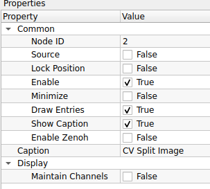
    

    ### 1. Common (การตั้งค่าทั่วไป)
    | Property | Default | คำอธิบาย |
    | :--- | :--- | :--- |
    | **Node ID** | `2` | เลขประจำตัวลำดับของโหนด |
    | **Source** | `False` | โหนดนี้ไม่ใช่ Source (ต้องรับภาพ Input เข้ามา) |
    | **Lock Position** | `False` | ล็อกตำแหน่งโหนด |
    | **Enable** | `True` | เปิด/ปิด การทำงานของโหนด |
    | **Minimize** | `False` | ย่อขนาดโหนด |
    | **Draw Entries** | `True` | แสดงจุดเชื่อมต่อ (Ports) |
    | **Show Caption** | `True` | แสดงแถบชื่อโหนด |
    | **Enable Zenoh** | `False` | เปิดระบบสื่อสาร Zenoh |
    | **Caption** | `CV Split Image` | ชื่อโหนดที่แสดงผลบน Workspace |

    ### 2. Display (การตั้งค่าการแสดงผล)
    | Property | Default | คำอธิบาย |
    | :--- | :--- | :--- |
    | **Maintain Channels** | `False` | รูปแบบข้อมูลขาออก: - **False:** ส่งออกเป็นภาพขาวดำ (Grayscale 1-channel) ตามความเข้มของช่องสีนั้นๆ (นิยมใช้ที่สุด) - **True:** ส่งออกโดยคงคุณสมบัติช่องสีเดิมไว้ (ผลลัพธ์อาจยังเป็น 3-channel แต่มีค่าแค่ช่องเดียว) |

    ---

    !!! tip "วิธีการใช้งาน (Usage Workflow)"
        เมื่อต่อสายจากภาพสี (BGR) เข้ามาที่โหนดนี้ Output Ports จะงอกออกมา 3 ช่องโดยอัตโนมัติ:
        
        1.  **Output 0 (Blue):** ช่องสัญญาณสีน้ำเงิน
        2.  **Output 1 (Green):** ช่องสัญญาณสีเขียว
        3.  **Output 2 (Red):** ช่องสัญญาณสีแดง
        
        *หมายเหตุ: ลำดับ 0-1-2 จะเปลี่ยนไปตาม Color Space ของภาพต้นทาง (เช่นถ้าเป็น HSV ช่อง 0 จะเป็น Hue)*

    !!! info "ตัวอย่างการประยุกต์ใช้ (Use Case)"
        * **HSV Color Detection:** แปลงภาพเป็น HSV ก่อน -> เข้าโหนด **CV Split Image** -> ดึงเฉพาะขา **S (Saturation)** หรือ **H (Hue)** ไปทำ *Thresholding* เพื่อตรวจจับวัตถุสีสดๆ โดยไม่สนใจแสงเงา
        * **Red Light Detection:** แยกช่องสี Red ออกมา แล้วนำไปหาค่าความสว่างสูงสุด เพื่อดูว่าไฟสีแดงติดอยู่หรือไม่

??? node "- **CV Invert Grascale:**"
    

	{width=80}
	

    
    **CV Invert Grayscale** คือโหนดสำหรับการประมวลผลภาพ (Image Processing) ทำหน้าที่ **"กลับค่าความเข้มแสง (Bitwise NOT / Inversion)"** ของภาพขาวดำ โดยการเปลี่ยนพิกเซลสีดำให้เป็นขาว และสีขาวให้เป็นดำ ($NewValue = 255 - OldValue$) เปรียบเสมือนการสร้างภาพฟิล์มเนกาทีฟ

    ## **ตารางการตั้งค่า (Properties)**
    

    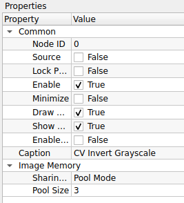
    

    ### 1. Common (การตั้งค่าทั่วไป)
    | Property | Default | คำอธิบาย |
    | :--- | :--- | :--- |
    | **Node ID** | `0` | เลขประจำตัวลำดับของโหนด |
    | **Source** | `False` | โหนดนี้ไม่ใช่ Source (ต้องรับภาพ Input เข้ามา) |
    | **Lock Position** | `False` | ล็อกตำแหน่งโหนด |
    | **Enable** | `True` | เปิด/ปิด การทำงานของโหนด |
    | **Minimize** | `False` | ย่อขนาดโหนด |
    | **Draw Entries** | `True` | แสดงจุดเชื่อมต่อ (Ports) |
    | **Show Caption** | `True` | แสดงแถบชื่อโหนด |
    | **Enable Zenoh** | `False` | เปิดระบบสื่อสาร Zenoh |
    | **Caption** | `CV Invert Grayscale` | ชื่อโหนดที่แสดงผลบน Workspace |

    ### 2. Image Memory (การจัดการหน่วยความจำภาพ)
    | Property | Default | คำอธิบาย |
    | :--- | :--- | :--- |
    | **Sharing Mode** | `Pool Mode` | รูปแบบการจัดการหน่วยความจำ: - **Pool Mode:** ใช้หน่วยความจำเดิมวนซ้ำ (ประหยัด RAM) - **Broadcast Mode:** สร้างข้อมูลใหม่แยกออกมา (ปลอดภัยสำหรับการแยกสายงาน) |
    | **Pool Size** | `3` | จำนวน Buffer ที่เตรียมไว้หมุนเวียน (สำหรับ Pool Mode) |

    ---

    !!! tip "เทคนิค: ทำไมต้องกลับสี? (Why Invert?)"
        อัลกอริทึมส่วนใหญ่ใน Computer Vision (เช่น *Find Contours*) มักถูกออกแบบมาให้ตรวจจับ **"วัตถุสีขาว บนพื้นหลังสีดำ"**
        
        * **ปัญหา:** หากคุณถ่ายภาพ "ตัวหนังสือสีดำ บนกระดาษสีขาว" มา โปรแกรมอาจจะมองเห็นกระดาษเป็นวัตถุแทน
        * **ทางแก้:** ส่งภาพเข้าโหนด **CV Invert Grayscale** -> ตัวหนังสือจะกลายเป็นสีขาว และกระดาษจะกลายเป็นสีดำ -> โปรแกรมจะจับตัวหนังสือได้ทันที!

    !!! warning "ข้อควรระวัง"
        โหนดนี้รับ input เป็นภาพ **Grayscale (ช่องสัญญาณเดียว)** เท่านั้น หากคุณส่งภาพสีเข้ามา ควรผ่านโหนด *CV RGB to Gray* หรือ *CV Color Space* ก่อน

## 7. Image Enhancement (การปรับปรุงคุณภาพภาพ)
ช่วยปรับภาพให้ชัดเจนขึ้น หรือปรับแสงสีให้เหมาะสม

	

??? node "- **CV CLAHE Equalization:**"
    

    {width=80}
    

    ### 1. Common (การตั้งค่าทั่วไป)
    | Property | Default | คำอธิบาย |
    | :--- | :--- | :--- |
    | **Node ID** | `0` | เลขประจำตัวลำดับของโหนด |
    | **Caption** | `CV CLAHE Equalization` | ชื่อโหนดที่แสดงผลบน Workspace |

    ### 2. Image Memory (การจัดการหน่วยความจำภาพ)
    | Property | Default | คำอธิบาย |
    | :--- | :--- | :--- |
    | **Sharing Mode** | `Pool Mode` | รูปแบบการจัดการหน่วยความจำ: - **Pool Mode:** ใช้หน่วยความจำเดิมวนซ้ำ (ประหยัด RAM) - **Broadcast Mode:** สร้างสำเนาข้อมูลใหม่แยกออกมา (ปลอดภัยที่สุดหากมีการต่อสายแยกไปหลายทาง) |
    | **Pool Size** | `3` | จำนวน Buffer ที่เตรียมไว้ (สำหรับ Pool Mode) |

    ### 3. Operation (การปรับตั้งค่า CLAHE)
    | Property | Default | คำอธิบาย |
    | :--- | :--- | :--- |
    | **Clip Limit** | `2.0000` | ค่าจำกัดความเปรียบต่าง (Contrast Limit) - **ค่าน้อย:** ภาพดูนวลเป็นธรรมชาติ - **ค่ามาก:** เห็นรายละเอียดชัดมาก แต่ Noise (จุดรบกวน) จะเยอะตามไปด้วย (แนะนำ 2.0 - 4.0) |
    | **Tile Size** | `8` | ขนาดตารางที่จะแบ่งภาพ (Grid Size) เช่น `8` คือแบ่งเป็น 8x8 ช่อง - ช่องเล็กเกินไปอาจทำให้ภาพดูเป็นกระเบื้อง - ช่องใหญ่ไปจะคล้าย Equalization แบบปกติ |
    | **Apply On Color Luma**| `True` | **(แนะนำ)** หากเป็นภาพสี ระบบจะแปลงโหมดสีเพื่อปรับเฉพาะค่าความสว่าง (Luma/Lightness) ทำให้สีไม่เพี้ยน |
    | **Color Space** | `YCrCb` | พื้นที่สีที่ใช้แยกความสว่าง (เมื่อเปิดโหมด Apply On Color Luma): - **YCrCb:** แยกช่อง Y (Luma) ออกมา (รวดเร็ว เป็นมาตรฐานวิดีโอ) - **Lab:** แยกช่อง L (Lightness) ออกมา (มีความแม่นยำสูงในเชิงการมองเห็นของมนุษย์) |
    | **Convert Non-8U** | `False` | แปลงข้อมูลเป็น 8-bit (0-255) อัตโนมัติหาก Input มาเป็นแบบอื่น |

    ---

    !!! tip "ความแตกต่าง: CLAHE vs Histogram Equalization ปกติ"
        * **Histogram Equalization (ปกติ):** ปรับแสงทั้งภาพพร้อมกัน ถ้าภาพมีจุดมืดมากกับสว่างมาก จะทำให้ส่วนสว่าง "ขาวโพลน" จนรายละเอียดหาย
        * **CLAHE (ตัวนี้):** ฉลาดกว่า เพราะปรับทีละส่วน ทำให้รายละเอียดในเงามืดก็เห็น ในที่สว่างก็ยังเห็นครบถ้วน

    !!! example "การนำไปประยุกต์ใช้"
        * **แก้ภาพย้อนแสง:** ช่วยดึงหน้าคนในเงามืดให้สว่างขึ้น โดยที่ท้องฟ้าด้านหลังไม่ขาวโพลน
        * **เตรียมภาพก่อน AI:** ช่วยให้ AI เห็นขอบวัตถุชัดขึ้นในทุกสภาพแสง (เช่น การอ่านป้ายทะเบียนรถตอนกลางคืน)

??? node "- **CV Histogram Equalization:**"
    

    {width=80}
     

    **CV Histogram Equalization** คือโหนดสำหรับการปรับปรุงคุณภาพภาพ (Image Enhancement) ทำหน้าที่ **"เกลี่ยค่าความสว่าง (Global Histogram Equalization)"** โดยนำค่าความถี่ของเม็ดสีมาคำนวณใหม่ให้กระจายตัวครอบคลุมช่วงความสว่างตั้งแต่ 0-255 ทำให้ภาพที่มีความเปรียบต่างต่ำ (เช่น ภาพมัวๆ ซีดๆ) กลับมามีความเปรียบต่างสูงและเห็นรายละเอียดชัดเจนขึ้น

    ## **ตารางการตั้งค่า (Properties)**
    

    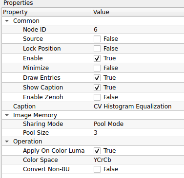
    

    ### 1. Common (การตั้งค่าทั่วไป)
    | Property | Default | คำอธิบาย |
    | :--- | :--- | :--- |
    | **Node ID** | `6` | เลขประจำตัวลำดับของโหนด |
    | **Caption** | `CV Histogram Equalization` | ชื่อโหนดที่แสดงผลบน Workspace |

    ### 2. Image Memory (การจัดการหน่วยความจำภาพ)
    | Property | Default | คำอธิบาย |
    | :--- | :--- | :--- |
    | **Sharing Mode** | `Pool Mode` | รูปแบบการจัดการหน่วยความจำ: - **Pool Mode:** ใช้หน่วยความจำเดิมวนซ้ำ (เร็ว, ประหยัด RAM) - **Broadcast Mode:** สร้างข้อมูลใหม่แยกออกมา (ปลอดภัยสำหรับการแยกสายงาน) |
    | **Pool Size** | `3` | จำนวน Buffer ที่เตรียมไว้หมุนเวียน (สำหรับ Pool Mode) |

    ### 3. Operation (การปรับตั้งค่า)
    | Property | Default | คำอธิบาย |
    | :--- | :--- | :--- |
    | **Apply On Color Luma**| `True` | **(แนะนำ)** หากเป็นภาพสี ระบบจะแปลงเป็นโหมดอื่นเพื่อปรับเฉพาะค่าความสว่าง (Luma) แล้วแปลงกลับ ทำให้สีไม่เพี้ยน |
    | **Color Space** | `YCrCb` | พื้นที่สีที่ใช้ในการแยกความสว่าง (เมื่อเปิดโหมด Apply On Color Luma) เลือกได้ดังนี้: - **YCrCb:** มาตรฐานทั่วไป แยก Luma (Y) ได้ดี - **Lab:** พื้นที่สีแบบ Perceptual แยกความสว่าง (L) ได้แม่นยำกว่าในบางกรณี |
    | **Convert Non-8U** | `False` | แปลงข้อมูลเป็น 8-bit (0-255) อัตโนมัติหาก Input มาเป็นแบบอื่น |

    ---

    !!! warning "ข้อควรระวัง: เทียบกับ CLAHE"
        โหนดนี้ใช้วิธีปรับแบบ **"Global" (ทั้งภาพใช้สูตรเดียวกัน)** ซึ่งมีข้อดีคือทำงานเร็วมาก แต่มีข้อเสียคือ:
        
        * **ถ้าภาพมี Noise:** จุดรบกวนจะถูกเร่งให้ชัดขึ้นอย่างน่าตกใจ
        * **ถ้าภาพมีส่วนสว่างอยู่แล้ว:** อาจทำให้ส่วนนั้น "ขาวโพลน" (Washed out) จนมองไม่เห็นรายละเอียด
        * *ทางแก้:* หากเจออาการข้างต้น ให้เปลี่ยนไปใช้โหนด **CV CLAHE Equalization** แทนครับ

    !!! info "เกร็ดความรู้: YCrCb vs Lab"
        * **YCrCb:** เป็นระบบสีที่ใช้ใน Video Compression ทั่วไป ทำงานได้รวดเร็ว
        * **Lab:** ถูกออกแบบมาให้ใกล้เคียงกับการมองเห็นของมนุษย์ที่สุด ช่อง **L (Lightness)** ของ Lab จะเป็นตัวแทนความสว่างที่แท้จริงมากกว่า YCrCb เล็กน้อย ถ้าเน้นความแม่นยำสูงลองเปลี่ยนเป็น Lab ดูได้ครับ

## 8. Image Modification (การดัดแปลงภาพ)
การวาดหรือแก้ไขข้อมูลบนภาพโดยตรง

	

??? node "- **CV Gaussian Blur:**"
    

    {width=80}
    

    **CV Gaussian Blur** คือโหนดสำหรับการปรับปรุงคุณภาพภาพ (Image Filtering) ทำหน้าที่ **"เบลอภาพแบบเกาส์เซียน (Gaussian Smoothing)"** ซึ่งเป็นการนำค่าเฉลี่ยถ่วงน้ำหนัก (Weighted Average) ของพิกเซลรอบข้างมาคำนวณ โดยให้ความสำคัญกับพิกเซลตรงกลางมากที่สุด ผลลัพธ์ที่ได้คือภาพที่ดูนวลขึ้นและจุดรบกวน (Noise) ลดลงอย่างมีประสิทธิภาพ

    ## **ตารางการตั้งค่า (Properties)**
    

    
    

    ### 1. Common (การตั้งค่าทั่วไป)
    | Property | Default | คำอธิบาย |
    | :--- | :--- | :--- |
    | **Node ID** | `7` | เลขประจำตัวลำดับของโหนด |
    | **Caption** | `CV Gaussian Blur` | ชื่อโหนดที่แสดงผลบน Workspace |

    ### 2. Image Memory (การจัดการหน่วยความจำภาพ)
    | Property | Default | คำอธิบาย |
    | :--- | :--- | :--- |
    | **Sharing Mode** | `Pool Mode` | รูปแบบการจัดการหน่วยความจำ (Pool Mode / Broadcast Mode) |
    | **Pool Size** | `3` | จำนวน Buffer ที่เตรียมไว้ |

    ### 3. Operation (การตั้งค่าความเบลอ)
    | Property | Default | คำอธิบาย |
    | :--- | :--- | :--- |
    | **Kernel Size** | `5 x 5` | ขนาดหน้าต่างที่จะนำมาคำนวณเฉลี่ย (Width x Height) - **กฎเหล็ก:** ค่าต้องเป็น **เลขคี่** เท่านั้น (เช่น 3, 5, 7, 9...) - **ค่ายิ่งมาก:** ภาพยิ่งเบลอมาก |
    | **Sigma X** | `0.0000` | ค่าเบี่ยงเบนมาตรฐานแกน X (Gaussian Standard Deviation) - **ถ้าใส่ 0:** ระบบจะคำนวณให้อัตโนมัติจากขนาด Kernel (แนะนำ) - **ถ้าใส่ค่าเอง:** จะเป็นการคุมความ "ฟุ้ง" ของการเบลออย่างละเอียด |
    | **Sigma Y** | `0.0000` | ค่าเบี่ยงเบนมาตรฐานแกน Y (ปกติใส่ 0 เพื่อให้เท่ากับแกน X) |

    ### 4. Display (การแสดงผลขอบภาพ)
    | Property | Default | คำอธิบาย |
    | :--- | :--- | :--- |
    | **Border Type** | `DEFAULT` | วิธีการจัดการกับพิกเซลที่อยู่ขอบภาพ (Edge Handling) เมื่อ Kernel ยื่นออกไปนอกภาพ: - **DEFAULT:** ใช้ค่ามาตรฐาน (Reflect 101) - **CONSTANT:** เติมขอบด้วยสีดำ (ค่าคงที่) - **REPLICATE:** ทำซ้ำพิกเซลตัวสุดท้ายของขอบ (ยืดขอบออกไป) - **REFLECT:** สะท้อนภาพเหมือนกระจก - **WRAP:** วนกลับไปเอาภาพจากอีกฝั่งมาแปะ (เหมือนปูกระเบื้อง) - **TRANSPARENT:** ไม่เปลี่ยนแปลงพิกเซลเป้าหมาย - **ISOLATED:** ไม่สนใจพิกเซลนอกพื้นที่ ROI |

    ---

    !!! tip "เทคนิค: Kernel Size เลือกยังไงดี?"
        * **3 x 3:** เบลอนิดเดียว ใช้ลด Noise เม็ดเล็กๆ โดยยังคงรายละเอียดภาพไว้ได้ดี
        * **5 x 5 (ค่าแนะนำ):** ค่ากลางๆ เหมาะสำหรับลบรอยยับ หรือ Noise ทั่วไป
        * **9 x 9 ขึ้นไป:** เบลอจนภาพมัว เหมาะสำหรับทำ Background เบลอ หรือต้องการลบรายละเอียดทิ้งไปเลย

    !!! info "Use Case: ทำไมต้องเบลอก่อน?"
        การใช้โหนดนี้ต่อ **"ก่อน"** ที่จะเข้าโหนด *Canny Edge Detection* หรือ *Find Contours* จะช่วยลดเส้นยุบยิบ (False Edges) ที่เกิดจากฝุ่นหรือแสงรบกวนได้มหาศาลครับ ทำให้โปรแกรมจับวัตถุได้แม่นยำขึ้นมาก

??? node "- **CV Erode and Dilate:**"
    

    {width=80}
    

    **CV Erode and Dilate** คือโหนดสำหรับการปรับแต่งรูปทรงของวัตถุในภาพ (Morphological Transformations) โดยอาศัยการเลื่อนหน้าต่าง (Kernel) ไปทั่วภาพเพื่อปรับเปลี่ยนพิกเซลตามเงื่อนไขทางเรขาคณิต นิยมใช้มากที่สุดในการทำความสะอาดภาพ Mask ขาวดำ (Binary Mask) เช่น การลบจุด Noise เล็กๆ หรือการอุดรูรั่วในวัตถุ

    ## **ตารางการตั้งค่า (Properties)**
    

    
    

    ### 1. Common (การตั้งค่าทั่วไป)
    | Property | Default | คำอธิบาย |
    | :--- | :--- | :--- |
    | **Node ID** | `8` | เลขประจำตัวลำดับของโหนด |
    | **Caption** | `CV Erode and Dilate` | ชื่อโหนดที่แสดงผลบน Workspace |

    ### 2. Image Memory (การจัดการหน่วยความจำภาพ)
    | Property | Default | คำอธิบาย |
    | :--- | :--- | :--- |
    | **Sharing Mode** | `Pool Mode` | รูปแบบการจัดการหน่วยความจำ: - **Pool Mode:** ใช้หน่วยความจำเดิมวนซ้ำ (ประหยัด RAM) - **Broadcast Mode:** สร้างสำเนาข้อมูลใหม่แยกออกมา (ปลอดภัยที่สุดหากมีการต่อสายแยกไปหลายทาง) |
    | **Pool Size** | `3` | จำนวน Buffer ที่เตรียมไว้ |

    ### 3. Operation (การตั้งค่ารูปร่าง Kernel)
    | Property | Default | คำอธิบาย |
    | :--- | :--- | :--- |
    | **Kernel Shape** | `MORPH_RECT` | รูปร่างของหน้าต่างที่จะนำมาทาบ (Structuring Element): - **MORPH_RECT:** สี่เหลี่ยมเต็ม (นิยมสุด เก็บรายละเอียดขอบได้ดี) - **MORPH_CROSS:** รูปกากบาท (กินพื้นที่น้อยกว่า เหมาะกับเส้นตัดกัน) - **MORTH_ELLIPSE:** รูปวงรี (เหมาะสำหรับวัตถุที่มีความโค้งมนหรือทรงกลม) |
    | **Kernel Size** | `3 x 3` | ขนาดของหน้าต่าง (Width x Height) ต้องเป็นเลขคี่ (3, 5, 7) - **เล็ก:** เก็บรายละเอียดขอบได้ดี - **ใหญ่:** ผลลัพธ์จะเปลี่ยนแปลงรุนแรง (เช่น ลบ Noise ได้เกลี้ยงแต่ของหาย) |
    | **Anchor Point** | `(-1, -1)` | จุดศูนย์กลางอ้างอิงของ Kernel (ปกติใช้ -1, -1 คือให้ระบบหาจุดกึ่งกลางเอง) |
    | **Iterations** | `1` | จำนวนรอบในการทำซ้ำ - ยิ่งใส่เลขเยอะ ภาพจะยิ่งถูกกร่อนหรือขยายมากขึ้นเป็นทวีคูณ |

    ### 4. Display (การแสดงผลขอบภาพ)
    | Property | Default | คำอธิบาย |
    | :--- | :--- | :--- |
    | **Border Type** | `DEFAULT` | วิธีการจัดการขอบภาพเมื่อ Kernel ยื่นออกไปนอกภาพ: - **DEFAULT:** ใช้ค่ามาตรฐาน (Reflect 101) - **CONSTANT:** เติมขอบด้วยสีดำ (ค่าคงที่) - **REPLICATE:** ทำซ้ำพิกเซลตัวสุดท้ายของขอบ (ยืดขอบออกไป) - **REFLECT:** สะท้อนภาพเหมือนกระจก - **WRAP:** วนกลับไปเอาภาพจากอีกฝั่งมาแปะ (เหมือนปูกระเบื้อง) - **TRANSPARENT:** ไม่เปลี่ยนแปลงพิกเซลเป้าหมาย - **ISOLATED:** ไม่สนใจพิกเซลนอกพื้นที่ ROI |

    ---

    !!! tip "ความแตกต่าง: Erode vs Dilate"
        ถึงชื่อโหนดจะรวมกัน แต่หลักการทำงานต่างกันคนละขั้ว:
        
        * **Erode (การกร่อน):** ทำให้พื้นที่สีขาว **"หดเล็กลง"**
            * *ประโยชน์:* ใช้ "ลบ" จุด Noise สีขาวเล็กๆ ที่กระจายอยู่ทิ้งไป หรือแยกวัตถุ 2 ชิ้นที่ติดกันอยู่นิดๆ ให้ขาดออกจากกัน
        * **Dilate (การขยาย):** ทำให้พื้นที่สีขาว **"ขยายใหญ่ขึ้น"**
            * *ประโยชน์:* ใช้ "เชื่อม" เส้นที่ขาดๆ หายๆ ให้ต่อกัน หรือ "อุดรู" สีดำที่แหว่งอยู่ในวัตถุสีขาว

    !!! example "สูตรลับ: การกำจัด Noise (Opening & Closing)"
        เรามักใช้ 2 อย่างนี้คู่กันเสมอ:
        
        1.  **Opening (Erode -> Dilate):** ใช้ลบจุดรบกวน (Noise) ภายนอกวัตถุ โดยไม่ทำให้ขนาดวัตถุเปลี่ยน
        2.  **Closing (Dilate -> Erode):** ใช้อุดรูพรุนภายในวัตถุ โดยไม่ทำให้ขนาดวัตถุเปลี่ยน

??? node "- **CV Pixel Iteration:**"
    

    {width=80}
    

    **CV Pixel Iteration** คือโหนด "อเนกประสงค์" สำหรับจัดการข้อมูลในระดับพิกเซล (Pixel-wise Operations) รองรับการทำงานหลากหลายรูปแบบตั้งแต่การนับจำนวนสี การแทนที่สี ไปจนถึงการปรับแต่งค่าความสว่างด้วยสมการคณิตศาสตร์ ขึ้นอยู่กับโหมดที่เลือกใช้งาน

    ## **ตารางการตั้งค่า (Properties)**
    

    
    

    ### 1. Common (การตั้งค่าทั่วไป)
    | Property | Default | คำอธิบาย |
    | :--- | :--- | :--- |
    | **Node ID** | `9` | เลขประจำตัวลำดับของโหนด |
    | **Source** | `False` | โหนดนี้ไม่ใช่ Source |
    | **Enable** | `True` | เปิด/ปิด การทำงานของโหนด |
    | **Show Caption** | `True` | แสดงแถบชื่อโหนด |
    | **Caption** | `CV Pixel Iteration` | ชื่อโหนดที่แสดงผลบน Workspace |

    ### 2. Operation (โหมดการทำงานและตัวแปร)
    | Property | Default | คำอธิบาย |
    | :--- | :--- | :--- |
    | **Operation** | `COUNT` | เลือกรูปแบบการคำนวณ: - **COUNT:** นับจำนวนพิกเซลที่มีสีตรงกับ *Input Color* - **REPLACE:** ค้นหาสี *Input Color* แล้วแทนที่ด้วย *Output Color* - **LINEAR:** ปรับค่าพิกเซลด้วยสูตร $Val \times \alpha + \beta$ (ปรับ Contrast/Brightness) - **INVERSE:** กลับค่าสี (Invert) ให้เป็นตรงกันข้าม |
    | **Input Color (B,G,R)** | `0, 0, 0` | ค่าสีเป้าหมายที่จะค้นหา (ใช้กับโหมด COUNT และ REPLACE) |
    | **Output Color (B,G,R)**| `0, 0, 0` | ค่าสีใหม่ที่จะนำไปแทนที่ (ใช้เฉพาะโหมด REPLACE) |
    | **Alpha** | `1.0000` | ตัวคูณ (Gain) สำหรับโหมด LINEAR (ค่า > 1 เพิ่ม Contrast) |
    | **Beta** | `0.0000` | ตัวบวก (Bias) สำหรับโหมด LINEAR (เพิ่มความสว่าง) |

    ---

    !!! tip "เจาะลึก: แต่ละโหมดใช้งานตอนไหน?"
        * **COUNT (การนับ):** ใช้เช็คว่า "มีวัตถุสีนี้อยู่ในภาพเยอะแค่ไหน?" ผลลัพธ์ที่ได้จะเป็นตัวเลขจำนวนพิกเซล เหมาะใช้เป็นเงื่อนไข Logic (เช่น ถ้าเจอสีแดง > 100 จุด ให้แจ้งเตือน)
        * **REPLACE (การแทนที่):** เหมือนถังสีในโปรแกรม Paint ใช้เปลี่ยนสีเจาะจง เช่น "เปลี่ยนพื้นหลังสีเขียว (Green Screen) ให้เป็นสีดำสนิท"
        * **LINEAR (ปรับแสง):** ใช้ปรับภาพที่มืดหรือจืดชืด
            * สูตร: $NewPixel = OldPixel \times Alpha + Beta$
            * ตัวอย่าง: ตั้ง `Alpha = 1.5` (เร่งสีเข้มขึ้น 50%) และ `Beta = 10` (บวกความสว่างเพิ่มนิดหน่อย)
        * **INVERSE (กลับสี):** เปลี่ยนภาพเป็นฟิล์มเนกาทีฟ (ขาวเป็นดำ ดำเป็นขาว) มักใช้เตรียมภาพก่อนส่งเข้า OCR หรือหาเส้นขอบ

??? node "- **CV Bilateral Filter:**"
    

    {width=80}
    

    **CV Bilateral Filter** คือโหนดสำหรับการปรับปรุงคุณภาพภาพ (Image Filtering) ที่มีความสามารถพิเศษในการ **"ลดสัญญาณรบกวนโดยยังคงรักษาความคมชัดของขอบวัตถุ (Edge-Preserving Smoothing)"** หลักการทำงานคือจะเกลี่ยสีให้เนียนเฉพาะในพื้นที่ที่มีสีใกล้เคียงกันเท่านั้น หากเจอเส้นขอบที่สีตัดกันชัดเจน มันจะหยุดเกลี่ยทันที นิยมใช้มากในการทำ "โหมดหน้าเนียน (Beauty Face)" หรือทำภาพสไตล์การ์ตูน

    ## **ตารางการตั้งค่า (Properties)**
    

    
    

    ### 1. Common (การตั้งค่าทั่วไป)
    | Property | Default | คำอธิบาย |
    | :--- | :--- | :--- |
    | **Node ID** | `10` | เลขประจำตัวลำดับของโหนด |
    | **Caption** | `CV Bilateral Filter` | ชื่อโหนดที่แสดงผลบน Workspace |

    ### 2. Image Memory (การจัดการหน่วยความจำภาพ)
    | Property | Default | คำอธิบาย |
    | :--- | :--- | :--- |
    | **Sharing Mode** | `Pool Mode` | รูปแบบการจัดการหน่วยความจำ: - **Pool Mode:** ใช้หน่วยความจำเดิมวนซ้ำ (ประหยัด RAM) - **Broadcast Mode:** สร้างสำเนาข้อมูลใหม่แยกออกมา (ปลอดภัยที่สุดหากมีการต่อสายแยกไปหลายทาง) |
    | **Pool Size** | `3` | จำนวน Buffer ที่เตรียมไว้ (สำหรับ Pool Mode) |

    ### 3. Operation (การตั้งค่าความเบลอ)
    | Property | Default | คำอธิบาย |
    | :--- | :--- | :--- |
    | **Diameter** | `9` | ขนาดเส้นผ่านศูนย์กลางของพื้นที่รอบพิกเซลที่จะนำมาคำนวณ - **ค่าปกติ:** 5 - 9 (สำหรับ Real-time) - **หมายเหตุ:** ยิ่งค่าเยอะยิ่งคำนวณช้ามาก |
    | **Sigma Color** | `75.0000` | ค่าความต่างของสีที่ยอมให้ผสมกันได้ - **ค่าน้อย:** สีต้องใกล้เคียงกันจริงๆ ถึงจะเบลอ (รักษาขอบดีเยี่ยม) - **ค่ามาก:** สีต่างกันก็จับเบลอหมด (ภาพจะดูเป็นปื้นๆ เหมือนสีน้ำ) |
    | **Sigma Space** | `75.0000` | ค่าระยะห่างของพิกเซลที่มีผลต่อกัน - คล้ายกับ Sigma ใน Gaussian Blur คือยิ่งมากยิ่งเบลอเป็นวงกว้าง |

    ---

    !!! tip "ความแตกต่าง: Bilateral vs Gaussian Blur"
        * **Gaussian Blur:** เบลอแบบไม่สนโลก ทุกอย่างมัวเท่ากันหมด (ทำงานเร็วมาก)
        * **Bilateral Filter:** เบลอแบบเลือกที่รักมักที่ชัง (เนียนเฉพาะผิว ขอบยังคม) **แต่แลกมาด้วยการกินสเปค CPU สูงกว่ามาก**

    !!! example "Use Case: การทำหน้าเนียน (Skin Smoothing)"
        หากต้องการทำโหมดบิวตี้ แนะนำให้ตั้งค่าประมาณนี้:
        
        * **Diameter:** `9` (ไม่กว้างเกินไป)
        * **Sigma Color:** `75` (เกลี่ยสีผิวที่มีรอยด่างดำให้กลืนกัน)
        * **Sigma Space:** `75` (ระยะเกลี่ยพอประมาณ)
        * *ผลลัพธ์:* รูขุมขนและรอยสิวจะหายไป แต่ดวงตาและริมฝีปากยังคมกริบ!

??? node "- **CV Morph Transformation:**"
    

    {width=80}
    

    **CV Morph Transformation** คือโหนดสำหรับการประมวลผลรูปทรงขั้นสูง (Advanced Morphological Operations) ซึ่งเป็นการนำฟังก์ชันพื้นฐานอย่าง Erode และ Dilate มาทำงานร่วมกันตามลำดับขั้นตอน เพื่อแก้ปัญหาทางภาพที่ซับซ้อน เช่น การกำจัด Noise โดยไม่ทำลายขนาดวัตถุ (Opening) หรือการเชื่อมวัตถุที่แตกหักเข้าด้วยกัน (Closing)

    ## **ตารางการตั้งค่า (Properties)**
    

    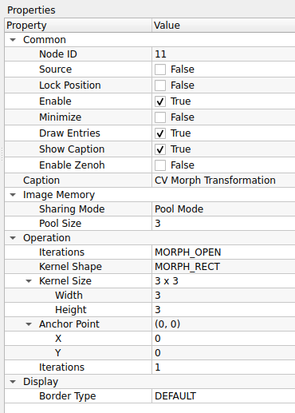
    

    ### 1. Common (การตั้งค่าทั่วไป)
    | Property | Default | คำอธิบาย |
    | :--- | :--- | :--- |
    | **Node ID** | `11` | เลขประจำตัวลำดับของโหนด |
    | **Caption** | `CV Morph Transformation` | ชื่อโหนดที่แสดงผลบน Workspace |

    ### 2. Image Memory (การจัดการหน่วยความจำภาพ)
    | Property | Default | คำอธิบาย |
    | :--- | :--- | :--- |
    | **Sharing Mode** | `Pool Mode` | รูปแบบการจัดการหน่วยความจำ: - **Pool Mode:** ใช้หน่วยความจำเดิมวนซ้ำ (ประหยัด RAM) - **Broadcast Mode:** สร้างสำเนาข้อมูลใหม่แยกออกมา (ปลอดภัยที่สุดหากมีการต่อสายแยกไปหลายทาง) |
    | **Pool Size** | `3` | จำนวน Buffer ที่เตรียมไว้ |

    ### 3. Operation (การตั้งค่ารูปแบบการแปลง)
    | Property | Default | คำอธิบาย |
    | :--- | :--- | :--- |
    | **Iterations** *(Mode)* | `MORPH_OPEN` | *(ชื่อในโปรแกรมซ้ำกับช่องล่าง แต่คือโหมดการทำงาน)* เลือกรูปแบบการแปลง: - **MORPH_OPEN:** Erode $\to$ Dilate (ลบ Noise จุดขาวๆ) - **MORPH_CLOSE:** Dilate $\to$ Erode (อุดรูดำๆ ในวัตถุ) - **MORPH_GRADIENT:** Dilate $-$ Erode (หาเส้นขอบวัตถุ) - **MORPH_TOPHAT:** Input $-$ Opening (เน้นส่วนสว่างกว่ารอบข้าง) - **MORPH_BLACKHAT:** Closing $-$ Input (เน้นส่วนมืดกว่ารอบข้าง) |
    | **Kernel Shape** | `MORPH_RECT` | รูปร่างของหน้าต่าง (Structuring Element): - **MORPH_RECT:** สี่เหลี่ยม (นิยมสุด) - **MORPH_CROSS:** กากบาท - **MORTH_ELLIPSE:** วงรี (ในโปรแกรมสะกดเป็น MORTH) |
    | **Kernel Size** | `3 x 3` | ขนาดหน้าต่างคำนวณ (Width x Height) ต้องเป็นเลขคี่ |
    | **Anchor Point** | `(0, 0)` | จุดอ้างอิงของ Kernel - `(0,0)`: มุมซ้ายบน - `(-1,-1)`: กึ่งกลาง (ค่ามาตรฐานทั่วไป) |
    | **Iterations** *(Count)*| `1` | จำนวนรอบในการทำซ้ำ (ยิ่งเยอะผลลัพธ์ยิ่งชัดเจน) |

    ### 4. Display (การแสดงผลขอบภาพ)
    | Property | Default | คำอธิบาย |
    | :--- | :--- | :--- |
    | **Border Type** | `DEFAULT` | วิธีการจัดการขอบภาพ: - **DEFAULT:** ใช้ค่ามาตรฐาน (Reflect 101) - **CONSTANT:** เติมขอบด้วยสีดำ - **REPLICATE:** ยืดขอบภาพออกไป - **REFLECT:** สะท้อนภาพเหมือนกระจก - **WRAP:** วนภาพกลับมาแปะ - **TRANSPARENT:** ไม่เปลี่ยนแปลง - **ISOLATED:** ไม่สนใจนอกพื้นที่ |

    ---

    !!! warning "ข้อสังเกต: ชื่อ Iterations ซ้ำกัน"
        ในตาราง Operation ของโปรแกรม จะมีหัวข้อชื่อ **"Iterations"** ปรากฏอยู่ 2 บรรทัด:
        
        1.  **บรรทัดบน (Dropdown):** คือ **"โหมดการทำงาน"** (เช่น MORPH_OPEN, MORPH_CLOSE)
        2.  **บรรทัดล่าง (ตัวเลข):** คือ **"จำนวนรอบ"** (Loop count)
        
        *เวลาตั้งค่าโปรดสังเกตที่ **Value** ด้านขวาเป็นหลักครับ*

    !!! tip "เลือกใช้อะไรดี? (Cheat Sheet)"
        * **ถ้าภาพมีจุดฝุ่นขาวๆ เต็มไปหมด:** ใช้ **`MORPH_OPEN`** (ฝุ่นหาย วัตถุหลักยังอยู่เท่าเดิม)
        * **ถ้าตัวหนังสือขาดๆ หายๆ หรือมีรูพรุน:** ใช้ **`MORPH_CLOSE`** (รูจะถูกถมเต็ม ตัวหนังสือจะเชื่อมติดกัน)
        * **ถ้าอยากได้แค่เส้นขอบ (Outline):** ใช้ **`MORPH_GRADIENT`** (จะได้ผลลัพธ์คล้ายโหนด Canny Edge แต่เส้นหนากว่า)

??? node "- **CV Filter 2D:**"
    

    {width=80}
    

    **CV Filter 2D** คือโหนดสำหรับการประมวลผลภาพด้วยการ "คอนโวลูชัน (Convolution)" ซึ่งเป็นการนำตารางตัวเลข (Kernel) ไปคำนวณร่วมกับพิกเซลในภาพเพื่อสร้างเอฟเฟกต์ต่างๆ โหนดนี้มีความยืดหยุ่นสูงสุด เพราะสามารถเปลี่ยนหน้าที่ได้หลากหลายตาม **Kernel Type** ที่เลือก เช่น อาจจะทำหน้าที่เป็นตัวทำให้ภาพคมชัด (Sharpen) หรือหาเส้นขอบ (Edge Detect) ก็ได้

    ## **ตารางการตั้งค่า (Properties)**
    

    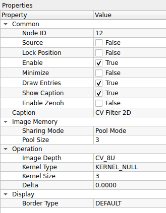
    

    ### 1. Common (การตั้งค่าทั่วไป)
    | Property | Default | คำอธิบาย |
    | :--- | :--- | :--- |
    | **Node ID** | `12` | เลขประจำตัวลำดับของโหนด |
    | **Caption** | `CV Filter 2D` | ชื่อโหนดที่แสดงผลบน Workspace |

    ### 2. Image Memory (การจัดการหน่วยความจำภาพ)
    | Property | Default | คำอธิบาย |
    | :--- | :--- | :--- |
    | **Sharing Mode** | `Pool Mode` | รูปแบบการจัดการหน่วยความจำ: - **Pool Mode:** ใช้หน่วยความจำเดิมวนซ้ำ (ประหยัด RAM) - **Broadcast Mode:** สร้างสำเนาข้อมูลใหม่แยกออกมา (ปลอดภัยที่สุดหากมีการต่อสายแยกไปหลายทาง) |
    | **Pool Size** | `3` | จำนวน Buffer ที่เตรียมไว้ |

    ### 3. Operation (การตั้งค่า Kernel และข้อมูลภาพ)
    | Property | Default | คำอธิบาย |
    | :--- | :--- | :--- |
    | **Image Depth** | `CV_8U` | ความลึกของข้อมูลภาพผลลัพธ์ (Bit Depth): - **CV_8U:** 8-bit Unsigned (ค่า 0-255) เหมาะสำหรับภาพทั่วไป - **CV_32F:** 32-bit Float (เก็บค่าทศนิยมและค่าติดลบได้) เหมาะสำหรับการคำนวณที่ต้องการความละเอียดสูง หรือกันข้อมูลสูญหายจากการคำนวณที่ค่าล้น (Overflow) |
    | **Kernel Type** | `KERNEL_NULL` | รูปแบบของหน้ากากฟิลเตอร์ที่จะใช้ |
    | **Kernel Size** | `3` | ขนาดของหน้าต่างคำนวณ (เช่น 3x3, 5x5) |
    | **Delta** | `0.0000` | ค่าที่จะบวกเพิ่มเข้าไปในผลลัพธ์สุดท้าย (Brightness Offset) - ใช้เพื่อดึงค่าแสงขึ้นในกรณีที่ผลลัพธ์มืดเกินไป |

    ### 4. Display (การแสดงผลขอบภาพ)
    | Property | Default | คำอธิบาย |
    | :--- | :--- | :--- |
    | **Border Type** | `DEFAULT` | วิธีการจัดการขอบภาพเมื่อ Kernel ยื่นออกไปนอกภาพ: - **DEFAULT:** ใช้ค่ามาตรฐาน - **CONSTANT:** เติมขอบด้วยสีดำ (ค่าคงที่) - **REPLICATE:** ยืดขอบภาพออกไป - **REFLECT:** สะท้อนภาพเหมือนกระจก - **WRAP:** วนภาพกลับมาแปะ - **TRANSPARENT:** ไม่เปลี่ยนแปลงพิกเซล - **ISOLATED:** ไม่สนใจพื้นที่นอกขอบเขต |

    ---

    !!! warning "ระวังเรื่อง Image Depth (CV_32F)"
        การเลือกใช้ **CV_32F** จะทำให้ข้อมูลภาพเปลี่ยนจากตัวเลขจำนวนเต็ม (0-255) เป็นทศนิยม (Float) ซึ่งอาจทำให้ **โหนดบางตัวแสดงผลไม่ได้** (จอดำ) หรือ Error
        
        * **ข้อแนะนำ:** หากใช้ `CV_32F` เพื่อคำนวณเสร็จแล้ว ควรแปลงกลับเป็น `CV_8U` ด้วยโหนด *Convert Scale Abs* หรือ *Normalize* ก่อนส่งไปแสดงผลที่หน้าจอ

??? node "- **CV In Range:**"
    

    {width=80}
    

    **CV In Range** คือโหนดสำหรับการแยกวัตถุออกจากพื้นหลัง (Segmentation) โดยใช้วิธี **"กำหนดค่าขีดจำกัด (Thresholding)"** เพื่อแปลงภาพให้เป็นขาว-ดำ (Binary) รองรับทั้งการกำหนดค่าเอง (Global), การให้ AI หาค่าให้ (Automatic), และการปรับค่าตามสภาพแสงเฉพาะจุด (Adaptive)

    ## **ตารางการตั้งค่า (Properties)**
    

    
    

    ### 1. Common (การตั้งค่าทั่วไป)
    | Property | Default | คำอธิบาย |
    | :--- | :--- | :--- |
    | **Node ID** | `13` | เลขประจำตัวลำดับของโหนด |
    | **Caption** | `CV In Range` | ชื่อโหนดที่แสดงผลบน Workspace |

    ### 2. Operation (การตั้งค่าการตัดสี)
    | Property | Default | คำอธิบาย |
    | :--- | :--- | :--- |
    | **Threshold Type** | `THRESH_BINARY` | รูปแบบเงื่อนไขการตัดค่าสี *(ดูคำอธิบายละเอียดด้านล่าง)*: **1. แบบกำหนดค่าเอง (Manual):** - `THRESH_BINARY`: ขาว/ดำ (ยอดนิยมสุด) - `THRESH_BINARY_INV`: ดำ/ขาว (กลับสี) - `THRESH_TRUNC`: ตัดยอดกราฟ (ถ้าเกินค่ากำหนด ให้ปรับลงมาเท่าค่ากำหนด) - `THRESH_TOZERO`: ถ้าต่ำกว่าเกณฑ์ ให้เป็นสีดำ (ส่วนที่เหลือเก็บสีเดิมไว้) - `THRESH_TOZERO_INV`: ถ้าเกินเกณฑ์ ให้เป็นสีดำ **2. แบบอัตโนมัติ (Automatic):** - `THRESH_OTSU`: คำนวณค่าจุดตัดที่ดีที่สุดให้เอง (เหมาะกับภาพที่มี 2 โทนสีชัดเจน) - `THRESH_TRIANGLE`: คำนวณด้วยวิธี Triangle (เหมาะกับภาพที่มี Histogram ยอดเดียว) **3. แบบปรับตัว (Adaptive):** - `ADAPTIVE_THRESH_MEAN_C`: ใช้ค่าเฉลี่ยของพื้นที่รอบๆ เป็นเกณฑ์ - `ADAPTIVE_THRESH_GAUSSIAN_C`: ใช้ค่าเฉลี่ยแบบถ่วงน้ำหนัก (Gaussian) เป็นเกณฑ์ |
    | **Threshold Value** | `128.0000` | ค่าความสว่างจุดตัด (0-255) - *หมายเหตุ:* หากเลือกโหมด `OTSU` หรือ `TRIANGLE` ค่านี้จะถูกเมิน (เพราะระบบหาค่าให้เอง) |
    | **Binary Value** | `255.0000` | ค่าสีที่จะนำไปแทนที่เมื่อผ่านเงื่อนไข (ปกติใช้ 255 เพื่อให้เป็นสีขาวสุด) |

    ---

    !!! tip "เลือกใช้ Type ไหนดี? (Cheat Sheet)"
        * **งานทั่วไป (แสงสว่างเท่ากันทั้งภาพ):** ใช้ `THRESH_BINARY` แล้วปรับค่า *Threshold Value* เอง
        * **ขี้เกียจปรับค่าเอง:** ใช้ `THRESH_OTSU` (ระบบจะหาค่าที่แยกวัตถุกับพื้นหลังได้ดีที่สุดให้)
        * **งานปราบเซียน (แสงส่องมาแค่ฝั่งเดียว/มีเงาบัง):** ใช้ `ADAPTIVE_THRESH_GAUSSIAN_C` (ระบบจะคำนวณเกณฑ์ตัดแสงแยกกันทุกจุด ทำให้เห็นตัวหนังสือชัดแม้ในเงามืด)

    !!! warning "ข้อสังเกตเรื่องชื่อโหนด"
        โหนดนี้ชื่อ **CV In Range** แต่ฟังก์ชันภายในคือ **Threshold** อย่างเต็มรูปแบบ หากคุณต้องการใช้งานฟังก์ชัน `inRange` จริงๆ (ที่กำหนดช่วงสี Min-Max เช่น เอาเฉพาะสีแดง) อาจต้องตรวจสอบว่ามีโหนดอื่นชื่อ *CV Color Threshold* หรือไม่ หรือต้องประยุกต์ใช้โหนดนี้หลายตัวร่วมกัน

??? node "- **CV Flood Fill:**"
    

    {width=80}
    

    **CV Flood Fill** คือโหนดสำหรับการ "เทสี" ลงในพื้นที่ที่กำหนด (Region Growing) โดยเริ่มจากจุดเริ่มต้น (Seed Point) แล้วขยายวงกว้างออกไปเรื่อยๆ ตราบเท่าที่พิกเซลข้างเคียงยังมีสีเหมือนหรือใกล้เคียงกับจุดเดิม นิยมใช้ในการเติมเต็มรูโหว่ของวัตถุ (Hole Filling) หรือใช้แยกวัตถุออกจากพื้นหลัง

    ## **ตารางการตั้งค่า (Properties)**
    

    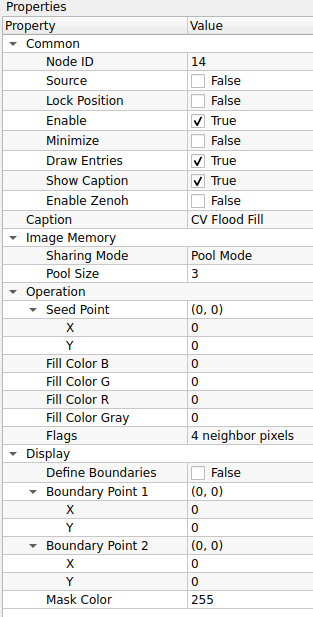
    

    ### 1. Common (การตั้งค่าทั่วไป)
    | Property | Default | คำอธิบาย |
    | :--- | :--- | :--- |
    | **Node ID** | `14` | เลขประจำตัวลำดับของโหนด |
    | **Caption** | `CV Flood Fill` | ชื่อโหนดที่แสดงผลบน Workspace |

    ### 2. Image Memory (การจัดการหน่วยความจำภาพ)
    | Property | Default | คำอธิบาย |
    | :--- | :--- | :--- |
    | **Sharing Mode** | `Pool Mode` | รูปแบบการจัดการหน่วยความจำ: - **Pool Mode:** ใช้หน่วยความจำเดิมวนซ้ำ (ประหยัด RAM) - **Broadcast Mode:** สร้างสำเนาข้อมูลใหม่แยกออกมา (ปลอดภัยที่สุดหากมีการต่อสายแยกไปหลายทาง) |
    | **Pool Size** | `3` | จำนวน Buffer ที่เตรียมไว้ |

    ### 3. Operation (การตั้งค่าการเทสี)
    | Property | Default | คำอธิบาย |
    | :--- | :--- | :--- |
    | **Seed Point** | `(0, 0)` | จุดเริ่มต้นที่จะเริ่มเทสี (X, Y) - **สำคัญ:** ในการใช้งานจริง ค่านี้มักจะรับมาจาก Mouse Click หรือจุด Centroid ของวัตถุ |
    | **Fill Color (B,G,R)** | `0, 0, 0` | สีใหม่ที่จะเทลงไป (สำหรับภาพสี) |
    | **Fill Color Gray** | `0` | ค่าความสว่างที่จะเทลงไป (สำหรับภาพขาวดำ Grayscale) |
    | **Flags** | `4 neighbor pixels` | เงื่อนไขการไหลของสี: - **4 neighbor pixels:** สีไหลไปทาง ซ้าย-ขวา-บน-ล่าง เท่านั้น (เหมาะกับรูปทรงเรขาคณิต) - **8 neighbor pixels:** สีไหลไปรอบทิศรวมถึงแนวทแยง (เหมาะกับภาพธรรมชาติ) - **FLOODFILL_MASK_ONLY:** ไม่เปลี่ยนสีในภาพจริง แต่จะไปสร้างพื้นที่สีขาวบน "ภาพ Mask" แทน - **FLOODFILL_FIXED_RANGE:** เปรียบเทียบสีกับ "จุดเริ่มต้น (Seed)" เท่านั้น (ถ้าไม่ติ๊ก จะเทียบกับพิกเซลข้างๆ ที่เพิ่งเทไป ซึ่งสีอาจเพี้ยนไปเรื่อยๆ ได้) |

    ### 4. Display (การแสดงผลขอบเขต)
    | Property | Default | คำอธิบาย |
    | :--- | :--- | :--- |
    | **Define Boundaries** | `False` | เปิด/ปิด การกำหนดกรอบพื้นที่ (Bounding Box) |
    | **Boundary Point 1** | `(0, 0)` | จุดมุมที่ 1 ของกรอบขอบเขต |
    | **Boundary Point 2** | `(0, 0)` | จุดมุมที่ 2 ของกรอบขอบเขต |
    | **Mask Color** | `255` | ค่าสีที่จะใช้เขียนลงใน Mask (กรณีที่มีการสร้าง Mask จากการเทสี) |

    ---

    !!! tip "เทคนิค: FIXED_RANGE คืออะไร?"
        * **ถ้าไม่ใช้ Fixed Range:** สีจะไหลไปเรื่อยๆ เหมือนไฟลามทุ่ง ถ้าสีเปลี่ยนทีละนิดๆ มันก็ไหลไปได้เรื่อยๆ จนทั่วภาพ
        * **ถ้าใช้ Fixed Range (แนะนำ):** ระบบจะยึด "สีของจุดเริ่มต้น" เป็นหลักเสมอ ถ้าจุดไหนสีต่างจากจุดเริ่มต้นเกินเกณฑ์ มันจะหยุดทันที (ช่วยคุมไม่ให้สีไหลเลอะเทอะออกนอกวัตถุ)

    !!! example "Use Case: การอุดรู (Hole Filling)"
        หากเราทำ Threshold แล้วได้วัตถุสีขาวที่มี "รูสีดำ" อยู่ข้างใน:
        1.  ใช้ **Flood Fill** เทสีขาวลงไปในรูสีดำนั้น
        2.  ผลลัพธ์คือวัตถุจะทึบตันสมบูรณ์ (Solid object)

??? node "- **CV Median Blur:**"
    

    {width=80}
    

    **CV Median Blur** คือโหนดสำหรับการปรับปรุงคุณภาพภาพ (Image Filtering) ด้วยวิธี **"ค่ามัธยฐาน (Median Filtering)"** หลักการทำงานคือระบบจะนำพิกเซลรอบๆ มาเรียงลำดับจากน้อยไปมาก แล้วเลือกค่าที่อยู่ "ตรงกลาง" (Median) มาแทนที่พิกเซลเดิม วิธีนี้มีประสิทธิภาพสูงสุดในการกำจัดจุดรบกวนแบบฉับพลัน (Impulse Noise) หรือที่เรียกว่า Salt-and-Pepper Noise โดยยังคงรักษาความคมชัดของเส้นขอบวัตถุไว้ได้ดีกว่าการเบลอแบบเฉลี่ย (Mean/Gaussian)

    ## **ตารางการตั้งค่า (Properties)**
    

    
    

    ### 1. Common (การตั้งค่าทั่วไป)
    | Property | Default | คำอธิบาย |
    | :--- | :--- | :--- |
    | **Node ID** | `15` | เลขประจำตัวลำดับของโหนด |
    | **Caption** | `CV Median Blur` | ชื่อโหนดที่แสดงผลบน Workspace |

    ### 2. Image Memory (การจัดการหน่วยความจำภาพ)
    | Property | Default | คำอธิบาย |
    | :--- | :--- | :--- |
    | **Sharing Mode** | `Pool Mode` | รูปแบบการจัดการหน่วยความจำ: - **Pool Mode:** ใช้หน่วยความจำเดิมวนซ้ำ (ประหยัด RAM) - **Broadcast Mode:** สร้างสำเนาข้อมูลใหม่แยกออกมา (ปลอดภัยที่สุดหากมีการต่อสายแยกไปหลายทาง) |
    | **Pool Size** | `3` | จำนวน Buffer ที่เตรียมไว้ |

    ### 3. Operation (การตั้งค่าความเบลอ)
    | Property | Default | คำอธิบาย |
    | :--- | :--- | :--- |
    | **Kernel Size** | `5` | ขนาดหน้าต่างที่จะนำมาคำนวณ (Aperture Linear Size) - **กฎเหล็ก:** ค่าต้องเป็น **เลขคี่ที่มากกว่า 1** เท่านั้น (เช่น 3, 5, 7, 9...) - **3:** ลบจุดรบกวนเล็กน้อย ขอบยังคมกริบ - **5:** ค่ามาตรฐาน ลบจุดรบกวนได้ดี - **7+:** เริ่มทำให้ภาพดูเหมือนภาพวาดสีน้ำมัน (รายละเอียดเล็กๆ จะหายไป) |

    ---

    !!! tip "Median Blur vs Gaussian Blur ใช้อันไหนดี?"
        * **Gaussian Blur:** ใช้เมื่อต้องการทำภาพให้นวล เบลอฉากหลัง หรือลด Noise ทั่วไปที่กระจายสม่ำเสมอ
        * **Median Blur (ตัวนี้):** ใช้เมื่อเจอภาพที่มี **"จุดเม็ดสีขาว/ดำ กระจายอยู่"** (Dead Pixel หรือฝุ่นเกาะเลนส์) เพราะมันจะลบจุดพวกนี้หายวับไปเลยโดยที่ภาพหลักไม่เสียความคมชัด

    !!! warning "ข้อควรระวัง"
        การใช้ **Kernel Size** ที่ใหญ่เกินไปกับโหนด Median Blur จะทำให้ภาพดูแบนและดูเป็นการ์ตูน (Cartoonish) และที่สำคัญคือ **กินทรัพยากรเครื่องมากกว่า Gaussian Blur** ค่อนข้างมากครับ

## 9. Image Operation (การกระทำกับภาพ)
การนำภาพสองภาพมาทำปฏิกิริยากันทางคณิตศาสตร์

	

??? node "- **CV Overlay Image:**"
    

    {width=80}
    

    **CV Overlay Image** คือโหนดสำหรับการซ้อนภาพ (Image Composition) โดยนำภาพขนาดเล็ก (Overlay) ไปวางทับบนภาพหลัก (Background) ณ ตำแหน่งพิกัด X, Y ที่กำหนด นิยมใช้ในการใส่โลโก้บริษัท, การแสดงผลแบบจอซ้อนจอ (Picture-in-Picture), หรือการนำผลลัพธ์ที่ตรวจจับได้ (ROI) กลับไปแปะคืนที่เดิม

    ## **ตารางการตั้งค่า (Properties)**
    

    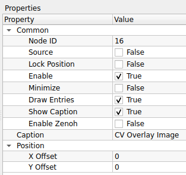
    

    ### 1. Common (การตั้งค่าทั่วไป)
    | Property | Default | คำอธิบาย |
    | :--- | :--- | :--- |
    | **Node ID** | `16` | เลขประจำตัวลำดับของโหนด |
    | **Caption** | `CV Overlay Image` | ชื่อโหนดที่แสดงผลบน Workspace |

    ### 2. Position (การกำหนดตำแหน่ง)
    | Property | Default | คำอธิบาย |
    | :--- | :--- | :--- |
    | **X Offset** | `0` | ระยะห่างจากขอบซ้ายของภาพหลัก (แกน X) - ค่าบวก (+) จะขยับภาพไปทางขวา |
    | **Y Offset** | `0` | ระยะห่างจากขอบบนของภาพหลัก (แกน Y) - ค่าบวก (+) จะขยับภาพลงด้านล่าง |

    ---

    !!! tip "ระบบพิกัดภาพ (Coordinate System)"
        ในคอมพิวเตอร์กราฟิก จุด `(0, 0)` จะอยู่ที่ **"มุมซ้ายบน"** ของภาพเสมอครับ
        
        * **X Offset:** ยิ่งมาก ภาพยิ่งเลื่อนไปขวา
        * **Y Offset:** ยิ่งมาก ภาพยิ่งเลื่อนลงล่าง

    !!! example "Use Case: การทำ Picture-in-Picture"
        หากคุณมีกล้อง 2 ตัว (กล้องมุมกว้าง และกล้องซูม):
        1.  ต่อสายจากกล้องมุมกว้างเข้า Input หลัก (Background)
        2.  ต่อสายจากกล้องซูม (ที่ย่อขนาดแล้ว) เข้า Input รอง (Overlay)
        3.  ปรับ **X Offset, Y Offset** เพื่อย้ายภาพกล้องซูมไปไว้ที่มุมจอ
        4.  คุณจะได้ภาพวงจรปิดที่มีจอเล็กซ้อนอยู่มุมขวา เหมือนในหนังเลยครับ!

??? node "- **CV Addition:**"
    

    {width=80}
    

    **CV Addition** คือโหนดสำหรับการคำนวณทางคณิตศาสตร์ด้วยการ **"บวก"** ค่าพิกเซลของภาพ 2 ภาพเข้าด้วยกัน ($Dst = Src1 + Src2$) ผลลัพธ์ที่ได้คือภาพที่สว่างขึ้น (เพราะค่าสีเพิ่มขึ้น) นิยมใช้ในการรวมเลเยอร์แสง หรือซ้อนภาพเอฟเฟกต์แสงสว่าง (Light Leaks) ลงบนภาพหลัก

    ## **ตารางการตั้งค่า (Properties)**
    

    
    

    

    | Property | Default | คำอธิบาย |
    | :--- | :--- | :--- |
    | **Node ID** | `17` | เลขประจำตัวลำดับของโหนด |
    | **Caption** | `CV Addition` | ชื่อโหนดที่แสดงผลบน Workspace |
    | **Pool Size** | `10` | จำนวน Buffer ที่เตรียมไว้ *(สังเกต: โหนดนี้ตั้งค่ามาสูงกว่าปกติที่ 3 อาจเพราะรองรับการประมวลผลที่รวดเร็วหรือมีการพักข้อมูลเยอะ)* |
    | **Sharing Mode** | `Pool Mode` | รูปแบบการจัดการหน่วยความจำ: - **Pool Mode:** ใช้หน่วยความจำเดิมวนซ้ำ (ประหยัด RAM) - **Broadcast Mode:** สร้างสำเนาข้อมูลใหม่แยกออกมา (ปลอดภัยที่สุดหากมีการต่อสายแยกไปหลายทาง) |

    

    ---

    !!! warning "ระวังเรื่องแสงจ้าเกิน (Saturation)"
        การบวกค่าสีจะทำให้ค่าตัวเลขสูงขึ้นเรื่อยๆ จนถึงขีดจำกัดที่ **255 (สีขาว)**
        
        * หากภาพต้นฉบับสว่างอยู่แล้ว เมื่อนำมาบวกกัน ภาพผลลัพธ์อาจจะ **"ขาวโพลน"** จนมองไม่เห็นรายละเอียด (Overexposed)
        * หากต้องการผสมภาพโดยไม่ให้สว่างเกินไป แนะนำให้ใช้โหนด **CV Add Weighted** (ถ้ามี) ซึ่งจะสามารถปรับลดความเข้มของแต่ละภาพได้

    !!! tip "เทคนิค: ใช้เพิ่มความสว่าง"
        คุณสามารถใช้โหนดนี้ **"เพิ่มความสว่าง (Brightness)"** ให้ภาพได้ โดยการนำภาพหลักมาบวกกับ **"ภาพสีเทา หรือ สีดำที่มีค่าสีน้อยๆ"** (Scalar) ค่าความสว่างก็จะถูกบวกเพิ่มเข้าไปในทุกพิกเซลครับ
        
??? node "- **CV Matrix Operation:**"
    

    {width=80}
    

    **CV Matrix Operation** คือโหนดสำหรับการประมวลผลทางคณิตศาสตร์ระหว่างภาพ 2 ภาพ (Matrix Arithmetic) แบบพิกเซลต่อพิกเซล ช่วยให้คุณสามารถนำภาพมาคำนวณหาผลลัพธ์ใหม่ได้หลากหลาย ทั้งการผสมภาพ (Arithmetic), การหาความต่าง, หรือการเปรียบเทียบค่าเพื่อสร้างเงื่อนไข (Comparison)

    ## **ตารางการตั้งค่า (Properties)**
    

    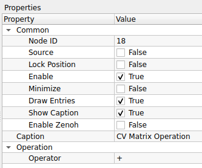
    

    

    | Property | Default | คำอธิบาย |
    | :--- | :--- | :--- |
    | **Node ID** | `18` | เลขประจำตัวลำดับของโหนด |
    | **Caption** | `CV Matrix Operation` | ชื่อโหนดที่แสดงผลบน Workspace |
    | **Operator** | `+` | เลือกรูปแบบการคำนวณ *(ดูรายละเอียดด้านล่าง)*: **1. คณิตศาสตร์ (Arithmetic):** `+`, `-`, `*`, `/` **2. การเปรียบเทียบ (Comparison):** `>`, `>=`, `<`, `<=` **3. ค่าสูงสุด/ต่ำสุด (Extremum):** `MAX`, `MIN` |

    

    ---

    !!! tip "เจาะลึก: แต่ละเครื่องหมายทำหน้าที่อะไร?"

        **กลุ่มที่ 1: คณิตศาสตร์ (ให้ผลลัพธ์เป็นภาพโทนสีเทา/สีปกติ)**
        * **`+` (Add):** นำค่าสีมารวมกัน (ภาพจะสว่างขึ้น)
        * **`-` (Subtract):** ใช้หา "ความแตกต่าง" (ส่วนที่เหมือนกันลบกันได้ 0 คือสีดำ ส่วนที่ต่างกันจะสว่างขึ้น)
        * **`*` (Multiply):** ใช้บังภาพ (Masking) สีดำคูณอะไรก็ได้ 0 (หายไป), สีขาวคูณอะไรก็ได้เท่าเดิม (คงอยู่)
        * **`/` (Divide):** ใช้ลดทอนค่าแสง หรือหาอัตราส่วนของความสว่าง
        
        **กลุ่มที่ 2: การเปรียบเทียบ (ให้ผลลัพธ์เป็นภาพขาว-ดำ เท่านั้น)**
        * **`>`, `>=`, `<`, `<=`:** ใช้เทียบค่าพิกเซลตำแหน่งเดียวกันของทั้ง 2 ภาพ
            * **ถ้าจริง:** ได้ค่า 255 (สีขาว)
            * **ถ้าเท็จ:** ได้ค่า 0 (สีดำ)
            * *ประโยชน์:* ใช้สร้าง Mask แบบ Dynamic เช่น "เอาเฉพาะส่วนที่ภาพ A สว่างกว่าภาพ B"
        
        **กลุ่มที่ 3: เลือกค่าสุดโต่ง (Blend Modes)**
        * **`MAX` (Lighten):** เทียบกันพิกเซลต่อพิกเซล ใครสว่างกว่าเอาคนนั้น (ผลลัพธ์เหมือนโหมด Lighten ใน Photoshop)
        * **`MIN` (Darken):** เทียบกันพิกเซลต่อพิกเซล ใครมืดกว่าเอาคนนั้น

    !!! warning "ข้อควรระวังเรื่องการหาร (/)"
        การหารด้วย 0 (Divide by Zero) อาจทำให้โปรแกรมเกิดข้อผิดพลาดหรือได้ผลลัพธ์เป็นค่าสูงสุด/ต่ำสุด ขึ้นอยู่กับการจัดการ Error ของระบบ แนะนำให้ระวังหากภาพตัวหารมีพื้นที่สีดำสนิท (ค่า 0)
        
??? node "- **CV Blend Images:**"
    

    {width=80}
    

    **CV Blend Images** คือโหนดสำหรับการผสมภาพ 2 ภาพเข้าด้วยกันแบบเชิงเส้น (Linear Blending) โดยใช้วิธีถ่วงน้ำหนัก (Weighted Sum) ตามสูตร $Dst = (Src1 \times \alpha) + (Src2 \times \beta) + \gamma$ ช่วยให้สร้างเอฟเฟกต์ภาพโปร่งแสง หรือการเปลี่ยนผ่านภาพ (Transition) ได้อย่างนุ่มนวล

    ## **ตารางการตั้งค่า (Properties)**
    

    
    

    

    | Property | Default | คำอธิบาย |
    | :--- | :--- | :--- |
    | **Node ID** | `19` | เลขประจำตัวลำดับของโหนด |
    | **Caption** | `CV Blend Images` | ชื่อโหนดที่แสดงผลบน Workspace |
    | **Alpha** | `0.5000` | น้ำหนักความเข้มของ **ภาพที่ 1** (Input แรก) - **1.0:** เห็นภาพแรกชัดสุด (100%) - **0.0:** ไม่เห็นภาพแรกเลย |
    | **Beta** | `0.5000` | น้ำหนักความเข้มของ **ภาพที่ 2** (Input สอง) - ปกติมักตั้งให้สัมพันธ์กับ Alpha (เช่น ถ้า Alpha 0.7, Beta ควรเป็น 0.3 เพื่อให้รวมกันได้ 1) |
    | **Gamma** | `0.0000` | ค่าความสว่างที่จะบวกเพิ่มเข้าไปในผลลัพธ์สุดท้าย (Brightness Offset) |
    | **Size From Port 0** | `False` | ตัวช่วยปรับขนาดภาพอัตโนมัติ - **True:** บังคับให้ภาพที่ 2 ยืด/หด ขนาดให้เท่ากับภาพที่ 1 (Port 0) เสมอก่อนนำมาผสม (ป้องกัน Error เรื่องขนาดภาพไม่เท่ากัน) - **False:** ใช้ขนาดภาพตามจริง (หากขนาดไม่เท่ากัน โปรแกรมอาจแจ้ง Error) |

    

    ---

    !!! tip "สูตรการผสมภาพ (The Recipe)"
        
        * **ภาพซ้อนมาตรฐาน (50-50):** `Alpha = 0.5`, `Beta = 0.5`
        * **ภาพแรกจางๆ บนภาพหลังชัดๆ:** `Alpha = 0.3`, `Beta = 0.9`
        * **เพิ่มความสว่าง (Over Exposure):** `Alpha = 1.0`, `Beta = 1.0` (ค่าสีจะรวมกันจนสว่างจ้า)

    !!! warning "ข้อควรระวังเรื่องขนาดภาพ"
        ฟังก์ชัน `addWeighted` ของ OpenCV บังคับว่า **"ภาพทั้ง 2 ต้องมีขนาด (Width x Height) เท่ากันเป๊ะ"**
        
        * หากคุณต่อสายมาจากแหล่งที่ขนาดต่างกัน (เช่น กล้องคนละตัว) **อย่าลืมติ๊ก `Size From Port 0` เป็น True** เพื่อให้โหนดช่วยปรับขนาดให้โดยอัตโนมัติครับ ไม่งั้นโปรแกรมจะหยุดทำงาน
        
??? node "- **CV Template Matcing:**"
    

    {width=80}
    

    **CV Template Matching** คือโหนดสำหรับการค้นหาตำแหน่งของวัตถุในภาพ โดยนำภาพต้นแบบขนาดเล็ก (Template) ไปเลื่อนทาบเปรียบเทียบกับภาพหลักทีละจุด (Sliding Window) เพื่อหาตำแหน่งที่มีความคล้ายคลึงกันมากที่สุด เมื่อเจอแล้วจะทำการวาดกรอบสี่เหลี่ยม (Bounding Box) ล้อมรอบวัตถุนั้นให้ทันที

    ## **ตารางการตั้งค่า (Properties)**
    

        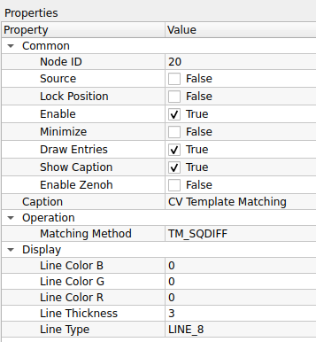
    

    
    

    | Property | Default | คำอธิบาย |
    | :--- | :--- | :--- |
    | **Node ID** | `20` | เลขประจำตัวลำดับของโหนด |
    | **Caption** | `CV Template Matching` | ชื่อโหนดที่แสดงผลบน Workspace |
    | **Matching Method** | `TM_SQDIFF` | วิธีการคำนวณความเหมือน: - **TM_SQDIFF:** หาจุดต่าง (ยิ่งน้อยยิ่งเหมือน) - **TM_SQDIFF_NORMED:** หาจุดต่างแบบปรับฐาน (ทนต่อแสงเงาเปลี่ยน) - **TM_CCORR:** หาความเหมือน (ยิ่งมากยิ่งเหมือน) - **TM_CCORR_NORMED:** หาความเหมือนแบบปรับฐาน - **TM_CCOEFF:** หาความสัมพันธ์ของสัมประสิทธิ์ - **TM_CCOEFF_NORMED:** (นิยมใช้ที่สุด) แม่นยำสูงแม้แสงเปลี่ยน |
    | **Line Color (B,G,R)** | `0, 0, 0` | สีของกรอบสี่เหลี่ยมที่จะวาดล้อมรอบวัตถุที่เจอ |
    | **Line Thickness** | `3` | ความหนาของเส้นกรอบ |
    | **Line Type** | `LINE_8` | รูปแบบของเส้น: - **LINE_8:** เส้นเชื่อมต่อ 8 ทิศทาง (มาตรฐาน) - **LINE_4:** เส้นเชื่อมต่อ 4 ทิศทาง (เส้นจะดูเหลี่ยมกว่า) - **LINE_AA:** เส้นลบรอยหยัก (Anti-Aliased) เส้นจะนวลสวยที่สุด |

    

    ---

    !!! tip "เทคนิค: ทำไมต้องใช้แบบ NORMED?"
        หากคุณเลือกใช้ตัวเลือกที่มีคำว่า **_NORMED** (เช่น `TM_CCOEFF_NORMED`) ระบบจะทำการคำนวณโดยหารเฉลี่ยค่าความสว่างให้
        
        * **ข้อดี:** ช่วยให้หาวัตถุเจอ **"แม้ว่าแสงในภาพจะเปลี่ยนไป"** (เช่น ภาพต้นแบบถ่ายตอนสว่าง แต่ภาพจริงถ่ายตอนมืดลงนิดหน่อย)
        * **ข้อเสีย:** อาจจะคำนวณช้ากว่าแบบธรรมดาเล็กน้อย

    !!! warning "ระวัง! วิธีการอ่านค่าไม่เหมือนกัน"
        * **กลุ่ม SQDIFF:** ต้องหาค่า **ต่ำสุด (Min Location)** ถึงจะเป็นจุดที่เจอวัตถุ
        * **กลุ่ม CCORR / CCOEFF:** ต้องหาค่า **สูงสุด (Max Location)** ถึงจะเป็นจุดที่เจอวัตถุ
        
??? node "- **CV Resize:**"
    

    {width=80}
    

    **CV Resize** คือโหนดสำหรับการปรับเปลี่ยนขนาดความกว้างและความสูงของภาพ (Image Rescaling) ให้เป็นไปตามค่าพิกเซลที่กำหนด นิยมใช้เพื่อปรับขนาดภาพให้เท่ากันทุกเฟรม (Standardization) หรือลดขนาดภาพเพื่อเพิ่มความเร็วในการประมวลผล

    ## **ตารางการตั้งค่า (Properties)**
    

    
    

    

    | Property | Default | คำอธิบาย |
    | :--- | :--- | :--- |
    | **Node ID** | `0` | เลขประจำตัวลำดับของโหนด (โหนดเริ่มต้น) |
    | **Caption** | `CV Resize` | ชื่อโหนดที่แสดงผลบน Workspace |
    | **Width** | `640` | ความกว้างใหม่ที่ต้องการ (หน่วยเป็นพิกเซล) |
    | **Height** | `480` | ความสูงใหม่ที่ต้องการ (หน่วยเป็นพิกเซล) |

    

    ---

    !!! warning "ระวังเรื่องสัดส่วนภาพ (Aspect Ratio)"
        การกำหนดค่า Width และ Height เองโดยอิสระ อาจทำให้ภาพเกิดการ **"บิดเบี้ยว (Distortion)"** ได้ หากสัดส่วนใหม่ไม่ตรงกับสัดส่วนเดิม
        
        * *ตัวอย่าง:* ภาพเดิมเป็นสี่เหลี่ยมจัตุรัส ถ้าบีบให้เป็นสี่เหลี่ยมผืนผ้า ภาพวัตถุข้างในจะดูแบนหรือยืดผิดรูปทันที

    !!! tip "Node ID 0 คืออะไร?"
        ในระบบ Programming หรือ Data Flow ส่วนใหญ่ **ID 0** มักจะหมายถึง **"จุดเริ่มต้น (Entry Point)"** หรือโหนดแรกสุดที่ถูกสร้างขึ้น หากโหนดนี้คือ Resize แสดงว่าระบบของคุณอาจจะมีการบังคับขนาดภาพตั้งแต่นำเข้า (Input) เลยเพื่อมาตรฐานเดียวกันทั้งระบบครับ

??? node "- **CV ROI:**"
    

    {width=80}
    

    **CV ROI (Region of Interest)** คือโหนดสำหรับการกำหนด "พื้นที่ที่สนใจ" หรือการตัดภาพ (Cropping) เพื่อเลือกเฉพาะส่วนหนึ่งของภาพมาประมวลผลต่อ ช่วยลดภาระการทำงานของระบบ (เพราะภาพเล็กลง) และช่วยตัดสิ่งรบกวนรอบข้างที่ไม่จำเป็นออกไป

    ## **ตารางการตั้งค่า (Properties)**
    

    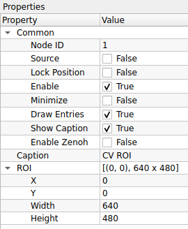
    

    

    | Property | Default | คำอธิบาย |
    | :--- | :--- | :--- |
    | **Node ID** | `1` | เลขประจำตัวลำดับของโหนด |
    | **Caption** | `CV ROI` | ชื่อโหนดที่แสดงผลบน Workspace |
    | **X** | `0` | พิกัดเริ่มต้นแนวนอน (นับจากซ้ายไปขวา) |
    | **Y** | `0` | พิกัดเริ่มต้นแนวตั้ง (นับจากบนลงล่าง) |
    | **Width** | `640` | ความกว้างของพื้นที่ที่ต้องการตัดออกมา |
    | **Height** | `480` | ความสูงของพื้นที่ที่ต้องการตัดออกมา |

    

    ---

    !!! tip "เทคนิค: ระบบพิกัดภาพ (Coordinate System)"
        ในคอมพิวเตอร์กราฟิก จุดกำเนิด **(0, 0)** จะอยู่ที่ **"มุมซ้ายบนสุด"** ของภาพ
        
        * **X:** เพิ่มขึ้นไปทางขวา
        * **Y:** เพิ่มขึ้นลงด้านล่าง
        * ดังนั้นการตั้งค่า ROI คือการบอกว่า "เริ่มตัดที่จุด (X,Y) แล้วกวาดความกว้างไปทางขวา (Width) และกวาดลงล่าง (Height)"

    !!! warning "ระวัง! พื้นที่เกินขอบเขต (Out of Bounds)"
        หากคุณกำหนดค่า X, Y หรือ Width, Height รวมกันแล้ว **"เกินขนาดของภาพต้นฉบับ"** (เช่น ภาพกว้าง 640 แต่ตั้ง ROI ไปเริ่มที่ 600 แล้วกว้างอีก 100 = 700) โปรแกรมอาจจะแจ้ง Error หรือหยุดทำงานได้ ควรตรวจสอบขนาดภาพต้นฉบับให้แน่ใจก่อนตั้งค่าครับ

    !!! example "Use Case: การโฟกัสเฉพาะจุด"
        สมมติคุณตั้งกล้องดูสายพานการผลิต แต่ต้องการตรวจเช็คแค่ "ฉลากสินค้า" ที่อยู่ตรงกลางภาพ
        1.  ใช้ **CV ROI** ตัดเฉพาะส่วนกลางภาพออกมา
        2.  ส่งภาพที่ตัดแล้วไปเข้ากระบวนการอ่านบาร์โค้ด หรือ OCR
        3.  **ผลลัพธ์:** ระบบทำงานเร็วขึ้นมาก เพราะไม่ต้องเสียเวลาสแกนพื้นที่ว่างรอบๆ

??? node "- **CV Bitwise Operation:**"
    

    {width=80}
    

    **CV Bitwise Operation** คือโหนดสำหรับการดำเนินการทางตรรกะ (Logic) ในระดับบิตของแต่ละพิกเซล นิยมใช้เป็นเครื่องมือหลักในการทำ "หน้ากาก (Masking)" เพื่อตัดส่วนที่ไม่ต้องการ, การรวมภาพขาวดำ, หรือการหาความแตกต่างของรูปทรง

    ## **ตารางการตั้งค่า (Properties)**
    

    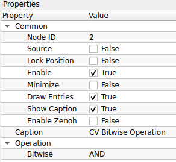
    

    

    | Property | Default | คำอธิบาย |
    | :--- | :--- | :--- |
    | **Node ID** | `2` | เลขประจำตัวลำดับของโหนด |
    | **Caption** | `CV Bitwise Operation` | ชื่อโหนดที่แสดงผลบน Workspace |
    | **Bitwise** | `AND` | คำสั่งตรรกะที่ต้องการใช้งาน: - **AND:** เอาเฉพาะส่วนที่ "ซ้อนทับกัน" (Intersection) ใช้สำหรับบังภาพ (Masking) - **OR:** เอาส่วนที่มี "สีขาวทั้งหมด" มารวมกัน (Union) ใช้รวม Mask หลายชิ้นเข้าด้วยกัน - **XOR:** เอาเฉพาะส่วนที่ "ต่างกัน" (Difference) ถ้าเหมือนกันจะเป็นสีดำ - **NOT:** กลับค่าสี (Invert) ขาวเป็นดำ ดำเป็นขาว |

    

    ---

    !!! tip "เจาะลึก: เลือกใช้อันไหนดี?"
        
        * **ใช้ `AND` เมื่อ:** ต้องการ **"ตัดภาพ"** (เช่น มีภาพคน กับภาพ Mask สีขาวที่เป็นตัวคน -> พอ AND กัน จะได้ภาพคนลอยอยู่บนพื้นดำ)
        * **ใช้ `OR` เมื่อ:** ต้องการ **"รวมภาพ"** (เช่น มี Mask ของรถยนต์ กับ Mask ของคนเดินเท้า -> พอ OR กัน จะได้ Mask ที่รวมทั้งรถและคนไว้ด้วยกัน)
        * **ใช้ `NOT` เมื่อ:** ต้องการ **"กลับด้าน"** (เช่น มี Mask ที่เจาะรูตรงกลางขาว -> พอ NOT จะได้วงกลมดำทึบตรงกลางแทน)
        * **ใช้ `XOR` เมื่อ:** ต้องการเช็คว่า **"ภาพเปลี่ยนไปตรงไหน"** (เช่น เทียบภาพก่อนและหลังวัตถุขยับ ส่วนที่ขยับจะกลายเป็นสีขาว)

    !!! warning "Input ไม่เท่ากัน"
        * คำสั่ง **AND, OR, XOR** ต้องการ **Input 2 ช่อง** (ภาพ A และ ภาพ B)
        * คำสั่ง **NOT** ต้องการ **Input แค่ 1 ช่อง** เท่านั้น (เพราะแค่กลับสีภาพตัวเอง)
        
??? node "- **CV Image ROI:**"
    

    {width=80}
    

    **CV Image ROI** คือโหนดสำหรับการกำหนดพื้นที่ที่สนใจ (Region of Interest) โดยใช้วิธีระบุ **"จุดมุมทะแยง"** 2 จุด (เช่น มุมซ้ายบน และ มุมขวาล่าง) แทนการระบุขนาด โหนดนี้มาพร้อมกับความสามารถในการวาดเส้นกรอบ (Bounding Box) เพื่อแสดงพื้นที่ที่เลือกบนภาพได้ด้วย

    ## **ตารางการตั้งค่า (Properties)**
    

    
    

    

    | Property | Default | คำอธิบาย |
    | :--- | :--- | :--- |
    | **Node ID** | `3` | เลขประจำตัวลำดับของโหนด |
    | **Caption** | `CV Image ROI` | ชื่อโหนดที่แสดงผลบน Workspace |
    | **Point 1** | `(0, 0)` | พิกัดของจุดมุมที่ 1 (ปกติคือมุมซ้ายบน) |
    | **Point 2** | `(0, 0)` | พิกัดของจุดมุมที่ 2 (ปกติคือมุมขวาล่าง) |
    | **Lock Output ROI** | `False` | ตัวเลือกการส่งออกภาพ: - **True:** ตัดภาพ (Crop) ให้เหลือเฉพาะส่วนในกรอบส่งออกไป - **False:** ส่งภาพเต็มออกไปเหมือนเดิม (แต่แปะข้อมูล ROI หรือวาดเส้นกรอบทับ) |
    | **Line Color (B,G,R)** | `0, 0, 0` | สีของเส้นกรอบที่จะวาดแสดงผล |
    | **Line Thickness** | `2` | ความหนาของเส้นกรอบ |
    | **Display Lines** | `True` | เปิด/ปิด การวาดเส้นกรอบสี่เหลี่ยมบนภาพ |

    

    ---

    !!! tip "ความแตกต่าง: CV ROI (ID 1) vs CV Image ROI (ID 3)"
        * **CV ROI (ID 1):** เหมาะสำหรับงานที่ **"รู้ขนาดที่แน่นอน"** (เช่น ต้องการตัดภาพขนาด 640x480 เสมอ โดยแค่ขยับจุดเริ่ม X,Y ไปเรื่อยๆ)
        * **CV Image ROI (ID 3):** เหมาะสำหรับงานที่ **"รู้ตำแหน่งจุดเริ่มและจุดจบ"** (เช่น การลากเมาส์คลุมพื้นที่ ซึ่งจะได้ค่า P1 และ P2 มา) และโหนดนี้เหมาะสำหรับใช้เพื่อ **"Visualization (การแสดงผล)"** มากกว่า เพราะมีตัวเลือกให้วาดเส้นกรอบโชว์ได้ทันที

    !!! warning "ลำดับจุดสำคัญไหม?"
        โดยปกติโปรแกรม OpenCV จะคำนวณสี่เหลี่ยมจาก Min/Max ของพิกัด ดังนั้นคุณจะกำหนด `Point 1` เป็นมุมขวาล่าง และ `Point 2` เป็นมุมซ้ายบนก็ได้ ผลลัพธ์จะได้กรอบสี่เหลี่ยมพื้นที่เดิมครับ
        
??? node "- **CV Rotate:**"
    

    {width=80}
    

    **CV Rotate** คือโหนดสำหรับการหมุนภาพ (Image Rotation) รอบจุดกึ่งกลางภาพตามมุมองศาที่กำหนด ช่วยให้สามารถแก้ไขภาพที่ถ่ายมาเอียง (Tilt correction) หรือกลับหัวภาพให้ถูกต้องได้

    ## **ตารางการตั้งค่า (Properties)**
    

    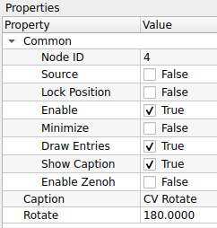
    

    

    | Property | Default | คำอธิบาย |
    | :--- | :--- | :--- |
    | **Node ID** | `4` | เลขประจำตัวลำดับของโหนด |
    | **Caption** | `CV Rotate` | ชื่อโหนดที่แสดงผลบน Workspace |
    | **Rotate** | `180.0000` | มุมที่ต้องการหมุน (หน่วยเป็นองศา) - **ค่าบวก (+):** หมุนทวนเข็มนาฬิกา (Counter-Clockwise) - **ค่าลบ (-):** หมุนตามเข็มนาฬิกา (Clockwise) |

    

    ---

    !!! tip "มุมยอดนิยม"
        * **90°:** หมุนตะแคงซ้าย
        * **-90° (หรือ 270°):** หมุนตะแคงขวา
        * **180°:** กลับหัว (Upside Down)

    !!! warning "ระวังเรื่องขอบภาพ (Clipping)"
        การหมุนภาพด้วยมุมที่ไม่ใช่ 90, 180, หรือ 270 องศา (เช่น 45 องศา) มักจะทำให้เกิดผลกระทบ 2 อย่าง:
        
        1.  **ขอบดำ:** จะเกิดพื้นที่ว่างสีดำขึ้นที่มุมทั้ง 4 ของภาพ
        2.  **ภาพโดนตัด:** ส่วนมุมของภาพเดิมอาจจะหลุดออกนอกกรอบเฟรม หากระบบไม่ได้ทำการขยายขนาดเฟรมให้อัตโนมัติ

## 10. Image Processing (การประมวลผลภาพ)
ฟังก์ชันพื้นฐานสำหรับปรับเปลี่ยนลักษณะของภาพ

	

??? node "- **CV Find Contour:**"
    

    {width=80}
    

    **CV Find Contour** คือโหนดสำหรับการค้นหาเส้นขอบ (Boundary) ของวัตถุในภาพ โดยรับอินพุตเป็นภาพขาว-ดำ (Binary Image) ระบบจะทำการลากเส้นเชื่อมต่อจุดที่มีความต่อเนื่องกัน เพื่อสร้างเป็นโครงสร้างข้อมูลเส้นขอบ (Vector of Points) สำหรับนำไปวิเคราะห์รูปร่างทางเรขาคณิตต่อไป

    ## **ตารางการตั้งค่า (Properties)**
    

    
    

    

    | Property | Default | คำอธิบาย |
    | :--- | :--- | :--- |
    | **Node ID** | `5` | เลขประจำตัวลำดับของโหนด |
    | **Caption** | `CV Find Contour` | ชื่อโหนดที่แสดงผลบน Workspace |
    | **Contour Mode** | `RETR_TREE` | รูปแบบการจัดลำดับชั้นของเส้นขอบ (Hierarchy): - **RETR_EXTERNAL:** หาเฉพาะเส้นขอบ "นอกสุด" เท่านั้น (ไม่สนรูข้างใน) - **RETR_LIST:** หาเส้นขอบทั้งหมด แต่ไม่จัดลำดับชั้น (ไม่สนว่าใครอยู่ในใคร) - **RETR_CCOMP:** จัดลำดับชั้นแค่ 2 ระดับ (ระดับนอกสุด และระดับรู) - **RETR_TREE:** (ละเอียดสุด) จัดลำดับชั้นสมบูรณ์แบบเป็นโครงสร้างต้นไม้ (Nested Layer) - **RETR_FLOODFILL:** ใช้เทคนิค Floodfill ในการหาเส้นขอบ (เหมาะกับบางงานเฉพาะ) |
    | **Contour Method** | `CHAIN_APPROX_SIMPLE` | วิธีการบันทึกจุดพิกัดของเส้นขอบ: - **CHAIN_APPROX_NONE:** เก็บ "ทุกจุด" พิกัด (ละเอียดมาก แต่กินเมมโมรี่มหาศาล) - **CHAIN_APPROX_SIMPLE:** (แนะนำ) เก็บเฉพาะ "จุดมุม" แล้วลากเส้นเชื่อม (ประหยัดเมมโมรี่มาก) - **CHAIN_APPROX_TC89_L1:** ใช้อัลกอริทึม Teh-Chin (L1) ลดจำนวนจุดรบกวน - **CHAIN_APPROX_TC89_KCOS:** ใช้อัลกอริทึม Teh-Chin (KCOS) ลดจำนวนจุดรบกวน |

    

    ---

    !!! warning "กฎเหล็ก: Input ต้องเป็นภาพขาว-ดำ"
        โหนดนี้ทำงานได้ดีที่สุดกับภาพ **Binary Image** (ภาพที่มีแค่สีขาวกับดำ) เท่านั้น
        
        * **ก่อนเข้าโหนดนี้:** ควรผ่านกระบวนการ `Threshold`, `Canny Edge Detection`, หรือ `inRange` มาก่อนเสมอ
        * **หลักการมองเห็น:** OpenCV จะมองหา **"วัตถุสีขาว"** บน **"พื้นหลังสีดำ"** (White objects on Black background)

    !!! tip "เลือก Mode ไหนดี?"
        * **งานนับจำนวนของ (Counting):** ใช้ `RETR_EXTERNAL` ก็พอ เพราะเราแค่อยากรู้วัตถุหลัก ไม่สนลวดลายข้างใน
        * **งานอ่านตัวหนังสือที่มีรู (OCR / Shape):** ใช้ `RETR_TREE` หรือ `RETR_CCOMP` เพื่อให้รู้ว่าในตัวอักษร A, B, O มีรูตรงกลางหรือไม่
        
??? node "- **CV Draw Contour:**"
    

    {width=80}
    

    **CV Draw Contour** คือโหนดสำหรับการแสดงผลเส้นขอบวัตถุ (Visualization) โดยนำข้อมูลพิกัดเส้นขอบ (Contours) ที่คำนวณได้มาวาดเป็นเส้นสีลงบนภาพต้นฉบับ ช่วยให้ผู้ใช้ตรวจสอบได้ว่าระบบตรวจจับวัตถุได้ถูกต้องหรือไม่

    ## **ตารางการตั้งค่า (Properties)**
    

    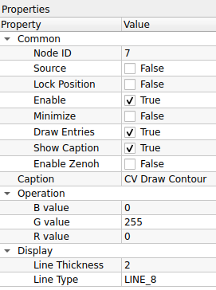
    

    
    

    | Property | Default | คำอธิบาย |
    | :--- | :--- | :--- |
    | **Node ID** | `7` | เลขประจำตัวลำดับของโหนด |
    | **Caption** | `CV Draw Contour` | ชื่อโหนดที่แสดงผลบน Workspace |
    | **B value** | `0` | ค่าสีน้ำเงิน (Blue) ของเส้นขอบ |
    | **G value** | `255` | ค่าสีเขียว (Green) ของเส้นขอบ |
    | **R value** | `0` | ค่าสีแดง (Red) ของเส้นขอบ |
    | **Line Thickness** | `2` | ความหนาของเส้น (หน่วยเป็นพิกเซล) |
    | **Line Type** | `LINE_8` | รูปแบบของเส้น: - **LINE_8:** เส้นเชื่อมต่อ 8 ทิศทาง (มาตรฐาน เส้นไม่ขาด) - **LINE_4:** เส้นเชื่อมต่อ 4 ทิศทาง (เส้นอาจดูเหลี่ยมกว่า) - **LINE_AA:** เส้นลบรอยหยัก (Anti-Aliased) เส้นจะนวลและสวยที่สุด (แต่อาจกินทรัพยากรเพิ่มเล็กน้อย) |

    

    ---

    !!! tip "เทคนิค: การระบายสีทึบ (Fill Poly)"
        หากคุณกำหนดค่า **Line Thickness** เป็น **`-1`** (ค่าติดลบ)
        
        * โปรแกรมจะไม่วาดแค่เส้นขอบ แต่จะ **"ระบายสีทึบ (Fill)"** ลงไปในพื้นที่ภายในเส้นขอบทั้งหมดแทน
        * *ประโยชน์:* ใช้สร้าง Mask หรือระบายสีเพื่อเน้นวัตถุทั้งชิ้น

    !!! warning "ลำดับการต่อสาย (Wiring)"
        โหนดนี้ต้องการ Input 2 อย่างเสมอ:
        
        1.  **Image:** ภาพที่จะให้วาดเส้นทับลงไป (จะเป็นภาพสีหรือขาวดำก็ได้)
        2.  **Contours:** ข้อมูลเส้นขอบที่ส่งมาจากโหนด **CV Find Contour** เท่านั้น (ถ้าไม่ต่อสายนี้ จะไม่มีอะไรให้วาด)
        
??? node "- **CV Distance Transform:**"
    

    {width=80}
    

    **CV Distance Transform** คือโหนดสำหรับการคำนวณระยะห่างระหว่างแต่ละพิกเซลของวัตถุกับขอบเขตที่ใกล้ที่สุด ผลลัพธ์ที่ได้คือภาพโทนสีเทา (Grayscale) ที่ความสว่างของพิกเซลจะบอกถึง "ระยะห่างจากขอบ" (ยิ่งสว่างแสดงว่ายิ่งอยู่กึ่งกลางวัตถุ) นิยมใช้ในขั้นตอนเตรียมภาพสำหรับการแบ่งส่วนวัตถุ (Segmentation)

    ## **ตารางการตั้งค่า (Properties)**
    

    
    

    

    | Property | Default | คำอธิบาย |
    | :--- | :--- | :--- |
    | **Node ID** | `8` | เลขประจำตัวลำดับของโหนด |
    | **Caption** | `CV Distance Transform` | ชื่อโหนดที่แสดงผลบน Workspace |
    | **Operation Type** | `DIST_L2` | สูตรการคำนวณระยะทาง: - **DIST_C:** (Chessboard) ระยะทางแบบเดินตัว Max (เหมือนตัว King ในหมากรุก) - **DIST_L1:** (Manhattan) ระยะทางแบบเดินตามตาราง (บวกค่า \|x1-x2\| + \|y1-y2\|) - **DIST_L2:** (Euclidean) ระยะทางเส้นตรงจริง (แม่นยำและนิยมที่สุด) - **DIST_L12:** (L1-L2 Metric) การประมาณค่าแบบผสม เพื่อความรวดเร็ว |
    | **Mask Size** | `3` | ขนาดของหน้ากากที่ใช้คำนวณ: - **0:** (Precise) ใช้หน้ากากแม่นยำสูง (Pixel-perfect) สำหรับ `DIST_L2` เท่านั้น - **3:** ใช้หน้ากากขนาด 3x3 (คำนวณเร็ว) - **5:** ใช้หน้ากากขนาด 5x5 (แม่นยำกว่า 3x3 เล็กน้อย) |

    

    ---

    !!! example "Use Case: การแยกเหรียญที่วางติดกัน"
        หากคุณมีภาพเหรียญวางเบียดกันจนขอบชนกัน การใช้ `Find Contour` ปกติจะมองเห็นเป็นก้อนเดียวใหญ่ๆ
        
        1.  ใช้ **CV Distance Transform** ภาพจะเปลี่ยนเป็นจุดสว่างๆ ตรงกลางเหรียญแต่ละเหรียญ (เหมือนยอดเขา)
        2.  พื้นที่รอยต่อระหว่างเหรียญจะมืดกว่า เพราะอยู่ใกล้ขอบ
        3.  นำภาพผลลัพธ์ไปทำ **Threshold** ตัดเอาเฉพาะส่วนที่สว่างที่สุด (ยอดเขา)
        4.  คุณจะได้จุดกึ่งกลางของแต่ละเหรียญแยกออกจากกันอย่างชัดเจน!

    !!! tip "Mask Size 0 คืออะไร?"
        ปกติ Mask Size จะเป็นขนาดตาราง (3x3, 5x5) แต่ถ้าเลือก **`0`** OpenCV จะใช้อัลกอริทึมพิเศษ (Saito-Toriwaki หรือใกล้เคียง) เพื่อหาค่าระยะทางแบบ **Precise Euclidean Distance** ซึ่งแม่นยำที่สุด แต่ **ต้องใช้คู่กับ `DIST_L2` เท่านั้น**
        
??? node "- **CV Hough Lines PoinSet:**"
    

    {width=80}
    

    **CV Hough Lines PointSet** คือโหนดสำหรับการตรวจจับเส้นตรงจาก **"ชุดจุดพิกัด" (Point Set)** โดยใช้อัลกอริทึม Standard Hough Transform โหนดนี้จะรับข้อมูลขาเข้าเป็นรายการของจุด (เช่น จุดจากเส้นรอบรูป หรือจุด Keypoints) และค้นหาว่ามีจุดกลุ่มไหนที่เรียงตัวกันเป็นเส้นตรงบ้าง ผลลัพธ์ที่ได้คือสมการเส้นตรงในรูปแบบ $(\rho, \theta)$

    ## **ตารางการตั้งค่า (Properties)**
    

    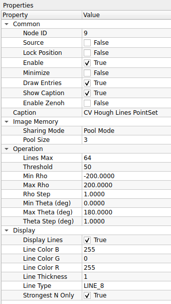
    

    ### **Common & Image Memory**
    

    | Property | Default | คำอธิบาย |
    | :--- | :--- | :--- |
    | **Node ID** | `9` | เลขประจำตัวลำดับของโหนด |
    | **Sharing Mode** | `Pool Mode` | โหมดการจัดการหน่วยความจำภาพ: - **Pool Mode:** ใช้ระบบ Memory Pool เพื่อนำหน่วยความจำกลับมาใช้ใหม่ (ประหยัดทรัพยากร) - **Broadcast Mode:** ส่งข้อมูลแบบกระจาย (เหมาะกับกรณีที่มีโหนดลูกข่ายรับข้อมูลหลายตัวพร้อมกัน) |
    | **Pool Size** | `3` | จำนวน Buffer สูงสุดที่จะจองไว้ใน Pool (เฉพาะ Pool Mode) |

    

    ### **Operation**
    

    | Property | Default | คำอธิบาย |
    | :--- | :--- | :--- |
    | **Lines Max** | `64` | จำนวนเส้นตรงสูงสุดที่ต้องการให้ส่งออกมา (Output limit) |
    | **Threshold** | `50` | คะแนนขั้นต่ำ (Vote) ที่จะนับว่าเป็นเส้นตรง (ต้องมีจุดเรียงกันอย่างน้อยกี่จุดจึงจะยอมรับ) |
    | **Min/Max Rho** | `-200` ถึง `200` | ขอบเขตระยะห่างจากจุดกำเนิด ($\rho$) ที่ต้องการค้นหา |
    | **Rho Step** | `1.0` | ความละเอียดของการค้นหาระยะห่าง ($\rho$) ทีละกี่พิกเซล |
    | **Min/Max Theta** | `0` ถึง `180` | ขอบเขตมุม ($\theta$) ที่ต้องการค้นหา (หน่วยเป็นองศา) |
    | **Theta Step** | `1.0` | ความละเอียดของการค้นหามุม ($\theta$) ทีละกี่องศา |
    | **Strongest N Only** | `True` | หากเปิดใช้งาน จะคัดเลือกเฉพาะเส้นที่มีคะแนน (Vote) สูงสุดจำนวน N เส้น (ตามค่า Lines Max) เรียงจากมากไปน้อย |

    

    ### **Display**
    

    | Property | Default | คำอธิบาย |
    | :--- | :--- | :--- |
    | **Display Lines** | `True` | เปิด/ปิด การวาดเส้นผลลัพธ์ลงบนภาพ |
    | **Line Color (B,G,R)** | `255, 0, 255` | กำหนดสีของเส้น (ค่าตั้งต้น: สีม่วง Magenta) |
    | **Line Thickness** | `1` | ความหนาของเส้น |
    | **Line Type** | `LINE_8` | รูปแบบอัลกอริทึมการวาดเส้น: - **LINE_8:** เส้นแบบ 8-connected (มาตรฐาน) - **LINE_4:** เส้นแบบ 4-connected - **LINE_AA:** (Anti-aliased) เส้นขอบเรียบ ลดรอยหยัก (สวยงามแต่กินทรัพยากรเพิ่มขึ้น) |

    

    ---

    !!! example "Use Case: การหาแนวเส้นขอบจาก Contour"
        หากคุณใช้โหนด **Find Contour** เพื่อหาขอบเขตของวัตถุสี่เหลี่ยม แต่จุดที่ได้อาจจะขรุขระหรือไม่เรียบเนียน
        
        1.  ส่งข้อมูลจุดจาก **Find Contour** เข้าสู่ **CV Hough Lines PointSet**
        2.  ปรับค่า **Threshold** ให้เหมาะสม เพื่อกรองจุดรบกวน (Noise) ออกไป
        3.  ผลลัพธ์ที่ได้คือ **เส้นตรงในอุดมคติ (Ideal Lines)** ที่ลากผ่านกลุ่มจุดเหล่านั้น ซึ่งสามารถนำไปคำนวณหามุมเอียง (Rotation Angle) ของวัตถุได้แม่นยำกว่าการใช้ Bounding Box

    !!! info "Rho ($\rho$) และ Theta ($\theta$) คืออะไร?"
        ระบบ Hough Transform ไม่ได้ใช้สมการ $y = mx + c$ แต่ใช้ระบบพิกัดเชิงขั้ว:
        
        * **$\rho$ (Rho):** ระยะห่างตั้งฉากจากจุดกำเนิด (มุมซ้ายบนของภาพ) ไปยังเส้นตรง
        * **$\theta$ (Theta):** มุมของเส้นตั้งฉากนั้น (หน่วยเป็นองศา)
        
??? node "- **CV Hough Lines P:**"
    

    {width=80}
    

    **CV Hough Lines P** คือโหนดสำหรับการตรวจจับเส้นตรงโดยใช้ **Probabilistic Hough Transform** ซึ่งเป็นเวอร์ชันปรับปรุงที่ทำงานได้รวดเร็วกว่าแบบมาตรฐาน โหนดนี้จะสุ่มเลือกจุดพิกัดมาคำนวณเพียงบางส่วน (แทนที่จะใช้ทุกจุด) และผลลัพธ์ที่ได้จะเป็น **ส่วนของเส้นตรง (Line Segments)** ที่ระบุพิกัดจุดเริ่มต้น $(x_1, y_1)$ และจุดสิ้นสุด $(x_2, y_2)$ ทำให้เหมาะกับการตรวจจับวัตถุที่มีขอบเขตชัดเจน

    ## **ตารางการตั้งค่า (Properties)**
    

    
    

    ### **Common**
    

    | Property | Default | คำอธิบาย |
    | :--- | :--- | :--- |
    | **Node ID** | `10` | เลขประจำตัวลำดับของโหนด |
    | **Caption** | `CV Hough Lines P` | ชื่อโหนดที่แสดงผลบน Workspace |

    

    ### **Image Memory**
    

    | Property | Default | คำอธิบาย |
    | :--- | :--- | :--- |
    | **Sharing Mode** | `Pool Mode` | โหมดการจัดการหน่วยความจำภาพ: - **Pool Mode:** ใช้ระบบ Memory Pool เพื่อนำหน่วยความจำกลับมาใช้ใหม่ (ประหยัดทรัพยากร) - **Broadcast Mode:** ส่งข้อมูลแบบกระจาย (เหมาะกับกรณีที่มีโหนดลูกข่ายรับข้อมูลหลายตัวพร้อมกัน) |
    | **Pool Size** | `3` | จำนวน Buffer สูงสุดที่จะจองไว้ใน Pool (เฉพาะ Pool Mode) |

    

    ### **Operation**
    

    | Property | Default | คำอธิบาย |
    | :--- | :--- | :--- |
    | **Rho** | `1.0` | ความละเอียดของการค้นหาระยะห่าง (หน่วยเป็นพิกเซล) |
    | **Theta** | `1.0` | ความละเอียดของการค้นหามุม (หน่วยเป็นองศา) |
    | **Threshold** | `50` | คะแนนขั้นต่ำ (Vote) ที่จะนับว่าเป็นเส้นตรง |
    | **Min Line Length** | `50.0` | ความยาวต่ำสุดของเส้นที่ยอมรับ (เส้นที่สั้นกว่านี้จะถูกตัดทิ้ง) |
    | **Max Line Gap** | `10.0` | ระยะห่างสูงสุดระหว่างจุดที่ยังอนุญาตให้เชื่อมต่อกันเป็นเส้นเดียวกันได้ (ช่วยเชื่อมเส้นที่ขาดช่วง) |

    

    ### **Display**
    

    | Property | Default | คำอธิบาย |
    | :--- | :--- | :--- |
    | **Display Lines** | `True` | เปิด/ปิด การวาดเส้นผลลัพธ์ลงบนภาพ |
    | **Line Color (B,G,R)** | `0, 255, 0` | กำหนดสีของเส้น (ค่าตั้งต้น: สีเขียว Lime `0, 255, 0`) |
    | **Line Thickness** | `2` | ความหนาของเส้น |
    | **Line Type** | `LINE_AA` | รูปแบบอัลกอริทึมการวาดเส้น: - **LINE_8:** เส้นแบบ 8-connected (มาตรฐาน) - **LINE_4:** เส้นแบบ 4-connected - **LINE_AA:** (Anti-aliased) เส้นขอบเรียบ ลดรอยหยัก (สวยงามแต่กินทรัพยากรเพิ่มขึ้น แนะนำสำหรับงานแสดงผล) |

    

    ---

    !!! example "Use Case: การตรวจจับเส้นเลนถนน (Lane Detection)"
        โหนดนี้เหมาะมากสำหรับงานตรวจจับเลนถนนหรือขอบวัตถุที่เป็นเส้นยาวแต่มีการขาดช่วง
        
        1.  ปรับ **Min Line Length** ให้ยาวพอที่จะกรอง Noise เล็กๆ น้อยๆ ออกไป
        2.  ปรับ **Max Line Gap** เพื่อช่วยเชื่อมเส้นถนนที่อาจจะลอกหรือขาดหายเป็นช่วงๆ ให้กลายเป็นเส้นเดียวกัน
        3.  ผลลัพธ์ที่ได้จะเป็นเส้นสีเขียวทับลงบนตำแหน่งเลนถนนจริง

    !!! tip "Standard vs Probabilistic Hough"
        * **Standard (Hough Lines):** คำนวณทุกจุด, ได้เส้นตรงความยาวอนันต์ ($\rho, \theta$), ช้ากว่า
        * **Probabilistic (Hough Lines P):** สุ่มคำนวณบางจุด, ได้ส่วนของเส้นตรงชัดเจน $(x_1,y_1, x_2,y_2)$, **เร็วกว่าและนิยมใช้มากกว่า**

??? node "- **CV Hough Lines:**"
    

    {width=80}
    

    **CV Hough Lines** คือโหนดสำหรับการตรวจจับเส้นตรงโดยใช้ **Standard Hough Transform** โหนดนี้จะรับภาพขาวดำ (Binary Image) และค้นหาเส้นตรงที่ตัดผ่านภาพ ผลลัพธ์ที่ได้จะไม่ใช่จุดเริ่มต้น-สิ้นสุด (Segment) แต่จะเป็น **สมการเส้นตรง $(\rho, \theta)$** ซึ่งเปรียบเสมือนเส้นตรงที่มีความยาวไม่สิ้นสุดลากผ่านขอบเขตของภาพ

    ## **ตารางการตั้งค่า (Properties)**
    

    
    

    ### **Common**
    

    | Property | Default | คำอธิบาย |
    | :--- | :--- | :--- |
    | **Node ID** | `11` | เลขประจำตัวลำดับของโหนด |
    | **Caption** | `CV Hough Lines` | ชื่อโหนดที่แสดงผลบน Workspace |

    

    ### **Image Memory**
    

    | Property | Default | คำอธิบาย |
    | :--- | :--- | :--- |
    | **Sharing Mode** | `Pool Mode` | โหมดการจัดการหน่วยความจำภาพ: - **Pool Mode:** ใช้ระบบ Memory Pool เพื่อนำหน่วยความจำกลับมาใช้ใหม่ (ประหยัดทรัพยากร) - **Broadcast Mode:** ส่งข้อมูลแบบกระจาย (เหมาะกับกรณีที่มีโหนดลูกข่ายรับข้อมูลหลายตัวพร้อมกัน) |
    | **Pool Size** | `3` | จำนวน Buffer สูงสุดที่จะจองไว้ใน Pool (เฉพาะ Pool Mode) |

    

    ### **Operation**
    

    | Property | Default | คำอธิบาย |
    | :--- | :--- | :--- |
    | **Rho** | `1.0` | ความละเอียดของการค้นหาระยะห่าง (หน่วยเป็นพิกเซล) |
    | **Theta** | `1.0` | ความละเอียดของการค้นหามุม (หน่วยเป็นองศา) |
    | **Threshold** | `100` | คะแนนขั้นต่ำ (Vote) ที่จะนับว่าเป็นเส้นตรง (ค่ายิ่งสูง จะได้เฉพาะเส้นที่ชัดจริงๆ เท่านั้น) |

    

    ### **Display**
    

    | Property | Default | คำอธิบาย |
    | :--- | :--- | :--- |
    | **Display Lines** | `True` | เปิด/ปิด การวาดเส้นผลลัพธ์ลงบนภาพ |
    | **Line Color (B,G,R)** | `255, 0, 0` | กำหนดสีของเส้น (ค่าตั้งต้น: สีน้ำเงิน Blue `255, 0, 0`) |
    | **Line Thickness** | `2` | ความหนาของเส้น |
    | **Line Type** | `LINE_AA` | รูปแบบอัลกอริทึมการวาดเส้น: - **LINE_8:** เส้นแบบ 8-connected (มาตรฐาน) - **LINE_4:** เส้นแบบ 4-connected - **LINE_AA:** (Anti-aliased) เส้นขอบเรียบ ลดรอยหยัก (สวยงามแต่กินทรัพยากรเพิ่มขึ้น) |

    

    ---

    !!! example "Use Case: การหาองศาเพื่อหมุนภาพ (Skew Correction)"
        เนื่องจากโหนดนี้ให้ค่าผลลัพธ์เป็นมุม $\theta$ (Theta) ของเส้นตรงที่ยาวที่สุดในภาพ จึงนิยมนำมาใช้ในการ:
        
        1.  หาเส้นขอบกระดาษหรือเส้นบรรทัดในเอกสารที่สแกนมาเอียงๆ
        2.  คำนวณค่าเฉลี่ยของมุม $\theta$ ที่ตรวจจับได้
        3.  นำค่ามุมนั้นไปสั่งหมุนภาพกลับให้ตรง (Deskewing)

    !!! warning "ข้อควรระวัง: เส้นยาวทะลุจอ!"
        ความแตกต่างสำคัญระหว่างโหนดนี้กับ **Hough Lines P**:
        
        * **CV Hough Lines (Standard):** ได้เส้นตรงที่ลากยาวตั้งแตสุดขอบซ้ายไปขอบขวาของภาพ (ไม่มีจุดจบ) เหมาะกับการหา "แนวโน้ม" หรือ "องศา" ของภาพ
        * **CV Hough Lines P (Probabilistic):** ได้เส้นที่มีจุดหัว-ท้ายชัดเจน เหมาะกับการหา "วัตถุ" หรือ "ขอบเขต"
        
??? node "- **CV Connected Components:**"
    

    {width=80}
    

    **CV Connected Components** คือโหนดสำหรับการทำ **Labeling** หรือการระบุและแยกกลุ่มของพิกเซลที่เชื่อมต่อกัน (Blobs) ในภาพ Binary ผลลัพธ์ที่ได้ไม่ใช่ภาพสีทั่วไป แต่เป็น **Label Map** (ข้อมูลชนิด Integer) ที่แต่ละพิกเซลจะเก็บค่า "หมายเลข ID ของวัตถุ" ที่มันสังกัดอยู่ (เช่น พื้นหลัง=0, วัตถุชิ้นแรก=1, วัตถุชิ้นสอง=2, ...) นิยมใช้ในการนับจำนวนวัตถุหรือแยกวัตถุเพื่อไปวิเคราะห์ต่อ

    ## **ตารางการตั้งค่า (Properties)**
    

    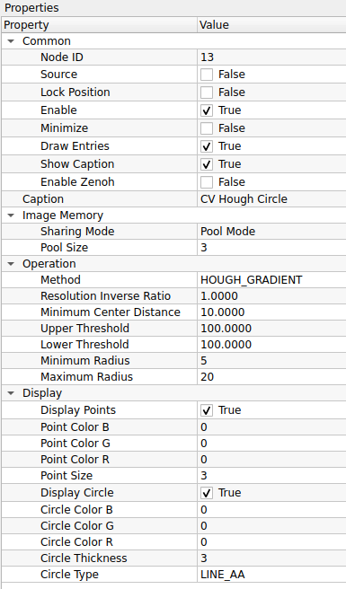
    

    ### **Common**
    

    | Property | Default | คำอธิบาย |
    | :--- | :--- | :--- |
    | **Node ID** | `12` | เลขประจำตัวลำดับของโหนด |
    | **Caption** | `CV Connected Components` | ชื่อโหนดที่แสดงผลบน Workspace |

    

    ### **Operation**
    

    | Property | Default | คำอธิบาย |
    | :--- | :--- | :--- |
    | **Connectivity** | `4` | รูปแบบการเชื่อมต่อของพิกเซลข้างเคียง: - **4:** เชื่อมต่อเฉพาะ บน-ล่าง-ซ้าย-ขวา (เหมาะกับวัตถุที่แยกกันชัดเจน) - **8:** เชื่อมต่อรวมแนวทแยงด้วย (เหมาะกับวัตถุที่มีรอยต่อบางๆ หรือจุดสัมผัสที่มุม) |
    | **Image Type** | `CV_32S` | ชนิดข้อมูลของภาพผลลัพธ์: - **CV_32S:** (32-bit Signed Integer) มาตรฐาน OpenCV รองรับจำนวนวัตถุได้มหาศาล - **CV_16U:** (16-bit Unsigned) ประหยัดหน่วยความจำกว่า แต่รองรับวัตถุได้สูงสุด 65,535 ชิ้น |
    | **Algorithm Type** | `CCL_DEFAULT` | อัลกอริทึมที่ใช้ประมวลผล: - **CCL_DEFAULT:** ให้ OpenCV เลือกวิธีที่เหมาะสมที่สุด (SAUF หรือ BBDT) - **CCL_WU:** (Wu's Algorithm) อัลกอริทึม SAUF แบบดั้งเดิม - **CCL_GRANA:** (Grana's Algorithm) อัลกอริทึม BBDT ที่ทำงานได้รวดเร็วมากบน CPU รุ่นใหม่ |

    

    ### **Display**
    

    | Property | Default | คำอธิบาย |
    | :--- | :--- | :--- |
    | **Visualize** | `False` | เปิด/ปิด การแสดงผลภาพสี: - **False:** ส่งข้อมูลเป็น Label Map (ภาพมืดๆ ดูด้วยตาเปล่าไม่รู้เรื่อง แต่คอมพิวเตอร์เข้าใจ) - **True:** แปลง ID ของวัตถุเป็นสีต่างๆ แบบสุ่ม (Random Colors) เพื่อให้มนุษย์ดูผลลัพธ์ได้ง่ายขึ้น |

    

    ---

    !!! example "Use Case: การนับจำนวนเม็ดยา"
        หากคุณมีภาพถ่ายเม็ดยาสีขาวบนพื้นดำ และผ่านการทำ Threshold มาแล้ว
        
        1.  ใช้ **CV Connected Components** ประมวลผลภาพ
        2.  ค่าสูงสุด (Max Value) ในภาพผลลัพธ์ คือ **จำนวนเม็ดยาทั้งหมด** ที่นับได้
        3.  หากต้องการหาขนาดพื้นที่ของเม็ดยาแต่ละเม็ด ก็สามารถนับจำนวนพิกเซลของแต่ละ ID (1, 2, 3...) ได้ทันที

    !!! tip "Visualize: False vs True"
        * **ใช้งานจริง (Processing):** ควรตั้งเป็น **`False`** เพื่อให้โหนดถัดไปได้รับค่า ID ที่ถูกต้อง (1, 2, 3...) ไปคำนวณต่อ
        * **ดีบัก (Debugging):** ควรตั้งเป็น **`True`** เฉพาะตอนที่ต้องการดูด้วยตาว่าโหนดแยกวัตถุได้ถูกต้องหรือไม่ เพราะสีที่แสดงผลออกมาเป็นเพียงการระบายสี (Visualization) ไม่ใช่ข้อมูล ID จริง

??? node "- **CV Hough Circle:**"
    

    
    

    **CV Hough Circles** คือโหนดสำหรับการตรวจจับวัตถุทรงกลมในภาพโดยใช้ **Hough Circle Transform** เหมาะสำหรับงานตรวจจับเหรียญ, ลูกบอล, หรือรูเจาะต่างๆ โหนดนี้มีความซับซ้อนกว่าการหาเส้นตรงเล็กน้อย เนื่องจากต้องระบุทั้งจุดศูนย์กลางและรัศมีของวงกลม

    ## **ตารางการตั้งค่า (Properties)**
    

    
    

    ### **Common**
    

    | Property | Default | คำอธิบาย |
    | :--- | :--- | :--- |
    | **Node ID** | `13` | เลขประจำตัวลำดับของโหนด (คาดการณ์จากลำดับ) |
    | **Caption** | `CV Hough Circles` | ชื่อโหนดที่แสดงผลบน Workspace |

    

    ### **Image Memory**
    

    | Property | Default | คำอธิบาย |
    | :--- | :--- | :--- |
    | **Sharing Mode** | `Pool Mode` | โหมดการจัดการหน่วยความจำภาพ: - **Pool Mode:** ใช้ระบบ Memory Pool (แนะนำ) - **Broadcast Mode:** ส่งข้อมูลแบบกระจาย |
    | **Pool Size** | `3` | จำนวน Buffer สูงสุดที่จะจองไว้ใน Pool |

    

    ### **Operation**
    

    | Property | Default | คำอธิบาย |
    | :--- | :--- | :--- |
    | **Method** | `HOUGH_GRADIENT` | อัลกอริทึมที่ใช้: - **HOUGH_GRADIENT:** (Standard) ใช้วิธีคำนวณ Gradient ของขอบภาพ (นิยมใช้ที่สุด) - **HOUGH_GRADIENT_ALT:** (Alternative) แม่นยำกว่าสำหรับวงกลมที่สมบูรณ์ ลด False Positive ได้ดีกว่าแบบปกติ |
    | **Resolution Inverse Ratio** | `1.0` | อัตราส่วนความละเอียดของตัวสะสม (dp): - **1.0:** ความละเอียดเท่าภาพต้นฉบับ - **2.0:** ความละเอียดครึ่งหนึ่ง (คำนวณเร็วขึ้น แต่อาจพลาดวงกลมเล็กๆ) |
    | **Minimum Center Distance** | `20.0` | (minDist) ระยะห่างต่ำสุดระหว่างจุดศูนย์กลางของวงกลมแต่ละวง (ถ้าน้อยเกินไป อาจตรวจเจอวงกลมซ้อนกันหลายวงในวัตถุเดียว) |
    | **Upper Threshold** | `100` | (param1) ค่า Threshold สูงสุดสำหรับ Canny Edge Detector ภายในฟังก์ชัน |
    | **Lower Threshold** | `100` | (param2) ค่า Threshold สำหรับการโหวตที่จุดศูนย์กลาง (ค่ายิ่งน้อย ยิ่งเจอวงกลมเยอะรวมถึงวงกลมปลอม, ค่ายิ่งมาก จะเจอเฉพาะวงกลมที่ชัดจริงๆ) |
    | **Minimum Radius** | `0` | รัศมีต่ำสุดของวงกลมที่จะตรวจจับ (0 = ไม่จำกัด) |
    | **Maximum Radius** | `0` | รัศมีสูงสุดของวงกลมที่จะตรวจจับ (0 = ไม่จำกัด) |

    

    ### **Display**
    

    | Property | Default | คำอธิบาย |
    | :--- | :--- | :--- |
    | **Display Circles** | `True` | เปิด/ปิด การวาดวงกลมผลลัพธ์ลงบนภาพ |
    | **Circle Color (B,G,R)** | `0, 255, 0` | กำหนดสีของเส้นวงกลม |
    | **Circle Thickness** | `2` | ความหนาของเส้นวงกลม |
    | **Circle Type** | `LINE_AA` | รูปแบบอัลกอริทึมการวาดเส้น: - **LINE_8:** เส้นแบบ 8-connected - **LINE_4:** เส้นแบบ 4-connected - **LINE_AA:** (Anti-aliased) เส้นขอบเรียบ ลดรอยหยัก (แนะนำเพื่อให้วงกลมดูสวยงาม) |

    

    ---

    !!! example "Use Case: การนับเหรียญ"
        1.  ตั้งค่า **Method** เป็น `HOUGH_GRADIENT`
        2.  ปรับ **Minimum Center Distance** ให้มีค่าประมาณขนาดของเหรียญ (เพื่อไม่ให้ตรวจจับซ้ำที่จุดเดิม)
        3.  ปรับ **Lower Threshold** (param2) ลงเรื่อยๆ จนกว่าจะเริ่มเห็นวงกลมครบทุกเหรียญ (ระวังอย่าให้ต่ำเกินไปจนเจอ Noise)
        4.  หากรู้ขนาดเหรียญที่แน่นอน ให้ระบุ **Min/Max Radius** เพื่อกรองวงกลมขนาดอื่นทิ้งไป

    !!! tip "HOUGH_GRADIENT vs ALT"
        หากคุณใช้ `HOUGH_GRADIENT` แล้วเจอปัญหาวงกลมซ้อนกันเยอะๆ หรือปรับค่ายาก ลองเปลี่ยนเป็น **`HOUGH_GRADIENT_ALT`** ซึ่งเป็นวิธีใหม่ใน OpenCV ที่มักจะให้ผลลัพธ์แม่นยำกว่าและตั้งค่าง่ายกว่า (ค่า param2 จะเปลี่ยนไปใช้ช่วง 0.0-1.0 แทนที่จะเป็นจำนวนโหวต)

??? node "- **CV Sobel and Scharr:**"
        

        
        

    
    **CV Sobel and Scharr** คือโหนดสำหรับการตรวจจับขอบภาพโดยใช้หลักการทางคณิตศาสตร์เรื่อง "อนุพันธ์" (Derivatives) เพื่อคำนวณหาการเปลี่ยนแปลงของความสว่างในแนวแกน X และ Y
    * **Sobel:** เป็นวิธีมาตรฐานที่นิยมใช้กรองหาขอบภาพ โดยใช้ Gaussian Smoothing ร่วมกับ Differential Operator ทำให้ทนต่อสัญญาณรบกวนได้ดี
    * **Scharr:** เป็นเวอร์ชันปรับปรุงของ Sobel (เฉพาะขนาด 3x3) ที่ให้ผลลัพธ์ความชันที่แม่นยำกว่าและมีความสมมาตรในการหมุนมากกว่า

    ## **ตารางการตั้งค่า (Properties)**
    

    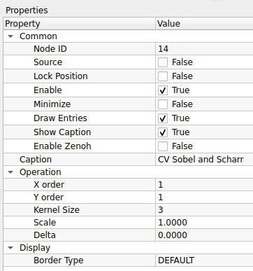
    

    ### **Common**
    

    | Property | Default | คำอธิบาย |
    | :--- | :--- | :--- |
    | **Node ID** | `14` | เลขประจำตัวลำดับของโหนด |
    | **Caption** | `CV Sobel and Scharr` | ชื่อโหนดที่แสดงผลบน Workspace |

    

    ### **Operation**
    

    | Property | Default | คำอธิบาย |
    | :--- | :--- | :--- |
    | **X order** | `1` | อันดับของอนุพันธ์ในแนวแกน X (แนวนอน): - **1:** หาขอบแนวตั้ง (Vertical Edges) - **0:** ไม่หาในแนวนี้ |
    | **Y order** | `1` | อันดับของอนุพันธ์ในแนวแกน Y (แนวตั้ง): - **1:** หาขอบแนวนอน (Horizontal Edges) - **0:** ไม่หาในแนวนี้ |
    | **Kernel Size** | `3` | ขนาดของหน้ากากกรอง (ต้องเป็นเลขคี่): - **3, 5, 7:** ใช้ Sobel Operator ตามขนาดปกติ - **-1:** (ค่าพิเศษ) ใช้ **Scharr Operator** (3x3) ซึ่งแม่นยำกว่า Sobel 3x3 ปกติ |
    | **Scale** | `1.0000` | ตัวคูณค่าผลลัพธ์ (ใช้ปรับความสว่างของเส้นขอบให้ชัดขึ้น) |
    | **Delta** | `0.0000` | ค่าคงที่ที่บวกเพิ่มเข้าไปในผลลัพธ์ (ใช้ปรับความสว่างพื้นหลัง) |

    

    ### **Display**
    

    | Property | Default | คำอธิบาย |
    | :--- | :--- | :--- |
    | **Border Type** | `DEFAULT` | วิธีการจัดการพิกเซลที่ขอบภาพ (Padding) เมื่อ Kernel ยื่นออกนอกภาพ: - **DEFAULT:** (Reflect 101) สะท้อนภาพแบบสมมาตร (gfedcb\|abcdefgh\|hgfedc) - **CONSTANT:** เติมค่าคงที่ (สีดำ) ล้อมรอบ - **REPLICATE:** ทำซ้ำพิกเซลขอบสุด (aaaaaa\|abcdefgh\|hhhhhh) - **REFLECT:** สะท้อนภาพแบบกระจกเงา (fedcba\|abcdefgh\|hgfedc) - **WRAP:** เชื่อมต่อขอบซ้าย-ขวา (cdefgh\|abcdefgh\|abcdefg) - **TRANSPARENT:** ไม่เปลี่ยนแปลงพิกเซลที่ขอบเดิม - **ISOLATED:** ไม่สนใจพิกเซลนอก ROI |

    

    ---

    !!! example "Use Case: การหาขอบเฉพาะแนวตั้ง (Vertical Edge Detection)"
        เทคนิคนี้มีประโยชน์มากเมื่อต้องการตรวจจับเสา, ขอบกำแพง, หรือเส้นเลนถนนแนวตั้ง
        
        1.  ตั้งค่า **X order = 1** (หาความชันแนวนอน -> เจอเส้นตั้ง)
        2.  ตั้งค่า **Y order = 0** (ไม่สนใจความชันแนวตั้ง -> ตัดเส้นนอนทิ้ง)
        3.  ผลลัพธ์ที่ได้จะเน้นเฉพาะเส้นที่เป็นแนวตั้ง ส่วนเส้นแนวนอนจะจางหายไป

    !!! tip "Sobel vs Scharr (Kernel Size)"
        * ถ้าคุณต้องการใช้ Kernel ขนาดเล็ก **3x3** แนะนำให้แก้ค่า **Kernel Size เป็น `-1`** เพื่อเรียกใช้ **Scharr** แทน เพราะ Sobel 3x3 แบบปกติอาจให้ผลลัพธ์ที่ไม่ค่อยแม่นยำในเรื่องทิศทางมุมเฉียงครับ
        * ถ้าต้องการ Kernel ขนาดใหญ่ (5x5, 7x7) เพื่อลด Noise ให้ใช้ค่าเลขคี่ตามปกติ (จะเป็น Sobel)

        ??? node "- **CV Find and Draw Contour:**"
            

            
            

## 11. Image Transformation (การแปลงทางเรขาคณิต)
การเปลี่ยนรูปร่าง ขนาด หรือมุมมองของภาพ

	

??? node "- **CV Make Border:**"
    

    {width=80}
    

    **CV Make Border** คือโหนดสำหรับการสร้างขอบ (Border) หรือการเพิ่ม Padding รอบรูปภาพ โดยฟังก์ชันนี้จะเรียกใช้ `cv::copyMakeBorder` ผู้ใช้สามารถกำหนดความหนาของขอบในแต่ละด้าน (บน, ล่าง, ซ้าย, ขวา) ได้อย่างอิสระ รวมถึงเลือกวิธีการเติมข้อมูลในส่วนขอบที่สร้างขึ้นใหม่ได้

    ## **ตารางการตั้งค่า (Properties)**
    

    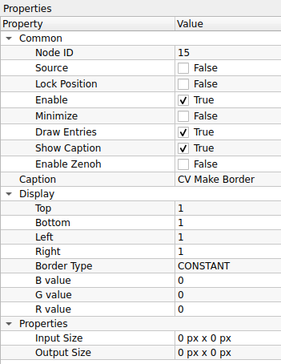
    

    ### **Common**
    

    | Property | Default | คำอธิบาย |
    | :--- | :--- | :--- |
    | **Node ID** | `15` | เลขประจำตัวลำดับของโหนด |
    | **Caption** | `CV Make Border` | ชื่อโหนดที่แสดงผลบน Workspace |

    

    ### **Display** (Settings)
    

    | Property | Default | คำอธิบาย |
    | :--- | :--- | :--- |
    | **Top** | `1` | ความหนาของขอบด้านบน (หน่วยเป็นพิกเซล) |
    | **Bottom** | `1` | ความหนาของขอบด้านล่าง (หน่วยเป็นพิกเซล) |
    | **Left** | `1` | ความหนาของขอบด้านซ้าย (หน่วยเป็นพิกเซล) |
    | **Right** | `1` | ความหนาของขอบด้านขวา (หน่วยเป็นพิกเซล) |
    | **Border Type** | `CONSTANT` | รูปแบบการเติมข้อมูลในขอบ: - **DEFAULT:** (Reflect 101) สะท้อนภาพแบบกระจกเงา (เป็นค่ามาตรฐานของ OpenCV) - **CONSTANT:** เติมด้วยสีคงที่ (ใช้ค่า B, G, R value ด้านล่าง) - **REPLICATE:** ก๊อปปี้พิกเซลขอบสุดซ้ำๆ ออกไป - **REFLECT:** สะท้อนภาพเหมือนกระจก - **WRAP:** นำภาพด้านตรงข้ามมาแปะ (เหมือนปูกระเบื้อง) |
    | **B value** | `0` | ค่าสีน้ำเงิน (Blue) สำหรับขอบแบบ CONSTANT |
    | **G value** | `0` | ค่าสีเขียว (Green) สำหรับขอบแบบ CONSTANT |
    | **R value** | `0` | ค่าสีแดง (Red) สำหรับขอบแบบ CONSTANT |

    

    ### **Properties** (Info)
    

    | Property | Default | คำอธิบาย |
    | :--- | :--- | :--- |
    | **Input Size** | `0 px x 0 px` | (Read-only) ขนาดของภาพต้นฉบับก่อนเติมขอบ |
    | **Output Size** | `0 px x 0 px` | (Read-only) ขนาดของภาพผลลัพธ์หลังรวมขอบแล้ว |

    

    ---

    !!! example "Use Case: การเตรียมภาพสำหรับ Deep Learning"
        โมเดล AI บางตัวต้องการภาพที่มีสัดส่วนเป็นสี่เหลี่ยมจัตุรัส (เช่น 640x640) แต่ภาพที่ได้จากกล้องอาจเป็นสี่เหลี่ยมผืนผ้า (เช่น 640x480)
        
        1.  คำนวณส่วนต่างความสูง (640 - 480 = 160 พิกเซล)
        2.  ใช้ **CV Make Border** เติมขอบ **Top = 80** และ **Bottom = 80** (หารสองบน-ล่าง)
        3.  เลือก **Border Type** เป็น `CONSTANT` (สีดำ) หรือ `REPLICATE`
        4.  ผลลัพธ์จะได้ภาพ 640x640 โดยที่สัดส่วนภาพเดิมไม่เพี้ยน (ไม่โดนยืด)

    !!! tip "Border Type สำหรับการ Process ภาพ"
        * หากต้องการ **ใส่กรอบสวยงาม** ให้ใช้ **`CONSTANT`** และเลือกสีตามชอบ
        * หากต้องการ **ทำ Blur หรือ Edge Detection** แนะนำให้ใช้ **`DEFAULT`** หรือ **`REFLECT`** เพื่อให้ขอบภาพดูเนียนต่อเนื่อง ไม่เกิดรอยต่อที่ผิดธรรมชาติเหมือนการตัดขอบด้วยสีดำ
        
??? node "- **CV Watershed:**"
    

    {width=80}
    

    **CV Watershed** คือโหนดสำหรับการแบ่งส่วนภาพ (Segmentation) โดยใช้อัลกอริทึม **Marker-based Watershed** ซึ่งจะมองค่าความสว่างของพิกเซลเป็นความสูง-ต่ำ (Topography) โหนดนี้ต้องการข้อมูลขาเข้า 2 ส่วนสำคัญ คือ:
    1.  **Source Image:** ภาพต้นฉบับ (สี 3 Channel)
    2.  **Markers:** ภาพลายเส้นระบุตำแหน่งวัตถุ (CV_32S) ที่ได้จากโหนด *Connected Components* หรือการวาดด้วยมือ เพื่อบอกจุดเริ่มต้นว่า "ตรงไหนเป็นวัตถุ" และ "ตรงไหนเป็นพื้นหลัง"

    ## **ตารางการตั้งค่า (Properties)**
    

    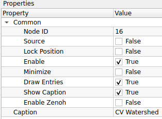
    

    ### **Common**
    

    | Property | Default | คำอธิบาย |
    | :--- | :--- | :--- |
    | **Node ID** | `16` | เลขประจำตัวลำดับของโหนด |
    | **Caption** | `CV Watershed` | ชื่อโหนดที่แสดงผลบน Workspace |

    

    *(หมายเหตุ: โหนดนี้ไม่มีพารามิเตอร์ปรับแต่งที่ซับซ้อนในหน้าต่าง Properties เนื่องจากอัลกอริทึมจะทำงานตาม "Marker" ที่ส่งเข้ามาทาง Input Pin โดยตรง)*

    ---

    !!! example "Use Case: Workflow มาตรฐานของการแยกวัตถุ"
        การใช้งาน Watershed มักจะเป็นขั้นตอนสุดท้ายของกระบวนการดังนี้:
        
        1.  **Distance Transform:** หาจุดกึ่งกลางของวัตถุ (ยอดเขา)
        2.  **Threshold/Peak:** ตัดเอาเฉพาะจุดยอดเพื่อทำเป็นจุดอ้างอิง
        3.  **Connected Components:** สร้าง Marker (ID 1, 2, 3...) จากจุดยอดเหล่านั้น
        4.  **CV Watershed:** นำ Marker มาขยายอิทธิพลลงบนภาพต้นฉบับ น้ำจะไหลจากจุดยอด (Marker) ไปชนกับขอบวัตถุ
        5.  **ผลลัพธ์:** จะได้เส้นขอบ (Boundary) ที่กั้นระหว่างวัตถุแต่ละชิ้นอย่างสมบูรณ์ แม้ว่าวัตถุจะวางชิดกันก็ตาม (เส้นขอบจะมีค่าเป็น -1)

    !!! warning "Input Requirement"
        โหนดนี้ **จำเป็น** ต้องเชื่อมต่อ Input ทั้งสองขา:
        * **Input 1 (Image):** ต้องเป็นภาพสี (8-bit 3-channel)
        * **Input 2 (Markers):** ต้องเป็นภาพ Label (32-bit integer `CV_32S`) เท่านั้น (มักมาจากโหนด Connected Components)

## 12. Math Operation (การคำนวณคณิตศาสตร์)
โหนดคำนวณตัวเลขทั่วไป

	

??? node "- **Convert to Integer:**"
    

    {width=80}
    

    **Convert to Integer** คือโหนดสำหรับการแปลงชนิดข้อมูลของภาพ (Data Type Conversion) จากรูปแบบทั่วไป (เช่น 8-bit Unsigned หรือ Floating point) ให้กลายเป็น **จำนวนเต็ม (Integer)** โดยปกติมักจะแปลงเป็นรูปแบบ **Signed 32-bit Integer (`CV_32S`)** เพื่อเตรียมข้อมูลสำหรับป้อนเข้าสู่ฟังก์ชันที่ต้องการความละเอียดของตัวเลขสูงหรือต้องการค่าติดลบได้ เช่น การทำ Marker ให้กับ Watershed

    ## **ตารางการตั้งค่า (Properties)**
    

    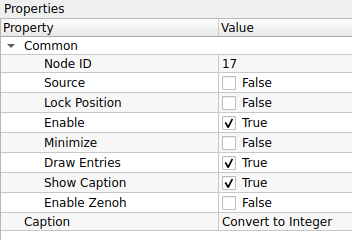
    

    ### **Common**
    

    | Property | Default | คำอธิบาย |
    | :--- | :--- | :--- |
    | **Node ID** | `17` | เลขประจำตัวลำดับของโหนด |
    | **Caption** | `Convert to Integer` | ชื่อโหนดที่แสดงผลบน Workspace |

    

    *(หมายเหตุ: โหนดนี้มักทำงานแบบ Direct Cast คือแปลงค่าพิกเซลตรงๆ ทันที จึงอาจไม่มีพารามิเตอร์ซับซ้อนให้ปรับแต่ง)*

    ---

    !!! example "Use Case: การเตรียม Marker สำหรับ Watershed"
        โหนด **CV Watershed** ต้องการ Input ช่องที่ 2 (Markers) เป็นภาพชนิด `CV_32S` เท่านั้น
        
        * **ปัญหา:** หากคุณวาดภาพ Marker ด้วยมือ หรือใช้ภาพขาวดำจาก Threshold ข้อมูลจะเป็นชนิด `CV_8U` (0-255) ซึ่งนำไปต่อเข้า Watershed ไม่ได้ (โปรแกรมจะฟ้อง Error หรือเชื่อมสายไม่ได้)
        * **ทางแก้:**
            1.  นำภาพ `CV_8U` นั้นมาผ่านโหนด **Convert to Integer** ก่อน
            2.  ข้อมูลจะถูกแปลงเป็น `CV_32S`
            3.  จากนั้นจึงลากสายไปเข้า Input ขา Marker ของ **CV Watershed** ได้อย่างสมบูรณ์

    !!! tip "Data Type ใน OpenCV"
        * **CV_8U:** (0 ถึง 255) ใช้เก็บภาพสี/ขาวดำทั่วไป
        * **CV_32S:** (-2,147,483,648 ถึง 2,147,483,647) ใช้เก็บ Label, ID วัตถุ, หรือ Marker ที่ต้องการตัวเลขจำนวนมาก

??? node "- **Condition:**"
    

    {width=80}
    

    **Condition** คือโหนดสำหรับสร้างเงื่อนไขทางตรรกะ (Logical Comparison) เพื่อเปรียบเทียบค่าตัวเลขขาเข้า (Input) กับค่าที่กำหนดไว้ (Number) ผลลัพธ์ที่ได้จะเป็นค่าความจริง (True/False) หรือใช้สำหรับการกรองข้อมูล (Filter) เช่น การคัดแยกวัตถุที่มีขนาดเล็กเกินไปออกจากการคำนวณ

    ## **ตารางการตั้งค่า (Properties)**
    

    
    

    ### **Operation**
    

    | Property | Default | คำอธิบาย |
    | :--- | :--- | :--- |
    | **Condition** | `>` | ตัวดำเนินการเปรียบเทียบ (Operator): - **>** : มากกว่า (Greater than) - **>=** : มากกว่าหรือเท่ากับ (Greater than or equal) - **<** : น้อยกว่า (Less than) - **<=** : น้อยกว่าหรือเท่ากับ (Less than or equal) - **=** : เท่ากับ (Equal) - **!=** : ไม่เท่ากับ (Not equal) |
    | **Number** | `0` | ค่าตัวเลขที่ใช้เป็นเกณฑ์ในการเปรียบเทียบ |

    

    ---

    !!! example "Use Case: การคัดกรองขนาดวัตถุ"
        หากคุณต้องการนับเฉพาะ "กล่องขนาดใหญ่" และตัด "เศษขยะชิ้นเล็กๆ" ทิ้ง
        
        1.  นำค่า **Area** (พื้นที่) จากโหนด *Connected Components* มาเข้าโหนดนี้
        2.  ตั้งค่า **Condition** เป็น **`>` (มากกว่า)**
        3.  ตั้งค่า **Number** เป็น **`500`** (ขนาดพิกเซลขั้นต่ำที่ต้องการ)
        4.  โหนดจะส่งผ่านข้อมูลเฉพาะวัตถุที่มีขนาดใหญ่กว่า 500 พิกเซลเท่านั้นไปสู่กระบวนการถัดไป

    !!! tip "สัญลักษณ์ทางคณิตศาสตร์"
        * **`>=` และ `<=`** : จะรวมค่าที่เท่ากันไปด้วย (Inclusive) เช่น `>= 10` คือเอาตั้งแต่เลข 10 ขึ้นไป
        * **`>` และ `<`** : จะไม่เอาค่าที่เท่ากัน (Exclusive) เช่น `> 10` คือต้องเป็น 11 ขึ้นไป

??? node "- **Sum Integer:**"
    

    {width=80}
    

    **Sum Integer** คือโหนดสำหรับการคำนวณหา **ผลรวม (Summation)** ของค่าตัวเลขจำนวนเต็ม (Integer) ที่รับเข้ามา โหนดนี้มักถูกใช้เพื่อรวมข้อมูลตัวเลขจากหลายส่วนเข้าด้วยกัน เช่น การรวมจำนวนวัตถุที่ตรวจจับได้จากกล้องหลายตัว หรือการรวมคะแนน (Score) จากเงื่อนไขต่างๆ

    ## **ตารางการตั้งค่า (Properties)**
    

    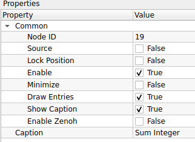
    

    ### **Common**
    

    | Property | Default | คำอธิบาย |
    | :--- | :--- | :--- |
    | **Node ID** | `19` | เลขประจำตัวลำดับของโหนด |
    | **Caption** | `Sum Integer` | ชื่อโหนดที่แสดงผลบน Workspace |

    

    *(หมายเหตุ: โหนดนี้ไม่มีพารามิเตอร์ซับซ้อน จะทำงานโดยการนำค่าจาก Input Pin ทุกขาที่เชื่อมต่อเข้ามาบวกกัน แล้วส่งผลลัพธ์ออกไปทาง Output Pin)*

    ---

    !!! example "Use Case: การรวมยอดจำนวนสินค้า"
        สมมติว่าคุณมีสายพานการผลิต 2 เส้น และใช้กล้อง 2 ตัวในการนับสินค้า:
        
        1.  **Camera 1 Process:** นับสินค้าได้ค่า `Count A` (Integer)
        2.  **Camera 2 Process:** นับสินค้าได้ค่า `Count B` (Integer)
        3.  นำค่าจากทั้งสองส่วนมาต่อเข้ากับ **Sum Integer**
        4.  ผลลัพธ์ที่ได้คือ `Total Count` (A + B) เพื่อส่งไปแสดงผลบนหน้าจอ Dashboard หรือส่งข้อมูลผ่าน Zenoh ต่อไป

    !!! tip "การใช้งานร่วมกับ Logic"
        โหนดนี้สามารถใช้รวมค่าจากโหนด **Condition** (ที่ส่งค่า 0 หรือ 1) ได้ เพื่อเช็คว่าผ่านเงื่อนไขครบกี่ข้อ เช่น:
        * เงื่อนไข A ผ่าน (1) + เงื่อนไข B ไม่ผ่าน (0) + เงื่อนไข C ผ่าน (1) -> **Sum = 2**

## 13. Number Operation (การจัดการตัวเลข)
การจัดการข้อมูลประเภทตัวเลขเฉพาะทาง

	

??? node "- **Data Generator:**"
    

    {width=80}
    

    **Data Generator** คือโหนดสำหรับการสร้างข้อมูลจำลอง (Synthetic Data) เพื่อใช้ในการทดสอบระบบหรือตรวจสอบความถูกต้องของ Logic โดยไม่จำเป็นต้องเชื่อมต่อกับอุปกรณ์จริง ผู้ใช้สามารถกำหนดค่าตัวเลข ข้อความ หรือสัญญาณ Boolean ให้ส่งออกมาตามจังหวะเวลาที่ต้องการได้ นิยมใช้เพื่อจำลองสถานการณ์ต่างๆ (Simulation)

    ## **ตารางการตั้งค่า (Properties)**
    

    
    

    ### **Common**
    

    | Property | Default | คำอธิบาย |
    | :--- | :--- | :--- |
    | **Node ID** | `20` | เลขประจำตัวลำดับของโหนด |
    | **Caption** | `Data Generator` | ชื่อโหนดที่แสดงผลบน Workspace |

    

    *(หมายเหตุ: ปกติโหนดนี้จะมีส่วนตั้งค่า **Operation** หรือ **Settings** เพิ่มเติมด้านล่างเพื่อกำหนดชนิดข้อมูล (Data Type), ค่าที่ต้องการ (Value), หรือความถี่ในการส่งข้อมูล (Interval) หากมีข้อมูลส่วนนั้นสามารถแจ้งเพิ่มเติมเพื่อให้นำมาลงตารางได้ครับ)*

    ---

    !!! example "Use Case: การจำลองสัญญาณ Trigger"
        หากคุณต้องการทดสอบระบบแจ้งเตือนเมื่อค่าเกินกำหนด แต่ไม่อยากรอให้เกิดเหตุการณ์จริง:
        
        1.  ใช้ **Data Generator** สร้างตัวเลขจำลอง (เช่น สุ่มค่า 0-100 หรือวนลูปตัวเลข)
        2.  ส่งค่าเข้าสู่โหนด **Condition** (เช่น ถ้าค่า > 80 ให้เป็น True)
        3.  ตรวจสอบผลลัพธ์ที่ปลายทางว่าระบบแจ้งเตือนทำงานถูกต้องหรือไม่

    !!! tip "การใช้งานร่วมกับ Loop"
        Data Generator มักถูกใช้คู่กับโหนด **Delay** หรือ **Timer** เพื่อสร้างจังหวะการส่งข้อมูลที่สม่ำเสมอ เหมือนกับการจำลองข้อมูลที่ส่งมาจากเซนเซอร์ IoT แบบ Real-time

??? node "- **Scalar Operation:**"
    

    {width=80}
    

    **Scalar Operation** คือโหนดสำหรับการทำ **การคำนวณทางคณิตศาสตร์และตรรกศาสตร์** ระหว่างตัวเลข 2 จำนวน (Scalar values) เพื่อสร้างค่าผลลัพธ์ใหม่ โหนดนี้มักใช้ในการปรับแต่งค่าพารามิเตอร์, การคำนวณ Offset, การเปรียบเทียบเงื่อนไข (เพื่อส่งค่า 0 หรือ 1), หรือการทำ Logic Gate พื้นฐาน

    ## **ตารางการตั้งค่า (Properties)**
    

    
    

    ### **Common**
    

    | Property | Default | คำอธิบาย |
    | :--- | :--- | :--- |
    | **Node ID** | `21` | เลขประจำตัวลำดับของโหนด |
    | **Caption** | `Scalar Operation` | ชื่อโหนดที่แสดงผลบน Workspace |

    

    ### **Operation**
    

    | Property | Default | คำอธิบาย |
    | :--- | :--- | :--- |
    | **Operator** | `+` | เครื่องหมายการคำนวณที่ต้องการใช้งาน:  **คณิตศาสตร์ (Arithmetic):** - **`+`:** บวก - **`-`:** ลบ - **`*`:** คูณ - **`/`:** หาร - **MAX:** เลือกค่าที่มากกว่า - **MIN:** เลือกค่าที่น้อยกว่า  **การเปรียบเทียบ (Comparison):** (ผลลัพธ์เป็น 1=จริง, 0=เท็จ) - **`>`:** มากกว่า - **`>=`:** มากกว่าหรือเท่ากับ - **`<`:** น้อยกว่า - **`<=`:** น้อยกว่าหรือเท่ากับ - **EQUAL:** เท่ากับ  **ตรรกศาสตร์ (Logic):** - **AND:** และ (True เมื่อทั้งคู่เป็นจริง) - **OR:** หรือ (True เมื่อตัวใดตัวหนึ่งเป็นจริง) - **XOR:** (Exclusive OR) True เมื่อค่าต่างกัน - **NOR:** ไม่-หรือ (ตรงข้ามกับ OR) - **NAND:** ไม่-และ (ตรงข้ามกับ AND) |

    

    ---

    !!! example "Use Case: ระบบแจ้งเตือนเมื่ออุณหภูมิสูงเกินกำหนด"
        สมมติคุณได้รับค่าอุณหภูมิจากเซนเซอร์ และต้องการส่งสัญญาณเตือนเมื่อเกิน 80 องศา
        
        1.  **Input A:** รับค่าอุณหภูมิปัจจุบัน (เช่น 85)
        2.  **Input B:** ตั้งค่าคงที่ `80` (Threshold)
        3.  เลือก **Operator** เป็น **`>` (มากกว่า)**
        4.  **ผลลัพธ์:** หากอุณหภูมิ (85) > 80 โหนดจะส่งค่า **`1` (True)** ออกไปสั่งงานแจ้งเตือน

    !!! tip "MAX/MIN สำหรับการจำกัดค่า (Clamping)"
        คุณสามารถใช้โหนดนี้เพื่อจำกัดไม่ให้ค่าเกินขอบเขตที่ต้องการได้ เช่น:
        * ใช้ **MIN** เทียบกับค่า `255` -> เพื่อให้มั่นใจว่าค่าที่ส่งออกไปจะไม่เกิน 255 (ป้องกัน Overflow)
        * ใช้ **MAX** เทียบกับค่า `0` -> เพื่อให้มั่นใจว่าค่าจะไม่ติดลบ

??? node "- **Sync Gate:**"
    

    {width=80}
    

    **Sync Gate** คือโหนดสำหรับการดำเนินการทางตรรกศาสตร์ (Logical Operations) เพื่อควบคุมเงื่อนไขการทำงานของระบบ โหนดนี้จะรับสัญญาณ Boolean (True/False) หรือสัญญาณ Trigger จากหลายแหล่ง และทำการเปรียบเทียบด้วยตรรกะที่กำหนด เช่น "ต้องมาครบทุกเงื่อนไข (AND)" หรือ "มาแค่เงื่อนไขเดียวก็ได้ (OR)" จึงจะส่งสัญญาณออกไป

    ## **ตารางการตั้งค่า (Properties)**
    

    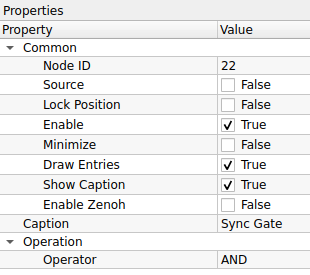
    

    ### **Common**
    

    | Property | Default | คำอธิบาย |
    | :--- | :--- | :--- |
    | **Node ID** | `22` | เลขประจำตัวลำดับของโหนด |
    | **Caption** | `Sync Gate` | ชื่อโหนดที่แสดงผลบน Workspace |

    

    ### **Operation**
    

    | Property | Default | คำอธิบาย |
    | :--- | :--- | :--- |
    | **Operator** | `AND` | รูปแบบตรรกะที่ใช้ตรวจสอบเงื่อนไข: - **EQUAL:** (เท่ากัน) ส่งค่า True เมื่ออินพุตทุกขามีค่าเหมือนกัน (True หมด หรือ False หมด) - **AND:** (และ) ส่งค่า True เมื่ออินพุต **ทุกขา** เป็น True - **OR:** (หรือ) ส่งค่า True เมื่อมีอินพุต **อย่างน้อย 1 ขา** เป็น True - **XOR:** (Exclusive OR) ส่งค่า True เมื่ออินพุตมีค่าต่างกัน - **NOR:** (Not OR) ตรงข้ามกับ OR (ส่ง True เมื่อไม่มีขาไหนเป็น True เลย) - **NAND:** (Not AND) ตรงข้ามกับ AND (ส่ง True เมื่อมีบางขาเป็น False) - **DIRECT:** (Buffer) ส่งค่าตามอินพุตตรงๆ (ไม่กลับค่า) - **DIRECT_NOT:** (Inverter/NOT) กลับค่าสัญญาณ (True &rarr; False, False &rarr; True) |

    

    ---

    !!! example "Use Case: ระบบความปลอดภัยแบบ 2 ชั้น (Safety Interlock)"
        สมมติว่าคุณต้องการให้หุ่นยนต์ทำงาน ก็ต่อเมื่อ "กดปุ่ม Start" **และ** "ประตูเครื่องจักรปิดสนิท" เท่านั้น
        
        1.  **Input 1:** รับสัญญาณจากปุ่ม Start (Button Pressed = True)
        2.  **Input 2:** รับสัญญาณจากเซนเซอร์ประตู (Door Closed = True)
        3.  นำสัญญาณทั้งสองมาเข้า **Sync Gate**
        4.  ตั้งค่า **Operator** เป็น **`AND`**
        5.  **ผลลัพธ์:** โหนดจะส่งสัญญาณให้หุ่นยนต์ทำงานก็ต่อเมื่อทั้งสองเงื่อนไขเป็นจริงพร้อมกัน หากประตูเปิดอยู่ (Input 2 = False) หุ่นยนต์จะไม่ทำงานแม้จะกดปุ่มก็ตาม

    !!! tip "Sync Gate vs Scalar Operation"
        * **Scalar Operation:** เน้นการคำนวณค่าตัวเลข (บวกลบคูณหาร) หรือเปรียบเทียบค่าเดียว
        * **Sync Gate:** เน้นการ **รวมสัญญาณ (Signal Aggregation)** จากหลายโหนดเพื่อตัดสินใจในขั้นตอนสุดท้าย (Decision Making) และมักรองรับอินพุตได้มากกว่า 2 ขา (Multi-input logic)

## 14. Output (การส่งออกผลลัพธ์)

	

??? node "- **CV Image Display:**"
    

    {width=80}
    

    **CV Image Display** คือโหนดสำหรับการแสดงผลรูปภาพ (Visualization) ที่ผ่านการประมวลผลแล้ว โหนดนี้จะทำหน้าที่เป็นจุดสิ้นสุดของสายสัญญาณภาพ (Sink Node) เพื่อให้ผู้ใช้งานสามารถตรวจสอบผลลัพธ์สุดท้าย หรือดูภาพระหว่างขั้นตอนการ Debug ได้

    ## **ตารางการตั้งค่า (Properties)**
    

    
    

    ### **Common**
    

    | Property | Default | คำอธิบาย |
    | :--- | :--- | :--- |
    | **Node ID** | `23` | เลขประจำตัวลำดับของโหนด |
    | **Caption** | `CV Image Display` | ชื่อโหนดที่แสดงผลบน Workspace |

    

    ### **Size (Read-Only)**
    *(ส่วนนี้เป็นข้อมูลสำหรับอ่านอย่างเดียว จะอัปเดตอัตโนมัติตามภาพที่ส่งเข้ามา)*
    

    | Property | Value | คำอธิบาย |
    | :--- | :--- | :--- |
    | **Width** | `0` | ความกว้างของภาพ (พิกเซล) |
    | **Height** | `0` | ความสูงของภาพ (พิกเซล) |
    | **Format** | `-` | รูปแบบของข้อมูลภาพ (เช่น RGB888, Grayscale, etc.) |

    

    ---

    !!! example "Use Case: การตรวจสอบผลลัพธ์"
        ในทุกๆ Workflow ของการประมวลผลภาพ มักจะจบด้วยโหนดนี้เสมอ:
        
        1.  **Read Image:** อ่านภาพเข้ามา
        2.  **Processing:** ผ่านโหนดต่างๆ (Blur -> Threshold -> Find Contours)
        3.  **CV Image Display:** ต่อสายสุดท้ายเข้าโหนดนี้เพื่อดูว่าผลลัพธ์ถูกต้องหรือไม่

    !!! tip "ทำไมค่า Width/Height เป็น 0?"
        หากคุณเห็นค่า Width หรือ Height เป็น `0` นั่นหมายความว่า **ยังไม่มีข้อมูลภาพถูกส่งเข้ามาที่โหนดนี้**
        * โปรดตรวจสอบการเชื่อมสาย (Link) ว่าถูกต้องหรือไม่
        * ตรวจสอบโหนดต้นทางว่ามีการทำงาน (Execute) แล้วหรือยัง

??? node "- **CV Image Properties:**"
    

    {width=80}
    

    **CV Image Properties** คือโหนดสำหรับการอ่านและตรวจสอบคุณสมบัติทางเทคนิค (Metadata) ของภาพที่ได้รับเข้ามา เช่น ขนาด, จำนวนช่องสี, หรือรูปแบบการจัดเก็บข้อมูลในหน่วยความจำ โหนดนี้มีประโยชน์มากในการสร้างเงื่อนไขการทำงานแบบอัตโนมัติ (เช่น ถ้าภาพเป็นขาวดำให้ข้ามขั้นตอนแปลงสี) หรือใช้สำหรับการดีบัก (Debugging)

    ## **ตารางการตั้งค่า (Properties)**
    

    
    

    ### **Common**
    

    | Property | Default | คำอธิบาย |
    | :--- | :--- | :--- |
    | **Node ID** | `24` | เลขประจำตัวลำดับของโหนด |
    | **Caption** | `CV Image Properties` | ชื่อโหนดที่แสดงผลบน Workspace |

    

    ### **Properties (Read-Only Info)**
    *(ส่วนนี้คือข้อมูลที่อ่านได้จากภาพขาเข้า ไม่ใช่การตั้งค่า)*
    

    | Property | Value | คำอธิบาย |
    | :--- | :--- | :--- |
    | **Name** | `ImageName` | ชื่ออ้างอิงของภาพ (ถ้ามี) |
    | **Channels** | `0` | จำนวนช่องสัญญาณสี: - **1:** ภาพขาวดำ (Grayscale) - **3:** ภาพสี (BGR) - **4:** ภาพสีพร้อมความโปร่งใส (BGRA) |
    | **Size** | `0 px x 0 px` | ขนาดความกว้าง x ความสูง ของภาพ |
    | **Binary** | `Yes/No` | ตรวจสอบว่าภาพเป็น Binary (มีค่าแค่ 0 กับ 255) หรือไม่ |
    | **Black and White** | `Yes/No` | ตรวจสอบว่าภาพเป็นโทนขาวดำ (ไม่มีเฉดสี) หรือไม่ |
    | **Continuous** | `Yes/No` | (Technical) ข้อมูลพิกเซลถูกเก็บในหน่วยความจำแบบเรียงต่อกันยาวเป็นก้อนเดียวหรือไม่ (มีผลต่อความเร็วในการประมวลผลด้วย Pointer) |
    | **Description** | `-` | คำอธิบายเพิ่มเติม (ถ้ามี) |

    

    ---

    !!! example "Use Case: การตรวจสอบความสมบูรณ์ของข้อมูล (Validation)"
        ก่อนที่จะส่งภาพเข้าสู่ Deep Learning Model ที่ต้องการภาพสีขนาด 640x640 เท่านั้น คุณสามารถใช้โหนดนี้ดักจับ Error ได้:
        
        1.  ส่งภาพเข้า **CV Image Properties**
        2.  เช็คค่า **Channels:** ถ้าเท่ากับ 1 (Grayscale) -> สั่งให้แปลงเป็น BGR ก่อน
        3.  เช็คค่า **Size:** ถ้าไม่ใช่ 640x640 -> สั่งให้ Resize
        4.  ช่วยป้องกันโปรแกรมค้าง (Crash) จากการส่งข้อมูลผิดรูปแบบเข้าโมเดล

    !!! tip "Continuous คืออะไร?"
        ค่า **Continuous = Yes** หมายความว่าข้อมูลภาพถูกเก็บใน RAM แบบเรียงต่อกันเป็นเส้นเดียว (ไม่มีช่องว่างท้ายบรรทัด) ซึ่งโหนดส่วนใหญ่ของ OpenCV จะทำงานได้เร็วกว่ามากเมื่อเจอภาพแบบนี้ แต่ถ้ามีการ Crop ภาพบางส่วนมา (ROI) ค่านี้อาจจะเป็น **No** ได้

??? node "- **Info Display:**"
    

    {width=80}
    

    **Info Display** คือโหนดสำหรับการแสดงผลข้อมูลในรูปแบบ **ข้อความ (Text)** หรือ **ตัวเลข (Numeric)** บน Workspace ทำหน้าที่คล้ายกับหน้าต่าง Terminal หรือ Console Log เพื่อให้ผู้ใช้สามารถติดตามค่าความเป็นไปของระบบ ตรวจสอบผลลัพธ์ทางคณิตศาสตร์ หรือดูค่าพิกัดต่างๆ ได้ทันทีโดยไม่ต้องเปิดหน้าต่าง Debug แยก

    ## **ตารางการตั้งค่า (Properties)**
    

    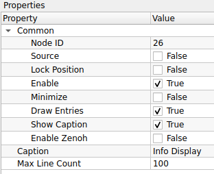
    

    ### **Common**
    

    | Property | Default | คำอธิบาย |
    | :--- | :--- | :--- |
    | **Node ID** | `26` | เลขประจำตัวลำดับของโหนด |
    | **Caption** | `Info Display` | ชื่อโหนดที่แสดงผลบน Workspace |

    

    ### **Settings**
    

    | Property | Default | คำอธิบาย |
    | :--- | :--- | :--- |
    | **Max Line Count** | `100` | จำนวนบรรทัดสูงสุดที่ต้องการให้แสดงผลค้างไว้: - หากข้อมูลที่ส่งเข้ามามีจำนวนเกินกว่าค่านี้ ระบบจะเริ่มลบข้อมูลเก่าที่สุดออก (FIFO: First-In, First-Out) เพื่อประหยัดหน่วยความจำและทำให้หน้าจอไม่รกจนเกินไป |

    

    ---

    !!! example "Use Case: การตรวจสอบพิกัดวัตถุ (Debugging Coordinates)"
        หากคุณต้องการรู้ว่าจุดศูนย์กลางของวัตถุ (Centroid) ที่ตรวจจับได้อยู่ที่พิกัดเท่าไหร่:
        
        1.  คำนวณหาตำแหน่งวัตถุ (จะได้ค่า X, Y)
        2.  ส่งค่า X, Y นั้นเข้าสู่โหนด **Info Display**
        3.  หน้าต่างโหนดจะแสดงค่าตัวเลขพิกัดไหลขึ้นมาเรื่อยๆ แบบ Real-time ทำให้คุณเห็นความเปลี่ยนแปลงได้ทันทีที่วัตถุขยับ

    !!! tip "Image Display vs Info Display"
        * **CV Image Display:** ใช้ดู **"รูปภาพ"** (Visual check) เช่น ภาพเบลอไหม, ขอบชัดไหม
        * **Info Display:** ใช้ดู **"ค่าตัวเลข/ข้อมูล"** (Data check) เช่น พื้นที่กี่พิกเซล, เจอวัตถุกี่ชิ้น, ค่า Threshold ปัจจุบันคือเท่าไหร่

??? node "- **CV Video Writer:**"
    

    {width=80}
    

    **CV Video Writer** คือโหนดสำหรับการบันทึกภาพต่อเนื่อง (Stream) ให้เป็นไฟล์วิดีโอ (Video Recording) ลงบนหน่วยความจำของเครื่องคอมพิวเตอร์ ช่วยให้คุณสามารถเก็บผลลัพธ์การทำงานย้อนหลัง หรือบันทึกเหตุการณ์เฉพาะช่วงเวลาที่สนใจได้

    ## **ตารางการตั้งค่า (Properties)**
    

    
    

    ### **Common**
    

    | Property | Default | คำอธิบาย |
    | :--- | :--- | :--- |
    | **Node ID** | `27` | เลขประจำตัวลำดับของโหนด |
    | **Caption** | `CV Video Writer` | ชื่อโหนดที่แสดงผลบน Workspace |

    

    ### **Settings**
    

    | Property | Default | คำอธิบาย |
    | :--- | :--- | :--- |
    | **Output Filename** | *(ว่าง)* | ชื่อไฟล์หรือเส้นทาง (Path) ที่ต้องการบันทึกไฟล์ (เช่น `record.avi`, `D:/logs/video.mp4`) *ควรระบุนามสกุลไฟล์ด้วยเพื่อให้โปรแกรมเลือก Codec ได้ถูกต้อง* |
    | **Recorded FPS** | `10` | (Frames Per Second) อัตราเฟรมเรตของวิดีโอผลลัพธ์ (ความเร็วในการเล่นกลับ) |
    | **Frame Per Video** | `1000` | จำนวนเฟรมสูงสุดต่อ 1 ไฟล์: - ใช้สำหรับ **การตัดแบ่งไฟล์ (File Splitting)** อัตโนมัติ - เมื่อบันทึกครบ 1000 เฟรม ระบบจะปิดไฟล์เดิมและสร้างไฟล์ใหม่ให้ทันที (ช่วยป้องกันไฟล์ใหญ่เกินไปหรือเสียหาย) |

    

    ---

    !!! example "Use Case: การบันทึกหลักฐานเมื่อเกิด Error"
        คุณอาจไม่ต้องการบันทึกวิดีโอตลอดเวลาเพื่อประหยัดพื้นที่ฮาร์ดดิสก์ แต่ต้องการบันทึกเฉพาะตอนเจอของเสีย:
        
        1.  ใช้โหนด **Condition** ตรวจสอบว่าเจอของเสียหรือไม่
        2.  ถ้าเจอของเสีย ให้ส่งสัญญาณ Trigger ไปสั่งเปิดการทำงานของ **CV Video Writer** (ผ่านขา Enable หรือ Flow Control)
        3.  ตั้งค่า **Frame Per Video** ไว้พอประมาณ (เช่น 100-200 เฟรม) เพื่อเก็บภาพเหตุการณ์สั้นๆ นั้นไว้

    !!! tip "Recorded FPS vs Real FPS"
        * **Recorded FPS:** คือการบอกไฟล์วิดีโอว่า "ให้เล่นภาพเร็วแค่ไหน" (Playback Speed)
        * หากกล้องของคุณส่งภาพมาจริงที่ 30 FPS แต่คุณตั้ง Recorded FPS ไว้ที่ `10`: วิดีโอผลลัพธ์จะดูเหมือน **Fast Forward (ภาพเคลื่อนไหวเร็ว)**
        * หากกล้องส่งมา 5 FPS แต่ตั้งไว้ `10`: วิดีโอจะดูเหมือน **Slow Motion**
        * *คำแนะนำ:* ควรตั้งค่านี้ให้ใกล้เคียงกับความเร็วการประมวลผลจริงของระบบ

## 15. Source (แหล่งกำเนิดภาพ)

	

??? node "- **CV Video Loader:**"
    

    {width=80}
    

    **CV Video Loader** คือโหนดสำหรับการโหลดและเล่นไฟล์วิดีโอ (Video Playback) เพื่อนำภาพจากวิดีโอมาประมวลผลต่อ เปรียบเสมือนการจำลองกล้องวิดีโอโดยใช้ไฟล์ข้อมูลที่มีอยู่แล้ว โหนดนี้มีประโยชน์อย่างมากในขั้นตอนการพัฒนา (Development) เพราะช่วยให้เราทดสอบอัลกอริทึมกับเหตุการณ์เดิมซ้ำๆ ได้จนกว่าจะพอใจ

    ## **ตารางการตั้งค่า (Properties)**
    

    
    

    ### **Common**
    

    | Property | Default | คำอธิบาย |
    | :--- | :--- | :--- |
    | **Node ID** | `28` | เลขประจำตัวลำดับของโหนด |
    | **Source** | `True` | ระบุว่าโหนดนี้เป็นจุดเริ่มต้นของข้อมูล (Source Node) |
    | **Caption** | `CV Video Loader` | ชื่อโหนดที่แสดงผลบน Workspace |

    

    ### **Settings**
    

    | Property | Default | คำอธิบาย |
    | :--- | :--- | :--- |
    | **Filename** | *(ว่าง)* | เส้นทาง (Path) ของไฟล์วิดีโอที่ต้องการเปิด (เช่น `D:/test_video.mp4`) |
    | **Flip Period (ms)** | `100` | ระยะเวลาหน่วงระหว่างเฟรม (มิลลิวินาที): - ใช้ควบคุมความเร็วในการเล่น (Playback Speed) - **100 ms** = ประมาณ 10 FPS (Frames Per Second) - **33 ms** = ประมาณ 30 FPS |
    | **Loop Play** | `True` | การวนซ้ำ: - **True:** เมื่อเล่นจบไฟล์ จะกลับมาเริ่มต้นใหม่ทันที (เหมาะสำหรับเปิดทิ้งไว้เพื่อจูนค่า) - **False:** เล่นจบแล้วหยุดส่งภาพ |

    

    ### **Image Memory**
    

    | Property | Default | คำอธิบาย |
    | :--- | :--- | :--- |
    | **Sharing Mode** | `Pool Mode` | โหมดการจัดการหน่วยความจำ (แนะนำ Pool Mode สำหรับวิดีโอ) |
    | **Pool Size** | `10` | จำนวน Buffer ที่จองไว้ (ค่า Default คือ 10 ซึ่งมากกว่าโหนดปกติ เพื่อให้การเล่นวิดีโอลื่นไหล) |

    

    ### **Size (Read-Only)**
    

    | Property | Value | คำอธิบาย |
    | :--- | :--- | :--- |
    | **Width** | `0` | ความกว้างของวิดีโอต้นฉบับ |
    | **Height** | `0` | ความสูงของวิดีโอต้นฉบับ |
    | **Format** | `-` | รูปแบบข้อมูลภาพ |

    

    ---

    !!! example "Use Case: การจูนค่า Threshold ที่แม่นยำ"
        การจูนค่าตรวจจับวัตถุกับกล้องสดทำได้ยากเพราะวัตถุอาจเคลื่อนที่ผ่านไปเร็วมาก
        
        1.  ใช้ **CV Video Writer** บันทึกเหตุการณ์ตอนวัตถุผ่านหน้ากล้องเก็บไว้ก่อน
        2.  เปลี่ยนมาใช้ **CV Video Loader** เปิดไฟล์วิดีโอนั้น
        3.  เปิด **Loop Play = True**
        4.  คุณจะเห็นภาพวัตถุวิ่งผ่านซ้ำๆ ไปมา ทำให้มีเวลาปรับจูนค่า Threshold หรือ Color Range ได้อย่างละเอียดจนกว่าจะจับวัตถุได้แม่นยำที่สุด

    !!! tip "คำนวณ Flip Period อย่างไร?"
        สูตรคือ: $1000 \div \text{FPS ที่ต้องการ} = \text{Flip Period}$
        
        * ต้องการ **10 FPS** -> ใส่ค่า **100**
        * ต้องการ **30 FPS** -> ใส่ค่า **33**
        * ต้องการ **60 FPS** -> ใส่ค่า **16**

??? node "- **CV Camera:**"
    

    {width=80}
    

    **CV Camera** คือโหนดสำหรับการเชื่อมต่อและรับภาพจากอุปกรณ์กล้อง (Camera Device) ที่เชื่อมต่ออยู่กับคอมพิวเตอร์ เช่น Web Camera หรือ Industrial Camera ผ่านพอร์ต USB/CSI โหนดนี้มีความสามารถในการควบคุมฮาร์ดแวร์ของกล้องโดยตรง เช่น การล็อคค่าแสง (Exposure) หรือการปรับสมดุลแสงขาว (White Balance) ซึ่งเป็นสิ่งจำเป็นเพื่อให้ได้คุณภาพของภาพที่สม่ำเสมอในการประมวลผล

    ## **ตารางการตั้งค่า (Properties)**
    

    
    

    ### **Common**
    

    | Property | Default | คำอธิบาย |
    | :--- | :--- | :--- |
    | **Node ID** | `29` | เลขประจำตัวลำดับของโหนด |
    | **Source** | `True` | ระบุว่าโหนดนี้เป็นจุดเริ่มต้นของข้อมูล (Source Node) |
    | **Caption** | `CV Camera` | ชื่อโหนดที่แสดงผลบน Workspace |

    

    ### **Camera Settings**
    

    | Property | Default | คำอธิบาย |
    | :--- | :--- | :--- |
    | **Camera ID** | `0` | ดัชนีของกล้อง (Index) ที่ต้องการเชื่อมต่อ: - **0:** กล้องตัวแรก (Default) - **1, 2, 3, 4:** กล้องตัวถัดไปที่เชื่อมต่อเพิ่มเข้ามา |
    | **Brightness** | `-10` | การชดเชยความสว่างของภาพ (ค่าขึ้นอยู่กับ Driver ของกล้องแต่ละรุ่น) |
    | **Auto White Balance**| `False` | ระบบปรับสมดุลแสงขาวอัตโนมัติ: - **False:** ล็อคค่าสีไว้ (แนะนำสำหรับงานตรวจจับสี เพื่อไม่ให้สีเพี้ยนเมื่อสภาพแสงเปลี่ยน) - **True:** ให้กล้องปรับสีเองตามธรรมชาติ |
    | **Auto Exposure** | `False` | ระบบปรับความสว่างอัตโนมัติ: - **False:** (แนะนำ) ล็อคค่าแสงไว้ ใช้คู่กับค่า Exposure ด้านล่าง - **True:** กล้องจะปรับแสงเอง (อาจทำให้ภาพวูบวาบเมื่อมีวัตถุผ่านหน้ากล้อง) |
    | **Exposure (1/s)** | `2000` | ความเร็วชัตเตอร์ (Shutter Speed) หรือเวลาในการรับแสง: - ค่านี้มักจะเป็นตัวหาร (เช่น 2000 = 1/2000 วินาที) หรือค่า Raw Value - **ค่ายิ่งมาก = ภาพมืดลงแต่จับภาพวัตถุเคลื่อนที่ได้หยุดนิ่งขึ้น** (ลด Motion Blur) |
    | **Gain** | `70` | อัตราการขยายสัญญาณดิจิทัล: - ใช้เพิ่มความสว่างเมื่อปรับ Exposure สูงๆ แล้วภาพมืดเกินไป - **ข้อควรระวัง:** ยิ่ง Gain เยอะ ภาพจะยิ่งมีจุดรบกวน (Noise/Grain) เยอะขึ้น |

    

    ---

    !!! example "Use Case: การตั้งค่ากล้องสำหรับสายพานการผลิต"
        หากคุณต้องตรวจจับวัตถุที่วิ่งบนสายพานด้วยความเร็ว:
        
        1.  **ปิด Auto Exposure (False):** เพื่อป้องกันไม่ให้ความสว่างเปลี่ยนไปมาเมื่อวัตถุสีขาว/ดำวิ่งผ่าน
        2.  **ปรับ Exposure ให้สูง (เช่น 2000+):** เพื่อลดอาการ "ภาพเบลอ" (Motion Blur) ขณะวัตถุเคลื่อนที่
        3.  **เพิ่ม Gain:** หากปรับ Exposure แล้วภาพมืดเกินไป ให้ค่อยๆ ดันค่า Gain ขึ้นจนสว่างพอเห็นรายละเอียด
        4.  **ปิด Auto White Balance:** เพื่อให้ค่าสี (Hue/Saturation) ของวัตถุคงที่ตลอดเวลา ง่ายต่อการเขียนเงื่อนไขแยกสี

    !!! tip "Camera ID หาอย่างไร?"
        หากเสียบกล้องแล้วภาพไม่ขึ้น ลองเปลี่ยน **Camera ID** เป็น `1` หรือ `2` ดูครับ ระบบปฏิบัติการ (Windows/Linux) อาจมองกล้อง Webcam ที่ติดมากับเครื่องเป็นเบอร์ 0 และกล้อง USB ใหม่เป็นเบอร์ 1

??? node "- **NodeData Timer:**"
    

    {width=80}
    

    **NodeData Timer** คือโหนดประเภท **Source** ที่ทำหน้าที่เป็นตัวกำเนิดจังหวะเวลา (Timer Source) เพื่อส่งสัญญาณ Trigger ออกมาเป็นคาบเวลาที่แน่นอน โหนดนี้มักถูกนำมาใช้เมื่อต้องการให้ระบบทำงานเป็นรอบๆ อย่างสม่ำเสมอ (Periodic Execution) หรือใช้กำหนดจังหวะในการส่งข้อมูล Node Data ไปยังเครือข่ายภายนอก

     

    
    

    1.  **การตั้งค่าเวลา (Time Settings):**
    * **`s` (Seconds):** ช่องสำหรับใส่จำนวนวินาที (ในภาพ = 0)
    * **`ms` (Milliseconds):** ช่องสำหรับใส่จำนวนมิลลิวินาที (ในภาพ = 500)
    * **ผลรวมเวลา:** ระบบจะนำค่าทั้งสองมารวมกัน เช่น 0s + 500ms = **0.500 วินาที** (หรือ 500ms) ซึ่งจะเป็นระยะห่างระหว่างการ Trigger แต่ละครั้ง

    2.  **โหมดการทำงาน (Operation Mode):**
        * **Period:** (ตามภาพ) หมายถึง **แบบทำซ้ำ (Loop)** เมื่อเวลาหมดลง จะส่งสัญญาณ Trigger แล้วเริ่มนับถอยหลังใหม่ทันที วนไปเรื่อยๆ (เหมาะสำหรับทำ Heartbeat หรือ Polling)
        * *(Single Shot):* (ถ้ามีตัวเลือกนี้) หมายถึง **ทำครั้งเดียว** เมื่อนับถอยหลังจบ จะส่งสัญญาณ Trigger ครั้งเดียวแล้วหยุด

    3.  **ปุ่มควบคุม (Control Buttons):**
        * **Start:** สั่งเริ่มจับเวลา
        * **Stop:** สั่งหยุดเวลาชั่วคราว
        * **Reset:** รีเซ็ตเวลาให้กลับมาเริ่มต้นใหม่และหยุดการทำงาน

    4.  **สถานะ (Status):**
        * **Time Remaining:** แสดงเวลาที่เหลืออยู่ในการนับถอยหลังรอบปัจจุบัน (หน่วยเป็น ms)

    ---

    ## **ตารางการตั้งค่า (Properties)**
    

    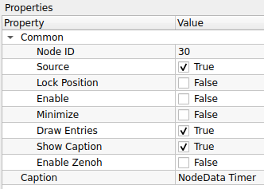
    

    ### **Common**
    

    | Property | Default | คำอธิบาย |
    | :--- | :--- | :--- |
    | **Node ID** | `30` | เลขประจำตัวลำดับของโหนด |
    | **Source** | `True` | ระบุว่าโหนดนี้เป็นจุดเริ่มต้นของข้อมูล (Source Node) |
    | **Enable** | `False` | เปิด/ปิด การทำงานของ Timer (ในภาพเป็น False ต้องติ๊กถูกเพื่อให้เริ่มนับเวลา) |
    | **Caption** | `NodeData Timer` | ชื่อโหนดที่แสดงผลบน Workspace |
    | **Enable Zenoh** | `False` | เปิด/ปิด การส่งข้อมูลผ่านโปรโตคอล Zenoh (สำหรับการเชื่อมต่อ IoT หรือ Dashboard ภายนอก) |

    

    ---

    !!! example "Use Case: การสร้าง Heartbeat ให้ระบบ"
        ในบางระบบที่ไม่มีกล้อง (Camera) คอยส่งภาพมาขับเคลื่อน Loop การทำงาน คุณสามารถใช้ **NodeData Timer** เป็นตัวขับเคลื่อนแทนได้:
        
        1.  ตั้งค่า Timer ให้ทำงานทุกๆ 1000ms (1 วินาที)
        2.  ส่งสัญญาณไปเข้าโหนด **Data Generator** หรือ **Status Check**
        3.  ระบบจะทำการตรวจสอบสถานะทุกๆ 1 วินาที โดยอัตโนมัติ (Polling System)

    !!! tip "Source Node คืออะไร?"
        สังเกตที่ช่อง **Source** ถูกติ๊กถูก (`True`) หมายความว่าโหนดนี้สามารถทำงานได้ด้วยตัวเองโดยไม่ต้องรอสัญญาณ Input จากใคร เปรียบเสมือนหัวขบวนรถไฟที่ลากโหนดอื่นๆ ให้ทำงานตาม

??? node "- **CV Image Loader:**"
    

    {width=80}
    

    **CV Image Loader** คือโหนดสำหรับอ่านไฟล์รูปภาพจากหน่วยความจำเครื่องคอมพิวเตอร์เพื่อนำมาประมวลผล สามารถใช้งานได้ 2 รูปแบบ คือโหลดภาพนิ่งเพียงภาพเดียว หรือโหลดภาพทั้งหมดในโฟลเดอร์ (Directory) แล้วนำมาแสดงผลวนลูปเป็นลำดับ (Sequence) เพื่อจำลองสถานการณ์เหมือนรับภาพจากกล้อง

    

    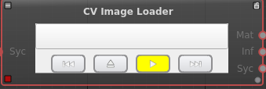
    

        Component,Icon,คำอธิบาย
    Path Input,(ช่องข้อความ),ช่องสำหรับระบุหรือแสดงเส้นทางไฟล์ (File Path) ของภาพหรือโฟลเดอร์ที่กำลังโหลดอยู่
    Previous / Reset,`,<<`
    Load / Browse,⏏,ปุ่มเลือกไฟล์:- เปิดหน้าต่าง File Explorer เพื่อเลือกไฟล์ภาพหรือโฟลเดอร์ใหม่ที่ต้องการนำเข้ามาใช้งาน
    Play / Pause,▶,ปุ่มเล่นอัตโนมัติ:- สีเหลือง (Active): กำลังเล่น (ส่งภาพออกมาต่อเนื่องตามเวลาที่กำหนด)- สีเทา (Inactive): หยุดชั่วคราว (Pause)
    Next / Step,`>>,`

    ## **ตารางการตั้งค่า (Properties)**
    

    
    

    ### **Common**
    

    | Property | Default | คำอธิบาย |
    | :--- | :--- | :--- |
    | **Node ID** | `33` | เลขประจำตัวลำดับของโหนด |
    | **Source** | `True` | ระบุว่าโหนดนี้เป็นจุดเริ่มต้นของข้อมูล (Source Node) |
    | **Caption** | `CV Image Loader` | ชื่อโหนดที่แสดงผลบน Workspace |

    

    ### **Settings**
    

    | Property | Default | คำอธิบาย |
    | :--- | :--- | :--- |
    | **Filename** | *(ว่าง)* | เส้นทางไฟล์ (Path) สำหรับกรณีต้องการโหลด **ภาพเดียว** (เช่น `D:/images/sample.jpg`) |
    | **Dirname** | *(ว่าง)* | เส้นทางโฟลเดอร์ (Path) สำหรับกรณีต้องการโหลด **ทั้งโฟลเดอร์** (Sequence) |
    | **Flip Period (ms)** | `1000` | ระยะเวลาหน่วงก่อนเปลี่ยนภาพถัดไป (เฉพาะกรณีใช้ Dirname): - **1000 ms:** เปลี่ยนภาพทุก 1 วินาที - **0:** เปลี่ยนภาพเร็วที่สุดเท่าที่เป็นไปได้ |
    | **Loop Flip** | `True` | การวนซ้ำ (เฉพาะกรณีใช้ Dirname): - **True:** เมื่อแสดงครบทุกภาพในโฟลเดอร์ จะวนกลับมาเริ่มภาพแรกใหม่ - **False:** หยุดเมื่อครบทุกภาพ |

    

    ### **Info Display**
    *(เลือกข้อมูลที่จะแสดงผลบนตัวโหนดใน Workspace)*
    

    | Property | Default | คำอธิบาย |
    | :--- | :--- | :--- |
    | **Time** | `True` | แสดงเวลาปัจจุบัน |
    | **Image Type** | `True` | แสดงชนิดของภาพ (เช่น BGR, Grayscale) |
    | **Image Format** | `True` | แสดงรูปแบบไฟล์ (เช่น .jpg, .png) |
    | **Image Size** | `True` | แสดงขนาดความกว้าง x สูง ของภาพ |
    | **Image Filename** | `True` | แสดงชื่อไฟล์ภาพที่กำลังถูกโหลดอยู่ ณ ขณะนั้น |

    

    ---

    !!! example "Use Case: การทดสอบ Dataset (Good/NG)"
        หากคุณมีภาพตัวอย่างสินค้าดี (Good) และสินค้าเสีย (NG) เก็บแยกไว้ในโฟลเดอร์ เพื่อทดสอบความแม่นยำของ AI:
        
        1.  เลือกช่อง **Dirname** แล้วชี้ไปที่โฟลเดอร์เก็บภาพ `D:/Dataset/Test_Images`
        2.  ตั้งค่า **Flip Period** เป็น `2000` (2 วินาที) เพื่อให้มีเวลาสังเกตผลลัพธ์ของแต่ละภาพ
        3.  ระบบจะทยอยส่งภาพในโฟลเดอร์ออกมาทีละภาพ วนไปเรื่อยๆ ช่วยให้คุณตรวจสอบได้ว่าอัลกอริทึมทำงานถูกต้องกับทุกเคสหรือไม่ โดยไม่ต้องมานั่งกดเปลี่ยนรูปเอง

    !!! tip "Filename vs Dirname"
        * หากระบุ **Filename:** ระบบจะโหลดภาพนั้นภาพเดียวและส่งออกมาตลอดเวลา (ภาพนิ่ง)
        * หากระบุ **Dirname:** ระบบจะเล่นภาพทั้งหมดในโฟลเดอร์นั้นวนไปเรื่อยๆ (สไลด์โชว์)
        * *แนะนำให้ล้างค่าในช่อง Filename ออกก่อน หากต้องการใช้งาน Dirname*

## 16. Template Category

	

??? node "- **Test_Sharpen:**"
    

    {width=80}
    

    **Test_Sharpen** คือโหนดสำหรับการปรับปรุงภาพ (Image Enhancement) ด้วยเทคนิค **Sharpening** ทำหน้าที่เน้นเส้นขอบและรายละเอียดของวัตถุให้ดูคมชัดขึ้น เหมาะสำหรับแก้ไขภาพที่เบลอเล็กน้อย หรือใช้เตรียมภาพก่อนส่งเข้าสู่กระบวนการที่ต้องการความแม่นยำของขอบสูง เช่น การอ่านตัวอักษร (OCR) หรือการตรวจจับบาร์โค้ด

    ## **ตารางการตั้งค่า (Properties)**
    

    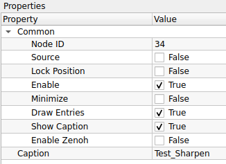
    

    ### **Common**
    

    | Property | Default | คำอธิบาย |
    | :--- | :--- | :--- |
    | **Node ID** | `34` | เลขประจำตัวลำดับของโหนด |
    | **Source** | `False` | โหนดนี้ไม่ใช่ Source Node (ต้องรับภาพเข้ามาประมวลผล) |
    | **Caption** | `Test_Sharpen` | ชื่อโหนดที่แสดงผลบน Workspace |

    

    *(รอข้อมูลเพิ่มเติมส่วน Operation/Settings เช่น Kernel Size, Strength)*

    ---

    !!! example "Use Case: การเตรียมภาพสำหรับอ่านตัวอักษร (OCR Pre-processing)"
        หากกล้องจับภาพฉลากสินค้าได้ แต่ตัวหนังสือดูฟุ้งๆ หรือเบลอเล็กน้อย ทำให้โหนด OCR อ่านค่าผิดพลาด
        
        1.  ส่งภาพจากกล้องเข้าสู่โหนด **Test_Sharpen**
        2.  อัลกอริทึมจะช่วยเพิ่ม Contrast บริเวณขอบตัวอักษรให้ตัดกับพื้นหลังมากขึ้น
        3.  ส่งภาพที่คมชัดแล้วไปเข้าโหนด **OCR** หรือ **Barcode Reader** จะช่วยเพิ่มความแม่นยำในการอ่านได้สูงขึ้น

    !!! tip "Sharpening คืออะไร?"
        หลักการพื้นฐานคือการนำภาพเดิมไปลบด้วยภาพที่เบลอ (Unsharp Masking) หรือการใช้ Filter (เช่น Laplacian) เพื่อหาจุดที่มีการเปลี่ยนแปลงความเข้มแสงสูงๆ (ขอบ) แล้วเพิ่มน้ำหนักสีตรงนั้นเข้าไป ทำให้ภาพดู "เด้ง" หรือคมขึ้นด้วยตาเปล่า

??? node "- **Template Model:**"
    

    {width=80}
    

    **Template Model** คือโหนดต้นแบบที่ใช้สำหรับการทดสอบหรือสาธิตการสร้างส่วนติดต่อผู้ใช้ (GUI Controls) ภายในระบบ ประกอบไปด้วยตัวอย่างการรับค่ารูปแบบต่างๆ เช่น การเลือกรายการ (ComboBox), การป้อนตัวเลข (SpinBox), การติ๊กเลือก (CheckBox), และการกำหนดขนาด/พิกัด (Size/Point) มักใช้เป็น Reference สำหรับนักพัฒนาที่ต้องการเขียน Plugin หรือ Custom Node ใหม่

    

    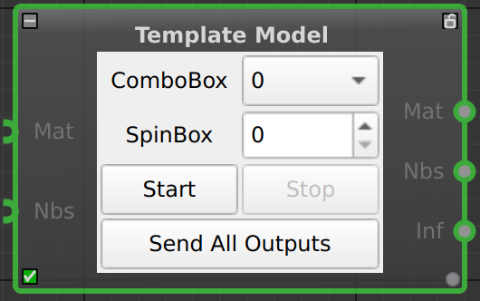{width=200}
    

    **Template Model** คือโหนดต้นแบบสำหรับการสาธิต (Demo Node) ที่รวบรวมฟังก์ชันการทำงานพื้นฐานของระบบไว้ในที่เดียว ทั้งการรับค่าผ่าน UI, การกดปุ่มสั่งงาน, และการรับ-ส่งข้อมูลผ่านพอร์ตต่างๆ เหมาะสำหรับนักพัฒนาที่ต้องการศึกษาโครงสร้างการทำงานของโหนด หรือใช้ทดสอบการเชื่อมต่อสัญญาณ (Signal Flow)

    ## **ตารางการตั้งค่า (Properties)**

    ### **Common**
    

    | Property | Default | คำอธิบาย |
    | :--- | :--- | :--- |
    | **Node ID** | `35` | เลขประจำตัวลำดับของโหนด |
    | **Caption** | `Template Model` | ชื่อโหนดที่แสดงผลบน Workspace |

    

    ### **On-Node Controls** (ส่วนควบคุมบนตัวโหนด)
    *(อ้างอิงจากภาพหน้าตาโหนดสีเทา)*
    

    | Control | Type | คำอธิบาย |
    | :--- | :--- | :--- |
    | **ComboBox** | Dropdown | ตัวเลือกรายการแบบดึงลง (ในภาพเลือกค่า `0`) |
    | **SpinBox** | Number | ช่องปรับค่าตัวเลขจำนวนเต็ม (ในภาพค่า `0`) |
    | **Start** | Button | ปุ่มสั่งเริ่มการทำงาน (Simulation Start) |
    | **Stop** | Button | ปุ่มสั่งหยุดการทำงาน (Simulation Stop) |
    | **Send All Outputs**| Button | ปุ่มสั่งให้ส่งข้อมูลออกไปทุกพอร์ตทันที (Force Trigger Output) |

    

    ### **I/O Ports** (จุดเชื่อมต่อสายสัญญาณ)
    *(อ้างอิงจากจุดสีเขียวด้านข้างโหนด)*
    

    | Port | Type | Direction | คำอธิบาย |
    | :--- | :--- | :--- | :--- |
    | **Mat** | Matrix/Image | Input | รับข้อมูลภาพเข้ามา |
    | **Nbs** | Number/Scalar | Input | รับข้อมูลตัวเลขเข้ามา |
    | **Mat** | Matrix/Image | Output | ส่งข้อมูลภาพออกไป |
    | **Nbs** | Number/Scalar | Output | ส่งข้อมูลตัวเลขออกไป |
    | **Inf** | Info/Text | Output | ส่งข้อมูลสถานะหรือข้อความออกไป |

    

    !!! example "Use Case: การทดสอบการไหลของข้อมูล (Data Flow Testing)"
        เนื่องจากโหนดนี้มีทั้งปุ่มกดและพอร์ตครบทุกแบบ จึงเหมาะมากสำหรับการเช็คระบบ:
        
        1.  **กดปุ่ม "Send All Outputs":** เพื่อทดสอบว่าโหนดปลายทาง (เช่น Display) ได้รับสัญญาณหรือไม่ โดยไม่ต้องรอ Input
        2.  **ปรับค่า SpinBox:** เพื่อดูว่าค่าตัวเลขถูกส่งออกไปทางพอร์ต **Nbs** ถูกต้องหรือไม่
        3.  **Start/Stop:** ใช้ทดสอบ Logic การทำงานของ State Machine ภายใน

        ## **ตารางการตั้งค่า (Properties)**
        

        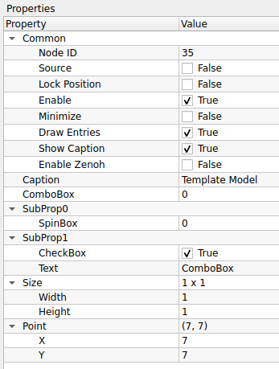
        

        

        | Property | Default | คำอธิบาย |
        | :--- | :--- | :--- |
        | **Node ID** | `35` | เลขประจำตัวลำดับของโหนด |
        | **Caption** | `Template Model` | ชื่อโหนดที่แสดงผลบน Workspace |

        

        ### **Parameters (Demo Controls)**
        

        | Property | Default | คำอธิบาย |
        | :--- | :--- | :--- |
        | **ComboBox** | `0` | ตัวอย่างการเลือกรายการแบบ Dropdown List |
        | **SpinBox** | `0` | (ในหมวด SubProp0) ตัวอย่างช่องป้อนตัวเลขจำนวนเต็ม |
        | **CheckBox** | `True` | (ในหมวด SubProp1) ตัวอย่างช่องติ๊กถูกเลือก (True/False) |
        | **Text** | `ComboBox` | (ในหมวด SubProp1) ตัวอย่างช่องป้อนข้อความ String |

        

        ### **Geometry (Size & Point)**
        

        | Property | Default | คำอธิบาย |
        | :--- | :--- | :--- |
        | **Size** | `1 x 1` | ตัวอย่างข้อมูลประเภทขนาด (Width x Height) |
        | **Point** | `(7, 7)` | ตัวอย่างข้อมูลประเภทพิกัด (X, Y) |

        

        ---

        !!! example "Use Case: สำหรับนักพัฒนา (Developer)"
            โหนดนี้อาจไม่ได้ใช้ในงานประมวลผลภาพจริง (Production) แต่มีประโยชน์มากสำหรับ:
            
            1.  **UI Testing:** ตรวจสอบว่า Theme ของโปรแกรมแสดงผล Control ต่างๆ ได้ถูกต้องหรือไม่
            2.  **Plugin Development:** นักพัฒนาสามารถดู Source Code ของโหนดนี้เพื่อเรียนรู้วิธีการประกาศ Property ประเภทต่างๆ (เช่น วิธีการสร้าง Sub-property หรือการจัดกลุ่มตัวแปร)

        !!! tip "ข้อสังเกต"
            หากคุณเป็นผู้ใช้งานทั่วไป (End User) คุณสามารถข้ามโหนดนี้ไปได้เลยครับ เพราะมันไม่ได้มีฟังก์ชันการคำนวณทาง Image Processing ใดๆ

## 17. Utility (เครื่องมืออรรถประโยชน์)
เครื่องมือช่วยอำนวยความสะดวกในการทำงาน

	

??? node "- **Combine Sync:**"
    

    {width=80}
    

    **Combine Sync** คือโหนดสำหรับการจัดจังหวะสัญญาณ (Synchronization) จากหลายแหล่งข้อมูลให้ตรงกันก่อนที่จะส่งต่อไปประมวลผล จุดเด่นคือความยืดหยุ่นที่ผู้ใช้สามารถกำหนดจำนวนช่องสัญญาณขาเข้า (Input Size) ได้ตามต้องการ โหนดนี้มักใช้ในกรณีที่ต้องรอรวบรวมข้อมูลจากกระบวนการย่อยหลายๆ ส่วนให้ครบถ้วน (Wait for all) หรือต้องการตรวจสอบเงื่อนไขจากหลายแหล่งพร้อมกัน

    ## **ส่วนควบคุมบนโหนด (On-Node Controls)**
    ส่วนนี้แสดงปุ่มและค่าต่างๆ ที่สามารถปรับได้ทันทีบนหน้าต่าง Workspace โดยไม่ต้องเข้าไปในเมนู Properties

    

    
    

    

    | Control | Type | คำอธิบาย |
    | :--- | :--- | :--- |
    | **Op** | Dropdown | ตัวเลือกเงื่อนไขตรรกะ (Logic Operator): - **AND:** รอสัญญาณครบทุกขา (Wait All) - **OR:** สัญญาณมาขาใดขาหนึ่งก็ทำงาน (Any) |
    | **Inputs** | SpinBox | ช่องปรับจำนวนขา Input: - สามารถกดลูกศรขึ้น/ลง เพื่อเพิ่มหรือลดจำนวนพอร์ต **Syc** (สีเขียวด้านซ้าย) ได้ทันที |
    | **Reset** | Button | ปุ่มรีเซ็ตสถานะ: - ใช้สำหรับเคลียร์ค่าสถานะการรอ (Pending Signals) ภายในโหนดให้กลับไปเป็นค่าเริ่มต้น |

    

    

    | Port | Label | Type | Direction | คำอธิบาย |
    | :--- | :--- | :--- | :--- | :--- |
    | **Input** | `Syc` | Sync Signal | Input (Left) | ช่องรับสัญญาณ Trigger (จำนวนจะเปลี่ยนไปตามค่า Inputs) |
    | **Output** | `Syc` | Sync Signal | Output (Right)| ช่องส่งสัญญาณ Trigger ออกไปเมื่อเงื่อนไขเป็นจริง |

    

    ---

    ## **ตารางการตั้งค่า (Properties)**
    การตั้งค่าละเอียดภายในโหนด (ซึ่งสัมพันธ์กับค่าบนหน้าโหนด)

    

    
    

    ### **Common**
    

    | Property | Default | คำอธิบาย |
    | :--- | :--- | :--- |
    | **Node ID** | `36` | เลขประจำตัวลำดับของโหนด |
    | **Caption** | `Combine Sync` | ชื่อโหนดที่แสดงผลบน Workspace |

    

    ### **Settings**
    

    | Property | Default | คำอธิบาย |
    | :--- | :--- | :--- |
    | **Condition** | `AND` | เงื่อนไขการรวมสัญญาณ (ตรงกับค่า **Op** บนหน้าโหนด): - **AND:** (และ) **โหมดรอครบ:** รอให้สัญญาณเข้ามาครบทุกช่อง Input ที่กำหนดไว้ จึงจะส่งข้อมูลออกไป - **OR:** (หรือ) **โหมดใครก็ได้:** หากมีสัญญาณเข้ามาที่ช่องใดช่องหนึ่ง ก็จะส่งข้อมูลออกไปทันที |
    | **Input Size** | `2` | จำนวนช่องสัญญาณขาเข้า (ตรงกับค่า **Inputs** บนหน้าโหนด) |

    

    ---

    !!! example "Use Case: การรวมผลลัพธ์จากกล้อง 4 ตัว (Quality Control)"
        สมมติคุณมีกล้อง 4 ตัวถ่ายภาพสินค้าชิ้นเดียวกันจาก 4 มุมมอง และต้องการสรุปผลว่าสินค้าชิ้นนี้ "ผ่าน" หรือไม่
        
        1.  ปรับค่า **Inputs = 4** ที่หน้าโหนด (จะมีจุดต่อสาย Input ปรากฏขึ้น 4 จุด)
        2.  ตั้งค่า **Op = AND**
        3.  ลากสายสัญญาณผลลัพธ์ (OK/NG) จากกล้องทั้ง 4 ตัวมาเข้าที่โหนดนี้
        4.  **ผลลัพธ์:** โหนดจะส่งสัญญาณ "ผ่าน (True)" ออกไป ก็ต่อเมื่อกล้อง **ทั้ง 4 ตัว** ส่งสัญญาณมาครบและยืนยันว่าผ่านทั้งหมด

    !!! tip "ความสะดวกของการปรับหน้าโหนด"
        คุณสามารถเพิ่มจำนวนกล้องหรือเงื่อนไขได้ง่ายๆ เพียงแค่กดลูกศรที่ช่อง **Inputs** บนตัวโหนด สายเชื่อมต่อเดิมจะไม่หลุดหาย ทำให้การขยายระบบ (Scale up) ทำได้รวดเร็วมากครับ

??? node "- **Not Sync:**"
    

    {width=80}
    

    **Properties Panel** คือหน้าต่างสำหรับการตั้งค่าคุณสมบัติของโหนด (Node Configuration) ทำหน้าที่แสดงและแก้ไขพารามิเตอร์ต่างๆ ของโหนดที่ถูกเลือกอยู่ในปัจจุบัน ช่วยให้ผู้ใช้สามารถปรับแต่งค่าตัวแปร, เปลี่ยนชื่อโหนด, หรือควบคุมสถานะการทำงานของโหนดนั้นๆ ได้แบบเรียลไทม์ (Real-time)

    ## **ตารางการตั้งค่า (Properties)**
    

        
    

    ### **Common Settings**
    

    | Property | Value (Example) | คำอธิบาย |
    | :--- | :--- | :--- |
    | **Node ID** | `1` | เลขประจำตัวลำดับของโหนด (Unique ID) ซึ่งระบบจะสร้างให้โดยอัตโนมัติ |
    | **Caption** | `Not Sync` | ชื่อของโหนดที่แสดงผลบน Workspace (สามารถแก้ไขเพื่อตั้งชื่อให้สื่อความหมายได้) |
    | **Enable** | `True` (Checked) | สถานะการทำงานของโหนด  • **ติ๊กถูก:** เปิดใช้งานโหนดปกติ  • **ไม่ติ๊ก:** ปิดการทำงาน (Bypass/Disable) |
    | **Minimize** | `False` (Unchecked) | การแสดงผลรูปทรงโหนด  • **ติ๊กถูก:** ย่อโหนดให้เหลือแต่ส่วนหัว (Header) เพื่อประหยัดพื้นที่  • **ไม่ติ๊ก:** แสดงโหนดขนาดเต็ม |
    | **Lock Position**| `False` (Unchecked) | การล็อคตำแหน่งบน Workspace  • **ติ๊กถูก:** ตรึงโหนดไว้กับที่ ไม่สามารถใช้เมาส์ลากย้ายได้  • **ไม่ติ๊ก:** สามารถลากย้ายตำแหน่งได้อิสระ |

    

    ---

    !!! example "Use Case: การจัดการ Workspace ที่ซับซ้อน"
        เมื่อ Flow การทำงานเริ่มมีขนาดใหญ่และมีโหนดจำนวนมาก:
        
        1.  ใช้ **Caption** เพื่อเปลี่ยนชื่อโหนดจากชื่อ Default (เช่น *Threshold_1*) เป็นชื่อที่สื่อความหมาย (เช่น *Main_Binarization*)
        2.  ใช้ **Minimize** กับโหนดที่ตั้งค่าเสร็จแล้วและไม่ค่อยได้แก้ เพื่อลดความรกของหน้าจอ
        3.  ใช้ **Lock Position** กับโหนดหลัก (Main Nodes) เพื่อป้องกันการเผลอไปลากโดนจน Flow เสียรูปทรง

    !!! tip "Real-time Update"
        การแก้ไขค่าในหน้าต่าง Properties จะมีผลทันทีโดยไม่ต้องกดปุ่ม Save หรือ Compile ใหม่ ทำให้เหมาะสำหรับการ Tuning ค่าพารามิเตอร์ต่างๆ ขณะที่โปรแกรมกำลังรันอยู่ (Runtime Adjustment)

??? node "- **Timer:**"
    

    {width=80}
    

    **Timer** คือโหนดประเภท Source (ตัวกำเนิดสัญญาณ) ที่ทำหน้าที่ส่งข้อมูลหรือสัญญาณทริกเกอร์ออกมาตามช่วงเวลาที่กำหนดไว้ (Interval) นิยมใช้ในการสร้าง Loop การทำงาน, การสั่งถ่ายภาพจากกล้องทุกๆ วินาที, หรือการตรวจสอบสถานะระบบเป็นระยะๆ

    ## **ตารางการตั้งค่า (Properties)**

    

    
    

    

    | Property | Default | คำอธิบาย |
    | :--- | :--- | :--- |
    | **Node ID** | `2` | เลขประจำตัวลำดับของโหนด |
    | **Caption** | `Timer` | ชื่อโหนดที่แสดงผลบน Workspace |
    | **Source** | `True` | ระบุว่าโหนดนี้เป็นจุดเริ่มต้นของข้อมูล (ไม่ต้องการ Input จากใคร) |
    | **Interval (m)** | `1000` | ระยะเวลาในการส่งสัญญาณแต่ละครั้ง (หน่วยเป็นมิลลิวินาที) - **1000** = 1 วินาที - **500** = 0.5 วินาที |

    

    ---

    !!! tip "หน่วยเวลา (m)"
        ในช่อง **Interval (m)** ตัว "m" นี้ย่อมาจาก **Millisecond (มิลลิวินาที)** ครับ
        
        * หากต้องการตั้งเวลา **1 วินาที** ให้ใส่ค่า `1000`
        * หากต้องการตั้งเวลา **5 วินาที** ให้ใส่ค่า `5000`

    !!! warning "ระวังการตั้งค่าเร็วเกินไป"
        หากตั้งค่า Interval น้อยมากๆ (เช่น `10` หรือ `1` ms) อาจทำให้โหนดส่งข้อมูลออกมาถี่เกินไปจนเครื่องประมวลผลไม่ทัน (CPU Overload) แนะนำให้ตั้งค่าให้เหมาะสมกับความเร็วในการประมวลผลของระบบโดยรวมครับ

??? node "- **CV Save Image:**"
    

    {width=80}
    

    **CV Save Image** คือโหนดสำหรับการบันทึกภาพ (Image Saving) ลงในหน่วยความจำถาวร (Hard Disk/SSD) รองรับการตั้งชื่อไฟล์แบบอัตโนมัติและการเลือกนามสกุลไฟล์ที่หลากหลาย นิยมใช้ในการเก็บรวบรวมข้อมูล (Data Collection) หรือการบันทึกภาพเหตุการณ์สำคัญ

    

    
    

    **Visual Interface** คือหน้าตาของโหนดที่ปรากฏบน Workspace ซึ่งแสดงจุดเชื่อมต่อ (Ports) สำหรับรับและส่งข้อมูล

    ## **ตารางจุดเชื่อมต่อ (Port Connections)**

    

    | Port Name | Type | Direction | คำอธิบาย |
    | :--- | :--- | :--- | :--- |
    | **Mat** | Image (Matrix) | **Input** (ซ้าย) | ช่องรับภาพที่ต้องการบันทึก *(ต้องต่อสายนี้เสมอ ไม่งั้นไม่มีภาพให้บันทึก)* |
    | **Inf** | Info / Data | **Input** (ซ้าย) | ช่องรับข้อมูลเพิ่มเติม *(มักใช้สำหรับส่งชื่อไฟล์แบบ Dynamic หรือ Metadata ถ้าไม่ต่อจะใช้ชื่อตามที่ตั้งใน Properties)* |
    | **Syc** | Sync / Signal | **Input** (ซ้าย) | ช่องรับสัญญาณสั่งงาน *(ใช้ร่วมกับ Timer เพื่อสั่งให้บันทึกเป็นจังหวะ ถ้าไม่ต่อ โหนดอาจจะบันทึกทุกเฟรมที่เข้ามา)* |
    | **Syc** | Sync / Signal | **Output** (ขวา) | ช่องส่งสัญญาณบอกว่า "บันทึกเสร็จแล้ว" *(ใช้ต่อพ่วงไปบอกโหนดถัดไปให้เริ่มทำงานต่อ)* |

    

    ---

    !!! tip "การต่อสายเพื่อบันทึกเป็นระยะ (Best Practice)"
        เพื่อไม่ให้ฮาร์ดดิสก์เต็มเร็วเกินไป แนะนำให้ต่อสายดังนี้:
        
        1.  **Timer Node** (ช่อง Output) $\rightarrow$ **CV Save Image** (ช่อง `Syc` Input)
        2.  **Camera/Image Node** (ช่อง Output) $\rightarrow$ **CV Save Image** (ช่อง `Mat` Input)
        
        *ผลลัพธ์:* ภาพจะถูกบันทึกเฉพาะตอนที่ Timer ส่งสัญญาณมาเท่านั้น (เช่น ทุก 1 วินาที) แทนที่จะบันทึกรัวๆ ครับ

    ## **ตารางการตั้งค่า (Properties)**

    

    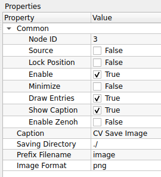
    

    

    | Property | Default | คำอธิบาย |
    | :--- | :--- | :--- |
    | **Node ID** | `3` | เลขประจำตัวลำดับของโหนด |
    | **Caption** | `CV Save Image` | ชื่อโหนดที่แสดงผลบน Workspace |
    | **Saving Directory** | `./` | ที่อยู่โฟลเดอร์สำหรับเก็บไฟล์ - **`./`** หมายถึง โฟลเดอร์เดียวกับที่รันโปรแกรม (Current Directory) - สามารถระบุ Path เต็มได้ เช่น `C:/MyImages/` |
    | **Prefix Filename** | `image` | คำนำหน้าชื่อไฟล์ *(โปรแกรมมักจะเติมตัวเลขลำดับหรือเวลาต่อท้ายให้ เช่น image_001.png)* |
    | **Image Format** | `png` | นามสกุลไฟล์ภาพ - **png:** ภาพคมชัด ไม่สูญเสียรายละเอียด (Lossless) แต่ไฟล์ใหญ่ - **jpg/jpeg:** ไฟล์เล็ก ประหยัดพื้นที่ แต่คุณภาพลดลงเล็กน้อย (Lossy) |

    

    ---

    !!! tip "เลือก PNG หรือ JPG ดี?"
        * **เลือก `png` เมื่อ:** คุณต้องการนำภาพไป **"วิเคราะห์ต่อ (Analysis)"** เพราะค่าสีทุกพิกเซลจะเหมือนต้นฉบับเป๊ะๆ ไม่เพี้ยน
        * **เลือก `jpg` เมื่อ:** คุณต้องการ **"ความเร็ว (Speed)"** หรือประหยัดพื้นที่ฮาร์ดดิสก์ เช่น การบันทึกภาพจากกล้องวงจรปิดตลอด 24 ชม.

    !!! warning "ระวัง! พื้นที่เต็ม (Disk Space)"
        หากคุณต่อโหนดนี้เข้ากับกล้องวีดีโอที่ส่งภาพมา 30 เฟรมต่อวินาที (30 FPS) โปรแกรมจะ **"บันทึกรัว 30 รูปทุกวินาที"**
        
        * ฮาร์ดดิสก์ของคุณอาจจะเต็มอย่างรวดเร็ว!
        * **ข้อแนะนำ:** ควรใช้ร่วมกับโหนด **Timer** หรือตัว Logic อื่นๆ เพื่อสั่งให้บันทึกเป็นระยะๆ (เช่น ทุก 5 วินาที) แทนการบันทึกตลอดเวลา

    !!! tip "Performance Tip"
        การเขียนไฟล์ลง Disk เป็นกระบวนการที่ช้า (I/O Operation)
        
        * หากระบบของคุณต้องการความเร็วสูง (High Speed Real-time) การใส่โหนด Save Image ไว้อาจทำให้โปรแกรมโดยรวม **"กระตุกหรือช้าลง"** ได้
        * แนะนำให้เลือกใช้ **jpg** หากต้องการความเร็วในการบันทึกที่มากกว่า png

??? node "- **Info Concatenate:**"
    

    {width=80}
    

    **Info Concatenate** คือโหนดสำหรับการนำข้อมูลประเภทข้อความ (String/Text) หรือข้อมูลทั่วไป 2 ชุด มาเชื่อมต่อกันเป็นชุดเดียว (Join) นิยมใช้ในการสร้างข้อความแบบไดนามิก เช่น การสร้างชื่อไฟล์ที่ประกอบด้วย "ชื่อกล้อง" + "วันเวลา" หรือการรวมข้อมูล Sensor เพื่อส่งออกรายงาน

    

    {width=200}
    

    **Visual Interface** คือหน้าตาของโหนดบน Workspace ที่แสดงตำแหน่งการเชื่อมต่อสายข้อมูล

    ## **ตารางจุดเชื่อมต่อ (Port Connections)**

    

    | Port Name | Type | Direction | คำอธิบาย |
    | :--- | :--- | :--- | :--- |
    | **Inf** | Info / String | **Input** (ซ้ายบน) | ข้อมูลส่วนแรก (Prefix) *(เช่น คำว่า "Camera1_")* |
    | **Inf** | Info / String | **Input** (ซ้ายกลาง) | ข้อมูลส่วนหลัง (Suffix) *(เช่น ข้อมูลเวลา "12:00:00")* |
    | **Syc** | Sync / Signal | **Input** (ซ้ายล่าง) | ช่องรับสัญญาณกระตุ้น *(ใช้สำหรับสั่งให้โหนดเริ่มทำงาน ณ จังหวะเวลาที่กำหนด)* |
    | **Inf** | Info / String | **Output** (ขวา) | ผลลัพธ์ข้อความที่รวมกันแล้ว *(เช่น "Camera1_12:00:00" ส่งต่อไปยังโหนดอื่น)* |

    

    ---

    !!! tip "ลำดับการเชื่อมต่อ (Concatenation Order)"
        โปรแกรมจะนำข้อมูลมาต่อกันตามลำดับจาก **"บนลงล่าง"** เสมอ
        
        * **Input บน (Inf 1) + Input ล่าง (Inf 2) = Output**
        * หากคุณต้องการเปลี่ยนลำดับคำ (เช่น เอาเวลาขึ้นก่อน) ให้สลับสายที่เสียบเข้า Input ทั้งสองช่องครับ

    !!! info "ชนิดข้อมูล (Data Types)"
        แม้ช่องจะเขียนว่า **Inf (Information)** แต่โหนดนี้จะพยายามแปลงข้อมูลทุกอย่างที่ส่งเข้ามาให้เป็น **"ข้อความ (String)"** โดยอัตโนมัติ ดังนั้นคุณสามารถเอาตัวเลข (Int/Float) มาเสียบต่อกับข้อความได้เลยโดยไม่ต้องแปลงค่าก่อนครับ

    ## **ตารางการตั้งค่า (Properties)**
    

    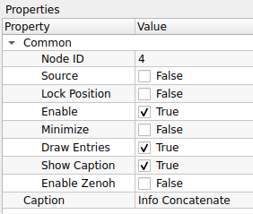
    

    

    | Property | Default | คำอธิบาย |
    | :--- | :--- | :--- |
    | **Node ID** | `4` | เลขประจำตัวลำดับของโหนด |
    | **Caption** | `Info Concatenate` | ชื่อโหนดที่แสดงผลบน Workspace |
    | **(ไม่มีการตั้งค่าเพิ่มเติม)** | - | โหนดนี้ทำงานโดยรับ Input เข้ามาและส่ง Output ออกไปโดยตรง ไม่มีการปรับจูนค่าภายใน |

    

    ---

    !!! example "Use Case: การตั้งชื่อไฟล์ภาพอัตโนมัติ"
        หากคุณใช้โหนดนี้ร่วมกับ **CV Save Image**:
        
        1.  **Input 1:** รับค่า "Cam1_" (ข้อความตายตัว)
        2.  **Input 2:** รับค่าจากโหนด **Timer** หรือ **Clock** (เช่น "12-30-55")
        3.  **Process:** โหนดจะรวมร่างกันเป็น "Cam1_12-30-55"
        4.  **Output:** ส่งไปเข้าช่อง `Inf` ของโหนด **CV Save Image** เพื่อใช้เป็นชื่อไฟล์

    !!! warning "ลำดับการต่อสาย"
        เนื่องจากโหนดนี้ไม่มีตัวเลือกให้สลับตำแหน่งข้อมูล
        
        * โปรแกรมมักจะยึดตามลำดับของ Port Input (บน/ล่าง) เป็นหลัก
        * ควรตรวจสอบให้แน่ใจว่าคุณต่อสายข้อมูลส่วนหน้า (Prefix) และส่วนหลัง (Suffix) เข้าถูกช่อง เพื่อให้ข้อความเรียงกันถูกต้อง

??? node "- **Call External Command:**"
    

    {width=80}
    

    **Call External Command** คือโหนดสำหรับการสั่งรันโปรแกรมภายนอก, สคริปต์, หรือคำสั่ง Command Line (Shell/Terminal) จากภายในตัวระบบ Flow ช่วยให้สามารถขยายขีดความสามารถของโปรแกรมด้วยการเชื่อมต่อกับระบบปฏิบัติการหรือภาษาโปรแกรมอื่นๆ ได้

    

    
    

    **Visual Interface** คือหน้าตาของโหนดบน Workspace ที่แสดงตำแหน่งการเชื่อมต่อสายสัญญาณ

    ## **ตารางจุดเชื่อมต่อ (Port Connections)**

    

    | Port Name | Type | Direction | คำอธิบาย |
    | :--- | :--- | :--- | :--- |
    | **Syc** | Sync / Signal | **Input** (ซ้าย) | ช่องรับสัญญาณกระตุ้น *(เมื่อมีสัญญาณเข้ามา โหนดจะเริ่มรันคำสั่งภายนอกทันที)* |
    | **(Output)** | Sync / Signal | **Output** (ขวา) | ช่องส่งสัญญาณบอกว่า "รันคำสั่งเสร็จแล้ว" *(จุดสีเทาทางขวา จะส่งสัญญาณออกไปเมื่อคำสั่ง External Command ทำงานจบ)* |

    

    ---

    !!! tip "การทำงานแบบ Synchronous (Blocking)"
        โหนดนี้ทำงานแบบ **"รอจนเสร็จ"** ครับ
        
        1.  สัญญาณเข้าช่อง **Syc (Input)**
        2.  ระบบรันคำสั่งภายนอก (เช่น รัน Script Python)
        3.  **...ระบบจะหยุดรอ (Wait)...** จนกว่า Script นั้นจะทำงานเสร็จ
        4.  สัญญาณจึงจะออกจากช่อง **Output** ไปยังโหนดถัดไป
        
        *ดังนั้น:* หากคำสั่งภายนอกใช้เวลานาน (เช่น 1 นาที) โปรแกรม Flow ของคุณก็จะหยุดค้างรอ 1 นาทีเช่นกันครับ

    !!! example "การนำไปใช้งาน"
        เหมาะสำหรับใช้ **"สั่งงาน"** เมื่อเกิดเหตุการณ์บางอย่าง เช่น:
        
        * **เมื่อตรวจเจอผู้บุกรุก:** ส่งสัญญาณจากโหนด Detect ไปเข้า `Syc` ของโหนดนี้ เพื่อรันสคริปต์แจ้งเตือน Line Notify หรือเปิดไซเรน
        * **เมื่อจบกระบวนการ:** รันสคริปต์ Cleanup หรืออัปโหลด Log ขึ้น Server

        ## **ตารางการตั้งค่า (Properties)**
        

        
        

        

        | Property | Default | คำอธิบาย |
        | :--- | :--- | :--- |
        | **Node ID** | `5` | เลขประจำตัวลำดับของโหนด |
        | **Caption** | `Call External Command` | ชื่อโหนดที่แสดงผลบน Workspace |
        | **External Command** | *(ว่าง)* | คำสั่งหลักหรือโปรแกรมที่ต้องการเรียกใช้งาน *(เช่น `python3`, `bash`, `cmd`, หรือ Path เต็มของโปรแกรม `.exe`)* |
        | **Arguments** | *(ว่าง)* | พารามิเตอร์หรือตัวแปรที่จะส่งต่อให้คำสั่งนั้น *(เช่น ชื่อไฟล์สคริปต์ `main.py` หรือออปชัน `--verbose`)* |

        

        ---

        !!! example "Use Case: การเรียกใช้ Python Script"
            หากคุณต้องการให้โหนดนี้รันโค้ด Python AI ที่คุณเขียนเองแยกต่างหาก:
            
            * **External Command:** `/usr/bin/python3` (ระบุตัวรัน)
            * **Arguments:** `/home/pi/my_ai_script.py` (ระบุไฟล์สคริปต์)
            
            *ผลลัพธ์:* เมื่อสัญญาณวิ่งมาถึงโหนดนี้ ระบบจะไปปลุก Python ให้รันสคริปต์ดังกล่าวทันที

        !!! warning "ข้อควรระวัง (Best Practices)"
            1.  **Full Path:** ควรใช้ที่อยู่ไฟล์แบบเต็มเสมอ (Absolute Path) เช่น `C:/MyProject/run.exe` แทนการใช้แค่ `run.exe` เพื่อกันปัญหาหาไฟล์ไม่เจอ
            2.  **Blocking:** โดยปกติการเรียกคำสั่งภายนอกจะทำให้ระบบหลัก **"ค้างรอ (Block)"** จนกว่าคำสั่งนั้นจะทำเสร็จ หากสคริปต์คุณใช้เวลาทำงานนาน (เช่น 10 วินาที) โปรแกรมหลักก็จะค้างไป 10 วินาทีเช่นกัน

## 18. cv::Mat Operations (การจัดการข้อมูล Matrix)
การจัดการข้อมูลดิบของภาพ (OpenCV Matrix)

	

??? node "- **CV Sum:**"
